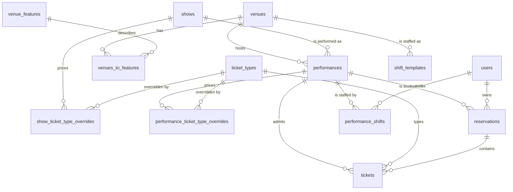

# Domain model

The schema lives in `server/db/schema/` — five files: `show.ts`, `venue.ts`, `ticket.ts`,
`reservation.ts`, `user.ts`. Migrations are in `server/db/migrations/sqlite/`, `0000` to `0008`.

Read this before changing the schema. Several of the constraints below are load-bearing in ways
that are not obvious from the table definitions.

## The shape



Four groups:

- **Programme** — `shows` → `performances` → `venues` (+ `venue_features`). What is on, when, where.
- **Money** — `ticket_types` with two layers of override. What things cost.
- **Sales** — `users` → `reservations` → `tickets`. Who is coming and what they paid.
- **Staffing** — `performance_shifts` (+ `shift_templates`). Who is working, which is also what
  scopes the show night screen ([ADR-0019](./decisions/0019-the-rota-scopes-the-front-of-house-role.md)).

## Entities

### `shows`

A production. The top-level programming unit.

| Column | Notes |
|---|---|
| `id` | nanoid, 21 chars |
| `slug` | **UNIQUE.** URL identity: `/whats-on/<slug>`. Validated against a regex on create |
| `title`, `subtitle`, `description` | |
| `posterUrl` | R2 path, served through `/images/**` |
| `status` | `DRAFT` \| `PUBLISHED` |

**Invariants and gotchas**

- A show is only visible on `/whats-on` when `PUBLISHED`. It is visible on `GET /api/shows`
  regardless — see [09-known-issues](./09-known-issues.md#drafts-are-public).
- `slug` uniqueness is enforced by index *and* checked in the handler. Both are needed: the handler
  check gives a decent error, the index prevents the race.
- Deleting a show cascades to performances, and thence would cascade into reservations — except
  `reservations.performanceId` is `onDelete: restrict`, so the delete fails instead. That is
  deliberate. Do not relax it.

### `performances`

One scheduled instance of a show.

| Column | Notes |
|---|---|
| `showId` | FK, `cascade` |
| `venueId` | FK, `restrict` |
| `startsAt` | **unix timestamp, integer seconds.** Not a string, unlike the metadata columns |
| `doorsAt` | optional |
| `durationMinutes`, `intervalCount`, `intervalMinutes` | |
| `capacityOverride` | `NULL` = use `venue.capacity` |
| `status` | `DRAFT` \| `ON_SALE` \| `CANCELLED` |

**Invariants and gotchas**

- `SOLD_OUT` and `COMPLETED` are **not** statuses. Sold-out is derived from ticket counts;
  completed is derived from `startsAt < now`. The schema comment says so; believe it.
- Effective capacity is `capacityOverride ?? venue.capacity`, and **`NULL` means unlimited**. A
  venue with no capacity set silently disables the capacity check on every performance in it.
- Timestamps are seconds, not milliseconds. Drizzle's `mode: 'timestamp'` handles the conversion;
  raw SQL does not. Getting this wrong shifts everything to 1970.

### `venues`, `venue_features`, `venues_to_features`

Rooms and their accessibility/facility tags, many-to-many. `venues.name` and `venue_features.name`
are both UNIQUE.

`venues.capacity` is nullable and, as above, `NULL` disables capacity enforcement rather than
meaning zero.

### `ticket_types`

The price list. See [06-pricing-and-ticket-types](./06-pricing-and-ticket-types.md) for the
resolution rules.

| Column | Notes |
|---|---|
| `name` | **UNIQUE, global.** There is no per-show namespace |
| `price` | **integer pence.** Never floats, anywhere in this codebase |
| `activeByDefault` | Whether it is offered unless overridden |

`show_ticket_type_overrides` and `performance_ticket_type_overrides` both carry a nullable `price`
and a nullable `active`, unique on `(showId, ticketTypeId)` and `(performanceId, ticketTypeId)`
respectively. **`NULL` at a layer means "inherit", not "unset"** — this is the single most
misread thing in the schema.

### `users`

A **mirror**, not an identity store. Accounts, credentials, roles and verification live in the
central auth service (stage-door); migration 0014 dropped `password`, `email_verified`,
`last_login`, `user_roles`, `email_verifications` and `password_resets` from this database.

| Column | Notes |
|---|---|
| `id` | The auth service's canonical id. **Never regenerate or reuse one** — `reservations.user_id` FKs against it |
| `email` | **UNIQUE, NOT NULL**, lowercase (canonical store convention) |
| `name` | NOT NULL |
| `anonymisedAt` | Set when the person has been erased; the row and its bookings stay |

Rows appear via `ensureLocalUser` (an idempotent primary-key upsert from the session) or, for guest
checkout, from `POST /api/users/shadow` on the auth service. The FK is `onDelete: 'restrict'`, so
nobody with booking history can be deleted — erasure rewrites instead of removing, which is why
`anonymisedAt` exists. See [04-auth-and-permissions](./04-auth-and-permissions.md#erasure).

**Shadow accounts.** A guest who books without registering gets a real central account with no
password, mirrored here like any other. `session.user.guest` distinguishes them. There is no local
flag, and there should not be one — this app cannot see credentials.

### `reservations`

A customer's booking for one performance.

| Column | Notes |
|---|---|
| `bookingRef` | 6 chars from `ABCDEFGHJKLMNPQRSTUVWXYZ23456789` — no O/0, no I/L/1. **UNIQUE** |
| `performanceId` | FK, `restrict`. **NOT NULL — a reservation is always for exactly one performance** |
| `userId` | FK, `restrict`. NOT NULL |
| `status` | `PENDING` \| `COLLECTED` \| `DOOR` \| `CANCELLED` \| `NO_SHOW` |
| `cancelledBy` | `CUSTOMER` \| `STAFF`, nullable |
| `customerNotes` | Written by the customer at booking. Access needs, dietary, etc. |
| `staffNotes` | Internal. **Never render this to a customer** |

**`performanceId` being NOT NULL is why passes need their own entity** — a multi-performance
product cannot be a reservation. See [10-passes-design](./10-passes-design.md).

The `restrict` on `userId` is deliberate and commented in the schema: it stops someone deleting a
customer and silently destroying booking history. Reassign before deleting.

### `tickets`

One issued seat. The atom of both capacity and money.

| Column | Notes |
|---|---|
| `reservationId` | FK, `restrict` |
| `performanceId` | FK, `restrict`. Denormalised from the reservation — see below |
| `ticketTypeId` | FK, `restrict` |
| `pricePaid` | **integer pence, snapshot at time of issue** |
| `refundedAt` | nullable timestamp |

**Why `performanceId` is on both the ticket and its reservation.** It is redundant, and nothing
enforces that they agree. It exists so the capacity query can count tickets without joining through
reservations twice. If you ever write to it, write both.

**`refundedAt` is read in five places and written by nothing.** Refunds are not implemented. See
[09-known-issues](./09-known-issues.md#refunds-do-not-exist).

### `performance_shifts`

One slot on one performance. A null `userId` is an open slot. Design:
[12-access-and-staffing](./12-access-and-staffing-design.md) §3.

| Column | Notes |
|---|---|
| `performanceId` | FK, `cascade` |
| `role` | `DUTY_MANAGER` \| `DOOR` \| `BAR` |
| `userId` | FK, `restrict`, **nullable**. Null means the slot is open |
| `status` | `OPEN` → `CLAIMED` → `CONFIRMED`, or `DECLINED` |
| `needsEligibilityReview` | Set when a claim was allowed under the eligibility fallback ([ADR-0026](./decisions/0026-eligibility-is-read-from-rehearsal-behind-one-seam.md)) |
| `assignedByUserId` | FK, `restrict`, nullable |
| `claimedAt`, `confirmedAt` | nullable timestamps |

Two invariants, both held by the database rather than by every writer:

- **Exactly one confirmed duty manager per performance**, as a partial unique index on
  `(performance_id) WHERE role = 'DUTY_MANAGER' AND status = 'CONFIRMED'`. A second one is refused
  with a 409 before it reaches the index, so staff see a sentence rather than a 500.
- **An unfilled slot is `OPEN` and a filled one is not**, as a check constraint pairing `status`
  and `user_id`. Without it "who is on" can quietly disagree with itself.

`userId` is `restrict` rather than `cascade` deliberately: the rota is a record of who worked, and
erasure anonymises the person while the shift survives
([ADR-0014](./decisions/0014-anonymise-never-delete.md)).

**A merge can collide here.** Two accounts confirmed on the same slot would break the duty-manager
index, so `mergeUser` deletes the loser's duplicate before re-pointing the rest.

### `shift_templates`

How many of each role a new performance starts with. One row per role per venue; a null `venueId`
is the estate default, used when a venue has no rows of its own. Stamped onto a performance at
creation, so publishing a rota costs nothing by default.

## Status lifecycles

### Reservation

```
                    ┌──────────► CANCELLED  (customer or staff; releases the seat)
                    │
  [booked] ──► PENDING ──► COLLECTED   (paid and collected at the door)
                    │
                    └──────────► NO_SHOW    (held, never collected; releases the seat)

  [walk-up] ──► DOOR                        (bought on the door, not pre-booked)
```

`CANCELLED` and `NO_SHOW` release capacity. `PENDING`, `COLLECTED` and `DOOR` consume it.

**`DOOR` is currently unreachable through the UI.** The walk-in flow creates `PENDING` then sets
`COLLECTED`, so pre-booked and on-the-door revenue cannot be told apart in reporting. See
[09-known-issues](./09-known-issues.md#door-status-is-never-set).

### Show and performance

A show goes `DRAFT` → `PUBLISHED` via `POST /api/shows/:id/publish`. There is no unpublish endpoint;
you must `PUT` the show back to `DRAFT`.

A performance goes `DRAFT` → `ON_SALE`, or `→ CANCELLED`. Publishing a show optionally bulk-sets its
performances to `ON_SALE` — and currently does so for cancelled ones too, which is a bug.

## Cross-cutting rules

**Money is always integer pence.** `ticket_types.price`, `tickets.pricePaid`. There is no float or
decimal anywhere and there must not be. Display formatting is the frontend's job.

**Ids are nanoid(21)**, generated in the application via `$defaultFn`, not by the database. This
means an insert without going through Drizzle's schema objects will produce a NULL id.

**Timestamps are inconsistent by design, and it is worth knowing which is which:**

- `startsAt`, `doorsAt`, `refundedAt`, token `expiresAt` — integer unix seconds.
- `createdAt`, `updatedAt`, `lastLogin` — text, SQLite `current_timestamp`, i.e. `YYYY-MM-DD HH:MM:SS`
  in **UTC**, no zone marker.

The theatre operates in Europe/London. Nothing in the schema records that. Anything doing date
arithmetic on the text columns must not assume local time — and anything displaying `startsAt` must
convert to Europe/London or the 19:30 curtain will read as 18:30 for half the year.

**Capacity is defined in exactly one way** and should stay that way:

> tickets joined to reservations, where `reservations.status IN ('PENDING','COLLECTED','DOOR')`
> and `tickets.refundedAt IS NULL`, counted against `performance.capacityOverride ?? venue.capacity`.

It is currently *computed* in five places and *enforced* in one. See
[05-booking-and-box-office](./05-booking-and-box-office.md#capacity).

## What the model does not have

Worth stating explicitly, because their absence shapes what you can build:

- **No payment entity.** Money is taken in person. `pricePaid` is a record of what was owed, not
  evidence of a transaction. There is no order, no payment, no till reconciliation.
- **No seat map.** Capacity is a single number per performance. Unreserved seating only.
- **No holds or expiry.** A `PENDING` reservation lives forever until someone acts on it.
- **No audit log.** Nothing records who changed a reservation's status, or when. The legacy Django
  system had one (`django_admin_log`, 2,782 rows); this does not.
- **No multi-performance product** — see passes.
- **No show categories or seasons.** Both are being added by the legacy migration; see
  [ADR-0003](./decisions/0003-legacy-ticketing-import.md).
- **Content warnings** are modelled as a curated vocabulary (`content_warnings`) plus per-show links
  carrying a level. A warning is either a technical effect — strobe, haze, loud noise, no level — or a
  theme recorded as mentioned, discussed or depicted. `shows.warningsConfirmedNone` distinguishes
  "the company checked and there are none" from "nobody filled this in", and the public page says
  which. Manageable at `/admin/content-warnings`; see
  [ADR-0004](./decisions/0004-content-warning-model.md).
