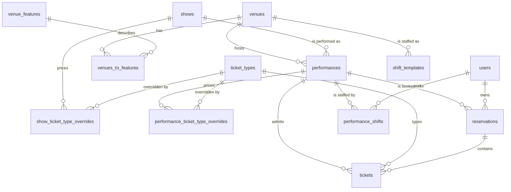

# Domain model

The schema lives in `server/db/schema/`: five files: `show.ts`, `venue.ts`, `ticket.ts`,
`reservation.ts`, `user.ts`. Migrations are in `server/db/migrations/sqlite/`, `0000` to `0008`.

Read this before changing the schema. Several of the constraints below are load-bearing in ways
that are not obvious from the table definitions.

## The shape



Four groups:

- **Programme**: `shows` → `performances` → `venues` (+ `venue_features`). What is on, when, where.
- **Money**: `ticket_types` with two layers of override. What things cost.
- **Sales**: `users` → `reservations` → `tickets`. Who is coming and what they paid.
- **Staffing**: `performance_shifts` (+ `shift_templates`). Who is working, which is also what
  scopes the show night screen ([ADR-0019](./decisions/0019-the-rota-scopes-the-front-of-house-role.md)).

## Entities

### `shows`

A production. The top-level programming unit.

| Column | Notes |
|---|---|
| `id` | nanoid, 21 chars |
| `slug` | **UNIQUE.** URL identity: `/whats-on/<slug>`. Validated against a regex on create |
| `title`, `subtitle`, `description` | |
| `posterUrl` | R2 path, served through `/images/**` |
| `ageGuidance`, `latecomerPolicy` | What the door gets asked, so it is on the record rather than in someone's head. Rendered by `/foh/tonight` |
| `status` | `DRAFT` \| `PUBLISHED` |

**Invariants and gotchas**

- A show is only visible on `/whats-on` when `PUBLISHED`. It is visible on `GET /api/shows`
  regardless: see [09-known-issues](./09-known-issues.md#drafts-are-public).
- `slug` uniqueness is enforced by index *and* checked in the handler. Both are needed: the handler
  check gives a decent error, the index prevents the race.
- Deleting a show cascades to performances, and thence would cascade into reservations: except
  `reservations.performanceId` is `onDelete: restrict`, so the delete fails instead. That is
  deliberate. Do not relax it.

### `performances`

One scheduled instance of a show.

| Column | Notes |
|---|---|
| `showId` | FK, `cascade` |
| `venueId` | FK, `restrict` |
| `startsAt` | **unix timestamp, integer seconds.** Not a string, unlike the metadata columns |
| `doorsAt` | optional |
| `durationMinutes`, `intervalCount`, `intervalMinutes` | |
| `capacityOverride` | `NULL` = use `venue.capacity` |
| `status` | `DRAFT` \| `ON_SALE` \| `CANCELLED` |

**Invariants and gotchas**

- `SOLD_OUT` and `COMPLETED` are **not** statuses. Sold-out is derived from ticket counts;
  completed is derived from `startsAt < now`. The schema comment says so; believe it.
- Effective capacity is `capacityOverride ?? venue.capacity`, and **`NULL` means unlimited**. A
  venue with no capacity set silently disables the capacity check on every performance in it.
- Timestamps are seconds, not milliseconds. Drizzle's `mode: 'timestamp'` handles the conversion;
  raw SQL does not. Getting this wrong shifts everything to 1970.

### `venues`, `venue_features`, `venues_to_features`

Rooms and their accessibility/facility tags, many-to-many. `venues.name` and `venue_features.name`
are both UNIQUE.

`venues.capacity` is nullable and, as above, `NULL` disables capacity enforcement rather than
meaning zero.

### `ticket_types`

The price list. See [06-pricing-and-ticket-types](./06-pricing-and-ticket-types.md) for the
resolution rules.

| Column | Notes |
|---|---|
| `name` | **UNIQUE, global.** There is no per-show namespace |
| `price` | **integer pence.** Never floats, anywhere in this codebase |
| `activeByDefault` | Whether it is offered unless overridden |

`show_ticket_type_overrides` and `performance_ticket_type_overrides` both carry a nullable `price`
and a nullable `active`, unique on `(showId, ticketTypeId)` and `(performanceId, ticketTypeId)`
respectively. **`NULL` at a layer means "inherit", not "unset"**: this is the single most
misread thing in the schema.

### `users`

A **mirror**, not an identity store. Accounts, credentials, roles and verification live in the
central auth service (stage-door); migration 0014 dropped `password`, `email_verified`,
`last_login`, `user_roles`, `email_verifications` and `password_resets` from this database.

| Column | Notes |
|---|---|
| `id` | The auth service's canonical id. **Never regenerate or reuse one**: `reservations.user_id` FKs against it |
| `email` | **UNIQUE, NOT NULL**, lowercase (canonical store convention) |
| `name` | NOT NULL |
| `anonymisedAt` | Set when the person has been erased; the row and its bookings stay |

Rows appear via `ensureLocalUser` (an idempotent primary-key upsert from the session) or, for guest
checkout, from `POST /api/users/shadow` on the auth service. The FK is `onDelete: 'restrict'`, so
nobody with booking history can be deleted: erasure rewrites instead of removing, which is why
`anonymisedAt` exists. See [04-auth-and-permissions](./04-auth-and-permissions.md#erasure).

**Shadow accounts.** A guest who books without registering gets a real central account with no
password, mirrored here like any other. `session.user.guest` distinguishes them. There is no local
flag, and there should not be one: this app cannot see credentials.

### `reservations`

A customer's booking for one performance.

| Column | Notes |
|---|---|
| `bookingRef` | 6 chars from `ABCDEFGHJKLMNPQRSTUVWXYZ23456789`: no O/0, no I/L/1. **UNIQUE** |
| `performanceId` | FK, `restrict`. **NOT NULL: a reservation is always for exactly one performance** |
| `userId` | FK, `restrict`. NOT NULL |
| `status` | `PENDING` \| `COLLECTED` \| `DOOR` \| `CANCELLED` \| `NO_SHOW` |
| `cancelledBy` | `CUSTOMER` \| `STAFF`, nullable |
| `customerNotes` | Written by the customer at booking. Access needs, dietary, etc. |
| `staffNotes` | Internal. **Never render this to a customer** |

**`performanceId` being NOT NULL is why passes need their own entity**: a multi-performance
product cannot be a reservation. See [10-passes-design](./10-passes-design.md).

The `restrict` on `userId` is deliberate and commented in the schema: it stops someone deleting a
customer and silently destroying booking history. Reassign before deleting.

### `tickets`

One issued seat. The atom of both capacity and money.

| Column | Notes |
|---|---|
| `reservationId` | FK, `restrict` |
| `performanceId` | FK, `restrict`. Denormalised from the reservation: see below |
| `ticketTypeId` | FK, `restrict` |
| `pricePaid` | **integer pence, snapshot at time of issue** |
| `refundedAt` | nullable timestamp |

**Why `performanceId` is on both the ticket and its reservation.** It is redundant, and nothing
enforces that they agree. It exists so the capacity query can count tickets without joining through
reservations twice. If you ever write to it, write both.

**`refundedAt` is read in five places and written by nothing.** Refunds are not implemented. See
[09-known-issues](./09-known-issues.md#refunds-do-not-exist).

### `performance_shifts`

One slot on one performance. A null `userId` is an open slot. Design:
[12-access-and-staffing](./12-access-and-staffing-design.md) §3.

| Column | Notes |
|---|---|
| `performanceId` | FK, `cascade` |
| `role` | `DUTY_MANAGER` \| `DOOR` \| `BAR` |
| `userId` | FK, `restrict`, **nullable**. Null means the slot is open |
| `status` | `OPEN` → `CLAIMED` → `CONFIRMED`, or `DECLINED` |
| `needsEligibilityReview` | Set when a claim was allowed under the eligibility fallback ([ADR-0026](./decisions/0026-eligibility-is-read-from-rehearsal-behind-one-seam.md)) |
| `assignedByUserId` | FK, `restrict`, nullable |
| `claimedAt`, `confirmedAt` | nullable timestamps |

Two invariants, both held by the database rather than by every writer:

- **Exactly one confirmed duty manager per performance**, as a partial unique index on
  `(performance_id) WHERE role = 'DUTY_MANAGER' AND status = 'CONFIRMED'`. A second one is refused
  with a 409 before it reaches the index, so staff see a sentence rather than a 500.
- **An unfilled slot is `OPEN` and a filled one is not**, as a check constraint pairing `status`
  and `user_id`. Without it "who is on" can quietly disagree with itself.

`userId` is `restrict` rather than `cascade` deliberately: the rota is a record of who worked, and
erasure anonymises the person while the shift survives
([ADR-0014](./decisions/0014-anonymise-never-delete.md)).

**A merge can collide here.** Two accounts confirmed on the same slot would break the duty-manager
index, so `mergeUser` deletes the loser's duplicate before re-pointing the rest.

### `rota_settings`

One row, `id = 'current'`. Whether a claim confirms itself is a season's decision, because trust
levels differ year to year (docs/12 §3.3). A claim allowed under the eligibility fail-open path is
never auto-confirmed, whatever this says: the flag exists to be looked at.

### `shift_templates`

How many of each role a new performance starts with. One row per role per venue; a null `venueId`
is the estate default, used when a venue has no rows of its own. Stamped onto a performance at
creation, so publishing a rota costs nothing by default.

### `venue_emergency_info`

The emergency card the show night screen renders, one row per venue. Deliberately **not** columns on
`venues`: that row is read by public pages, and a column added here must never be one missing
allow-list away from the front page.

Every field is nullable, so a venue with no card still answers rather than failing the request.
`addressForEmergencyCall` is stored as it should be *spoken* to a 999 handler, which is not always
the same as the postal address.

### `foh_contacts`

Numbers the door may need, tap-to-call: committee on-call, venue, security, taxi. Not the people
working tonight, which is the rota's answer, and not anyone's personal number from the mirror,
which holds none. Archived rather than deleted
([ADR-0010](./decisions/0010-archive-never-delete-referenced-records.md)): a number that was on the
card during an incident should still be findable afterwards.

### `incident_log`

The theatre's first structured incident record: performance, author, time, free text.

**Append-only, enforced by the database.** `BEFORE UPDATE` and `BEFORE DELETE` triggers raise, in
migration `0019`. Corrections are new rows carrying `supersedesId`, and both stay in order. The
reasoning is [ADR-0027](./decisions/0027-the-refusals-register-is-append-only.md)'s, applied to the
other register this app keeps: one you can tidy is not a record.

The trigger is hand-authored, because a trigger cannot be expressed in the Drizzle schema. That is
authoring a new migration, not editing a generated one, which stays forbidden.

**An append-only trigger must be scoped to the content columns**, as
`BEFORE UPDATE OF body, performance_id, supersedes_id, created_at`. A blanket `BEFORE UPDATE` also
blocks the author re-point that an estate account merge performs
([ADR-0025](./decisions/0025-every-user-reference-joins-the-estate-hooks.md)), and because
stage-door retries a failing hook indefinitely, that is a merge which can never complete. Migration
`0019` had exactly that bug and `0023` fixes it. Any future append-only table with a user column
needs the same scoping: what was written stays immutable; who the row points at is estate
bookkeeping.

### `backstage_nights`, `backstage_sessions`

The backstage board's access model ([ADR-0020](./decisions/0020-backstage-joins-by-a-nightly-code.md)).

**No code is stored, in any form.** `backstage_nights` holds a night and an `epoch`; the six-digit
code is derived from those two by HMAC against a worker secret. A database dump reveals nothing
without it, the front-of-house screen recomputes the code to display it, and joining recomputes it
to compare. Bumping `epoch` is therefore a reset *and* a mass sign-out in one write: every session
records the epoch it joined at, and one below the night's current epoch is dead.

`failedAttempts` counts wrong codes across all devices. Past the threshold the night rotates its own
epoch, so a distributed guesser achieves a reset rather than a join.

`backstage_sessions` holds no user. The device name is what somebody typed at join, and attribution
here is social rather than authenticated: the page's ability surface contains nothing the account
model exists to protect. The bearer token lives in a cookie; only its SHA-256 is stored.

### `backstage_presets`, `backstage_messages`

The comms board ([ADR-0021](./decisions/0021-show-night-comms-poll-rather-than-hold-a-socket.md)).

Presets are **admin data with a direction**, because each society runs its calls slightly
differently, and a preset may name a `milestone` (`CLEARANCE`, `HOUSE_OPEN`, `SHOW_START`,
`INTERVAL`, `RESTART`, `END`). Naming the milestone on the preset rather than matching its label is
what lets a society reword a call without losing the timing record that feeds the end-of-night
report (docs/11 §5.5).

`backstage_messages` snapshots the `label` it was sent with, for the same reason ticket prices are
snapshotted: rewording a preset next term must not rewrite what was called on the night.

**Exactly one sender column is set.** A front-of-house message has a `senderUserId`; a backstage
message has a `senderSessionId` and the name somebody typed at join, which is social rather than
authenticated ([ADR-0020](./decisions/0020-backstage-joins-by-a-nightly-code.md)).

`acknowledgedAt` is a column rather than a derived thing because acknowledgement is the entire
reason the board exists instead of a group chat. You cannot acknowledge your own side's message:
the value is one side seeing that the other has read it.

### `age_checks`

The Challenge 25 register ([ADR-0027](./decisions/0027-the-refusals-register-is-append-only.md)).

`ACCEPTED` rows are a **bare tally** and carry no detail at all: the ratio of accepted to refused is
the evidence that the policy is operated rather than merely displayed. Only refusals carry a reason,
what was asked for, and a description, which is *"tall man, grey coat"* and **never a name**. There
is nowhere to put a photograph, and there must not be.

Append-only, enforced by triggers in migration `0025`, **scoped to the content columns** so an
estate merge can still re-point `checked_by_user_id`: see the `incident_log` note above for why
that scoping is not optional.

### `access_profiles`

Access needs, one row per account ([ADR-0022](./decisions/0022-access-needs-are-special-category-data.md)).
Design: [12-access-and-staffing](./12-access-and-staffing-design.md) §2.

**Special category data**, held on explicit consent. Three consequences the schema encodes:

- `consentFohAt` is **null until somebody ticks the box**, and null means nothing is shown to anyone
  on a show night. It is the lawful basis, so it is never inferred from anything else.
- The needs are the **eight Access Card symbols plus a companion count**, which are operational
  statements ("needs level access") and never a diagnosis. There is no free-text field for one.
- `accessCardNumber` is recorded only if offered. **Evidence is viewed, never stored**: no document,
  scan or letter enters this system, and there is nowhere to put one.

**Erasure deletes the row outright** rather than anonymising it, which is a deliberate departure
from [ADR-0014](./decisions/0014-anonymise-never-delete.md)'s default: the data is held on consent,
and an erasure withdraws consent. It also joins the subject-access `export` hook, where it is the
part of the bundle that matters most.

Withdrawal keeps the row as a `WITHDRAWN` tombstone with every symbol, note and card number cleared,
so a future booking stops offering access ticket types. The tombstone is swept after 30 days.

**A merge drops the loser's profile rather than moving it.** Merging two sets of access needs is not
a decision this app should make on someone's behalf.

### `bar_categories`, `bar_products`, `bar_recipe_items`, `bar_prices`, `bar_discounts`

The bar catalogue. Design: [13-bar-design](./13-bar-design.md) §3.

**Money is integer pence and stock is counted in the product's own basis** (ADR-0035):
millilitres when it has a `container_ml`, whole items when it does not. A 70 cl bottle is
`container_ml = 700` and a single takes 25 of them, so 28 singles empty it exactly and nobody
works out a ratio by hand. Deliveries, stocktakes and adjustments are still entered in
**containers**, which is how an invoice and a shelf read; the app converts.

**`bar_prices` is append-only and date-effective.** A price change is a new row, never an update, so
the current price is a query (`effective_from <= today`, latest wins) and the history *is* the audit
trail. Setting a future date is how a change is planned rather than remembered.

**What a sold product is made of is its recipe**, a row per ingredient in `bar_recipe_items`
(ADR-0036). A 175 ml glass is one ingredient: 175 of its bottle's millilitres. **No rows means the
product holds its own stock**, so a bottled beer needs no figure and a sale takes one whole
container of itself.

**An ingredient is either one product or a choice from one category**, filled at the till, which
is how a gin and mixer is one button. Exactly one of `component_product_id` and
`choice_category_id` is set, and a choice pool must be counted the same way throughout, or its
`qty` would mean millilitres for one option and whole items for another. **One level:** an
ingredient must itself hold stock, so a recipe of recipes is refused.

**The price is on the sold product, not on what is picked**, so a choice pool should be things
you charge the same for. `transaction_lines.choices` records what was actually picked, because
stock movements are merged per transaction and the mixer would otherwise be unrecoverable.

**`stock_only` is stock you never sell.** A spirits bottle is delivered, counted and poured from
but never rung up, so it needs no price and the till never offers it.

**`container_ml` is fixed once anything has moved against the product.** Every movement means what
it means in the size current when it was written, so changing it would re-base the history with no
trace. The API refuses it and says to retire the product and add the new size as its own
(ADR-0035).

**Discounts are percentage, and bar lines only.** They never touch a ticket line: ticket prices have
their own override chain, and they are snapshotted onto a transaction when used, so changing the
committee rate next year does not rewrite history.

### `transactions`, `transaction_lines`

**The record of money taken in the building** ([ADR-0023](./decisions/0023-money-taken-is-recorded-as-a-transaction.md)).
One row per SumUp tap or comp, whatever mix of ticket payments, walk-ups and bar items it covers.

[ADR-0011](./decisions/0011-collection-is-the-payment-boundary.md) still says *when* money is taken:
collection is the boundary. This says *what was taken*, and the two are written in **one
`db.batch()`**: both, or neither. D1 has no interactive transactions, so nothing here takes a
transaction handle; the builders return statements and the caller batches them.

- **`takenOn` is the Europe/London calendar day**, computed server-side. The Worker runs in UTC, so
  a 23:30 sale in August lands on tomorrow's reader total without it.
- **Two questions, two keys.** *Did today balance* is `taken_on`. *How did that show do* is
  `transaction_lines.performance_id`. An advance payment belongs to one of each and to neither of
  the others: confusing them is the bug this shape exists to prevent.
- **Line amounts are gross.** The discount lives on the transaction, so "how much of that did we
  sell" stays honest and "how much did we give away" is one sum.
- **`bar_session_id` carries no foreign key.** It was written before `bar_sessions` existed, and
  SQLite cannot add a constraint later without rebuilding the table.
- **`tender = 'TAB'` is a sale on credit** ([ADR-0030](./decisions/0030-a-tab-is-a-sale-on-credit.md)).
  `tab_debtor_user_id` names who owes; the stock leaves the shelf and the sale is real, but no
  money has moved, so a tab is never in a SumUp Z-total until it is settled. A tab may never carry
  a ticket line: that would mark a booking paid for money nobody took.
- **Settlement is a separate `CARD` transaction** with one `TAB_SETTLEMENT` line and **no product**,
  which is what stops the sale being counted twice. The cleared charges are stamped with
  `tab_settled_at` and `tab_settlement_transaction_id`. So a tab appears in product reports on the
  day it was charged, and in the reader's total on the day it was paid.
- **`voided_at` is written by one path only:** an unsettled tab charge, taken back off the tab by
  its debtor or by `bar.manage` ([ADR-0031](./decisions/0031-a-tab-charge-is-the-only-voidable-transaction.md)).
  Everything else is corrected by a refund.

### `bar_sessions`, `bar_session_performances`, `day_reconciliations`

A **bar session** is one night's trading at one counter: who opened it, when, and which
performances it covered. A partial unique index allows **one open session at a time** (`WHERE
closed_at IS NULL`), so two volunteers tapping *Open the bar* cannot produce two sets of figures for
the same night.

- **The session is a container, not a total.** Every figure is derived from `transactions` at read
  time. Nothing is accumulated onto the session row, so a correction to a transaction is reflected
  without a rebuild, and a crashed till loses no money.
- **`bar_session_performances` is many-to-many on purpose.** A double bill is one bar session across
  two performances; a session with no performance (a social, a bar-only night) is legal and holds no
  rows here.
- **`day_reconciliations` records what the reader actually said**, once, at close, against what the
  transactions say it should have said. It is the operator's record of a discrepancy, not a
  correction to the sales: a short till is a fact to investigate, and overwriting the sales to make
  it balance destroys the evidence.

### `stock_movements`, `stock_deliveries`, `stocktakes`

A signed, append-only ledger. **`on_hand` is always `SUM(qty)` and is never stored**, so the
level cannot drift from the movements that explain it. Two SQLite triggers enforce the append-only
half: the content columns cannot be updated and no row can be deleted.

- **One writer.** Every insert goes through `movementStatements()` in `server/utils/stock.ts`.
  Nothing else writes the table, which is what makes the ledger a reliable account of why a level is
  what it is.
- **`created_by_user_id` is deliberately outside the update trigger.** An estate account merge
  re-points it, and a blanket `BEFORE UPDATE` would stall the merge hook for ever, which is exactly
  what happened to `incident_log` (ADR-0025, and migration `0023`).
- **Movements are always against the stock product.** A 175 ml glass resolves through
  its recipe and depletes 175 ml of the 75 cl bottle, so no row is ever written against the
  measure that was sold.
- **A correction is an opposing movement**, never an edit. `WASTAGE`, `TRANSFER` and `ADJUST` all
  require a reason, because the reason is the whole value of the row.
- **`VOID` reverses a voided tab charge**, and it is *copied* from that charge's original `SALE`
  rows rather than recomputed from the catalogue. Recomputing would not cancel the sale if
  the product's recipe had changed in between, and `on_hand` would drift
  permanently with no trace (ADR-0031).
- **Stocktake variance is computed against on-hand at the moment of finishing**, not against the
  snapshot taken at the start. `expected_qty` is recorded so the sheet can show what was expected
  when counting began, but correcting to it would erase any sale made during the count.
- **An `OPEN` stocktake writes nothing.** Abandoning it is free, and only one may be open at a time.
  That rule is held by the partial unique index `stocktakes_one_open` on `status` where `status =
  'OPEN'`, not by the route's read: two people tapping Start at once both read no open take. The
  loser of the race gets the same `409` as anyone else, and its lines roll back with it.

`stock_delivery_lines.cost_pence_per_container` is per container, as an invoice quotes it. The most
recent delivery cost is what stock is valued at, which is the closing-stock figure the Treasurer
needs at the end of term, and what GP scales: a 175 ml glass costs 175/750ths of its bottle.

### `comp_requests`

**The approval is the control, so the request is a row and the transaction is not.** A `PENDING`
request records nothing: no transaction, no stock movement, no money. Only an approval writes those,
and it writes them in one batch (ADR-0026).

- **Expiry is derived, never trusted to the sweep.** A request older than ten minutes reads as
  `EXPIRED` and is refused at approval whether or not `comps:sweep` has run. The task only tidies
  the row up, so a missed cron cannot leave a stale request approvable.
- **`lines` is a snapshot**, including the price id, because a price may change between asking and
  approving and the comp should record what was actually given away.
- **The transaction is `taken_by` the requester and `comp_approved_by` the approver.** Both names
  appear in the end-of-night report: who asked and who agreed are different facts.
- **`total_pence` is 0 but the lines stay gross.** What was given away is a real figure that product
  reporting needs; what was taken is nothing.
- **`bar_session_id` carries no foreign key**, because a comp can be asked for before the bar is
  formally opened.
- **The decision is claimed before the money is written.** Several people can hold the same
  `PENDING` card, so approve and decline both re-assert `status = 'PENDING'` in the `WHERE`, not
  only in the read above it. Approve claims the decision in its own statement first, then batches
  the transaction, the movements and the `transaction_id` back onto the request: a batch does not
  abort on zero rows affected, so a predicate inside it would not have stopped the second approval
  writing a second COMP transaction and depleting stock twice. A failure between the two leaves an
  `APPROVED` request with a null `transaction_id`, which reconciles; a doubled ledger does not.

Who may approve: tonight's confirmed `DUTY_MANAGER`, or `BOX_OFFICE`+ when there is none. If nobody
can, there are no comps tonight, which is the correct outcome rather than a fallback.

### `performance_reports`

**The stored row is the record; the email is a courtesy copy** (docs/12 §4.2). `payload` is the
whole report snapshotted as JSON at the moment of closing, not a view re-derived on read: a report
should say what the night looked like, and a price change or a corrected reservation next week must
not silently rewrite it.

- **One report per performance**, enforced by a unique index. Closing twice is `409`, which is also
  what makes the auto-close job safe to run more than once.
- **`closed_by_user_id` is null exactly when `auto_closed` is true.** Nobody signed it off, and the
  report says so in a banner rather than leaving the gap silent (docs/12 §4.1).
- **Access appears as two counts and nothing else.** Not the need, not the name, not the symbol. A
  report is forwarded by email, and a disability is special category data (ADR-0022).
- **Milestone timings are read from the messages, not the presets.** The message snapshots its own
  label, so renaming a preset later cannot rewrite what the night was called at the time.
- **Bar money is not in the performance takings.** It belongs to the session, and adding it to the
  performance would count a double bill's takings twice. It has its own section.

Closing also revokes the night's backstage codes by bumping the epoch (docs/11 §5.1), so a code
handed out at 19:00 stops working the moment the night is signed off.

### `pass_requests`

Asking for a pass online, when there is no way to pay for one online. **No `passes` row exists until
the box office takes the money** (ADR-0028), so nothing here grants admission and `canRedeem` never
sees it.

- **`quoted_pence` is what the requester was shown**, which is not necessarily what they pay: prices
  are date-effective and the box office charges the price on the day. Storing it makes a
  discrepancy visible rather than arguable.
- One `PENDING` request per person per pass type, so the queue does not fill with duplicates.
- `pass_id` is set on fulfilment and points at the pass that was actually issued.

The shape deliberately mirrors `comp_requests`: where an approval is the control, the thing awaiting
approval must not also be the thing that grants the entitlement.

### `training_runs`, `training_run_events`

Practice mode's own tables, and **the only two a training request may write**
([ADR-0032](./decisions/0032-training-mode-writes-to-its-own-table.md)). Design:
[14-training-mode](./14-training-mode-design.md).

- `training_runs`: `user_id` · `target_key` (`bar-till` | `challenge-25` | `door-scan`) ·
  `training_session_id` (rehearsal's, kept only so a trainer can find the lesson again) ·
  `started_at` · `expires_at` · `ended_at` · `ended_reason` (`ENDED` | `EXPIRED` | `PURGED`).
- `training_run_events`: `run_id` (cascade) · `kind` (`SALE` | `AGE_CHECK` | `LOOKUP`)
  · `payload` JSON · `at`.

**`expires_at` comes from rehearsal and is never extended here.** This app does not decide how long
somebody may practise; it asks, and it obeys the answer.

**Nothing else in this app reads either table.** That is what makes practice invisible to every
report, reconciliation and Z-total by construction, rather than by a filter each of them has to
remember. Do not add a join from anything operational.

They are also the exception to "erasure is anonymisation, never deletion"
([ADR-0014](./decisions/0014-anonymise-never-delete.md)): an erasure **deletes** a person's runs and
their events. That rule exists because sales statistics must survive an erasure, and practice is not
a statistic. `training_runs.user_id` still joins the estate hooks like every other user reference
([ADR-0025](./decisions/0025-every-user-reference-joins-the-estate-hooks.md)); it just takes the
deletion path on both erasure and merge.

### External: a venue, not a strand

Two different things are called external, and they behave in opposite directions (ADR-0029).

- **`venues.is_external`**: somewhere we perform but do not run, like a festival venue. The venue
  sells the tickets. We advertise the show and link out; there is no rota, no bar and no
  end-of-night report, because none of it happens in a building we run.
- **The `External` show category**: another company using *our* building, usually StuFF. **We sell
  the tickets, run the bar and staff the front of house**, because the hire requires it. The strand
  is for the listing and for reporting, and carries no operational meaning at all.

A performance is externally ticketed when its venue is external, when it carries its own
`external_booking_url`, or when its show carries an `external_url`. **The link is resolved
performance first**: a show that transfers plays five dates at home and one at the Fringe, and a
show-level link would take the home run off sale. The show-level link means the whole run.
**Two questions, answered separately.** `externallyTicketed()` and `ourTicketingPredicate()` answer
*who sells*, used by the public booking route and the box office feed. `ourBuildingPredicate()`
answers *whose building*, used by everything front of house: the rota, the duty-manager warning,
the show night screen, the emergency cards, closing the night, and what a bar session may serve.

They diverge for real cases. A show in our building that somebody else sells is not ours to ticket
and **is** ours to staff. Nothing reimplements either rule.

## Status lifecycles

### Reservation

```
                    ┌──────────► CANCELLED  (customer or staff; releases the seat)
                    │
  [booked] ──► PENDING ──► COLLECTED   (paid and collected at the door)
                    │
                    └──────────► NO_SHOW    (held, never collected; releases the seat)

  [walk-up] ──► DOOR                        (bought on the door, not pre-booked)
```

`CANCELLED` and `NO_SHOW` release capacity. `PENDING`, `COLLECTED` and `DOOR` consume it.

**`DOOR` is currently unreachable through the UI.** The walk-in flow creates `PENDING` then sets
`COLLECTED`, so pre-booked and on-the-door revenue cannot be told apart in reporting. See
[09-known-issues](./09-known-issues.md#door-status-is-never-set).

### Show and performance

A show goes `DRAFT` → `PUBLISHED` via `POST /api/shows/:id/publish`. There is no unpublish endpoint;
you must `PUT` the show back to `DRAFT`.

A performance goes `DRAFT` → `ON_SALE`, or `→ CANCELLED`. Publishing a show optionally bulk-sets its
performances to `ON_SALE`, and currently does so for cancelled ones too, which is a bug.

## Cross-cutting rules

**Money is always integer pence.** `ticket_types.price`, `tickets.pricePaid`. There is no float or
decimal anywhere and there must not be. Display formatting is the frontend's job.

**Ids are nanoid(21)**, generated in the application via `$defaultFn`, not by the database. This
means an insert without going through Drizzle's schema objects will produce a NULL id.

**Timestamps are inconsistent by design, and it is worth knowing which is which:**

- `startsAt`, `doorsAt`, `refundedAt`, token `expiresAt`: integer unix seconds.
- `createdAt`, `updatedAt`, `lastLogin`: text, SQLite `current_timestamp`, i.e. `YYYY-MM-DD HH:MM:SS`
  in **UTC**, no zone marker.

The theatre operates in Europe/London. Nothing in the schema records that. Anything doing date
arithmetic on the text columns must not assume local time, and anything displaying `startsAt` must
convert to Europe/London or the 19:30 curtain will read as 18:30 for half the year.

**Capacity is defined in exactly one way** and should stay that way:

> tickets joined to reservations, where `reservations.status IN ('PENDING','COLLECTED','DOOR')`
> and `tickets.refundedAt IS NULL`, counted against `performance.capacityOverride ?? venue.capacity`.

It is currently *computed* in five places and *enforced* in one. See
[05-booking-and-box-office](./05-booking-and-box-office.md#capacity).

## What the model does not have

Worth stating explicitly, because their absence shapes what you can build:

- **No payment entity.** Money is taken in person. `pricePaid` is a record of what was owed, not
  evidence of a transaction. There is no order, no payment, no till reconciliation.
- **No seat map.** Capacity is a single number per performance. Unreserved seating only.
- **No holds or expiry.** A `PENDING` reservation lives forever until someone acts on it.
- **No audit log.** Nothing records who changed a reservation's status, or when. The legacy Django
  system had one (`django_admin_log`, 2,782 rows); this does not.
- **No multi-performance product**: see passes.
- **No show categories or seasons.** Both are being added by the legacy migration; see
  [ADR-0003](./decisions/0003-legacy-ticketing-import.md).
- **Content warnings** are modelled as a curated vocabulary (`content_warnings`) plus per-show links
  carrying a level. A warning is either a technical effect (strobe, haze, loud noise, no level) or a
  theme recorded as mentioned, discussed or depicted. `shows.warningsConfirmedNone` distinguishes
  "the company checked and there are none" from "nobody filled this in", and the public page says
  which. Manageable at `/admin/content-warnings`; see
  [ADR-0004](./decisions/0004-content-warning-model.md).
