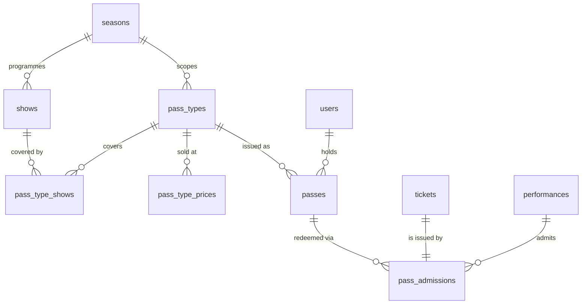

# Passes and season tickets — design

**Status:** **Phase 1 built** (August 2026) — schema, `canRedeem`, pass-type admin, and sell
and admit at the box office. Phases 2–4 remain as described in §9. Approved in principle by
Matt Adcock (IT Manager/Archivist 26/27), 10 August 2026.
**Decision record:** [ADR-0002](./decisions/0002-passes-as-first-class-entities.md)
**Target:** Autumn 2026 in-house/studio season, with festival passes following.

---

## 1. Why

The theatre has sold season passes since at least 2016 and stopped being able to see them properly
the moment the legacy system was replaced — because the legacy system never really modelled them.

What the Heroku/Django box office actually recorded, over 2016–2025:

| | Passes sold | Admissions used on a pass |
|---|---:|---:|
| Season ticket (public + NNT member) | 74 | 867 |
| StuFF day / festival / performer passes | 61 | 319 |
| **Total** | **135** | **1,186** |

Season pass admissions by show strand: In House 563, Fringe/Studio 294, External 10. StuFF passes
were used only on StuFF. Season passes peaked in 2017 at 331 admissions and settled at roughly 30 a
year thereafter.

Two things follow from that data.

**The product works.** 867 season admissions against 74 recorded sales is roughly twelve visits per
pass. Against a current £35 public / £28 member price and a ~10-show season, that is an effective
£3 a ticket versus £6–£8 at the door. Whether that is generosity or under-pricing is a committee
question, but it is not a dead product — it is a heavily-used one that the theatre currently cannot
account for. (Caveat: some passes were certainly sold outside the box office and never recorded, so
twelve is an upper bound on usage per pass.)

**Nothing was known about who held one.** `pricing_seasonticketpricing` contained two prices and
nothing else. There was no pass entity, no holder, no serial number, no validity window, no show
list, and no balance. A pass admission was a volunteer pressing a counter labelled "Season" on the
till screen. There is therefore no renewal list, no way to contact holders, no way to replace a lost
card, and no way to answer "was this pass valid for this show?" other than asking the person on the
door.

Proscenium should not reproduce that. It already has accounts, so a pass can have an owner.

## 2. What we are building

Four decisions, taken:

| Decision | Choice |
|---|---|
| **Entitlement** | **Unlimited within scope.** One admission to every covered show, no credit balance |
| **Scope** | **An explicit list of shows**, seeded from a season and editable afterwards |
| **Holder** | **Account-bound.** A pass belongs to a user (real or shadow), exactly like a booking |
| **Money** | Recorded on the pass, not as a ticket line |

And one design property that everything else hangs off:

> **Redeeming a pass produces an ordinary `tickets` row, priced at zero.**

That single choice is why this feature is small. Capacity counting, the door list, the collection
screen, "my bookings", the treasurer's CSV, the sold-out badge and the admin dashboard all operate
on tickets and reservations. If a pass admission *is* a ticket on a reservation, none of them need
to change to keep working. A pass holder appears on the door list like any other customer, with a
£0 line. The only genuinely new interfaces are selling a pass and looking one up.

### Entitlement, stated precisely

A pass grants **the right to book one seat at each covered show, at no charge, for as long as the
pass is valid**. It does not guarantee a seat — the pass holder books or turns up like everybody
else and is subject to capacity. "Unlimited" means unlimited entitlement, not reserved seating.
This must be in the terms of sale, because it is exactly the thing an unhappy customer will argue
about in the foyer.

One admission **per performance**, not per show, is what the database enforces (a unique index on
`(passId, performanceId)`). In practice that also means a holder could attend the same show twice on
different nights. That is a deliberate simplification: the check is trivial and unambiguous at the
door, and the historic data suggests heavy repeat attendance was the point. If the committee later
wants once-per-show, it is a second unique index and a rule change, not a redesign.

## 3. Schema

Five new tables plus one column on `shows`. Full Drizzle in
[`../schema/passes.ts`](../schema/passes.ts), migration in
[`../schema/0010_passes.sql`](../schema/0010_passes.sql).



### `seasons`

`Autumn 2026`, `Spring 2027`. Name, slug, start and end dates, sort order.

Seasons are useful well beyond passes — they are how the archive will eventually be browsed, and
they are the natural home for "everything In House this term". `shows.seasonId` is nullable, because
externals and one-offs do not belong to one.

Note this is **orthogonal to `shows.categoryId`**, which the legacy migration adds (In House,
Studio/Fringe, StuFF, External). Category is *what kind of show*; season is *when*. A pass typically
scopes to one season and one or two categories, but it stores the resulting show list explicitly
rather than the rule.

### `pass_types`

The product. `Autumn 2026 Season Pass`.

| Column | Purpose |
|---|---|
| `seasonId` | The season it was generated from. Nullable |
| `status` | `DRAFT` / `ON_SALE` / `CLOSED` |
| `validFrom`, `validTo` | The window in which admissions may be redeemed |
| `salesOpenAt`, `salesCloseAt` | When it can be bought. Nullable = always, while `ON_SALE` |
| `maxIssued` | Optional cap on how many can exist. See §6 |
| `transferable` | Default false |

`validFrom`/`validTo` do more work than they look like they do — see §7 on festivals.

### `pass_type_prices`

`Public £35`, `NNT Member £28`. A pass type has one or more price variants rather than being
duplicated per price point, so there is exactly one show list per product and no way for the two
prices to drift apart in what they cover. Legacy modelled these as two separate till counters
(`number_season_sale`, `number_season_sale_nnt`) and that is precisely the shape that made the data
unanalysable.

### `pass_type_shows`

The scope: an explicit `(passTypeId, showId)` list.

Created by seeding from a season — "add every In House and Studio show in Autumn 2026" — and then
editable. Explicit-with-a-seeder rather than a stored rule, because:

- it is auditable: you can print the list of shows a pass covers and put it on the website;
- shows get added and pulled mid-season, and a rule cannot express "everything except this one";
- a show added after passes were sold can be granted to existing holders by inserting one row, which
  is the behaviour you want and is impossible to get wrong.

### `passes`

An issued pass. `passTypeId`, `passTypePriceId`, `userId`, a 6-character `reference` from the same
unambiguous alphabet as `bookingRef`, `status` (`ACTIVE`/`CANCELLED`/`EXPIRED`), `pricePaid` in
pence, `issuedAt`, `issuedByUserId`, and a nullable `reservationId` recording the door transaction
it was sold alongside.

### `pass_admissions`

The ledger. One row per redemption: `passId`, `ticketId` (UNIQUE — one ticket is one admission),
`performanceId`, `redeemedAt`, `redeemedByUserId`.

`UNIQUE (passId, performanceId)` is the entitlement rule, enforced by the database rather than by
application logic. Given there are no transactions in D1, pushing this invariant into an index
matters: it is the only thing that will hold under a double-submit.

## 4. Flows

### Selling a pass at the box office

1. Staff open **Sell pass** from the box office screen.
2. Look up or create the customer by email — same shadow-account path as a walk-in booking.
3. Pick pass type and price variant. Take the money as cash or card, as now.
4. `POST /api/passes` → creates the `passes` row, returns the reference.
5. Confirmation email with the reference and the list of covered shows.

If the sale happens during a performance transaction, pass `reservationId` so the pass and the
night's takings are linked.

### Redeeming — online, logged in

In the booking flow, a logged-in user with an `ACTIVE` pass covering that show sees an extra option:
**Use my pass — £0**. Selecting it books a normal reservation containing one pass-admission ticket.
Everything downstream is unchanged.

Guests cannot redeem: there is no identity to redeem against. That is the intended consequence of
account-binding, and it is a mild incentive for holders to hold an account.

### Redeeming — at the door

1. Staff search by pass reference, name or email in the box office screen.
2. The pass card shows: holder, status, validity, whether this performance is covered, and whether
   it has already been redeemed tonight.
3. **Admit** creates a reservation with one £0 pass-admission ticket, `status = DOOR`, and the
   `pass_admissions` row.

If the holder already has a reservation for that performance, admit against the existing one rather
than creating a second.

### The validation rule, in one place

`server/utils/passes.ts` exports one function and everything calls it:

```ts
canRedeem(pass, performance) → { ok: true } | { ok: false, reason: PassRejection }
```

Rejection reasons, all of which need a sentence of copy a volunteer can read out:

| Reason | What the door says |
|---|---|
| `PASS_NOT_ACTIVE` | "This pass has been cancelled — please see the Box Office Manager." |
| `OUTSIDE_VALIDITY` | "This pass ran to 31 March; it doesn't cover tonight." |
| `SHOW_NOT_COVERED` | "This pass covers the In House season — this one's an External hire." |
| `ALREADY_REDEEMED` | "This pass has already been used for this performance." |
| `PERFORMANCE_NOT_ON_SALE` | staff override permitted |
| `SOLD_OUT` | "We're full tonight, I'm afraid — the pass doesn't reserve a seat." |

Do not reimplement this check in the UI. There are already five copies of the ticket-price
resolution rule in this codebase ([06-pricing-and-ticket-types](./06-pricing-and-ticket-types.md));
do not start a sixth family.

## 5. Reporting and money

Pass revenue lives on `passes.pricePaid`, not on a ticket. That means **every revenue query must
union two sources**, and the ones that exist today do not:

- `GET /api/admin/stats` — revenue currently sums `tickets.pricePaid` for `COLLECTED`/`DOOR`,
  non-refunded. Add pass revenue by `issuedAt`.
- `GET /api/admin/export/tickets` — the treasurer's CSV. Either add a pass column or ship a second
  export; a second export is cleaner, since a pass is not a per-performance line.
- Anything showing "revenue by show" needs a decision: **a pass admission earns £0 for the show it
  is used on.** Attributing a share of the pass price across the shows a holder attended is possible
  but is management accounting, not box office. Recommend: report pass income as its own line, and
  report pass admissions as attendance without revenue. Say so on the report, or the In House
  Coordinator will think their show took less than it did.

New reports worth having, none of which were possible before:

- Passes sold this season, against `maxIssued` and against last year.
- Admissions per pass — the utilisation number that tells you whether the price is right.
- Holders who have not renewed. This is the first time the theatre can have a renewal list at all.

## 6. Capacity and overselling

Passes create a real commercial risk that the legacy system had too and never surfaced: sell 200
season passes into an 86-seat auditorium and a popular night turns pass holders away.

Three mitigations, in order of importance:

1. **Pass admissions consume capacity like any other ticket**, because they *are* tickets. There is
   no separate pool to reconcile. This is the main protection and it is free.
2. **`passTypes.maxIssued`** — a hard cap, checked at sale.
3. **A pass-pressure readout** on the box office performance view: passes issued that cover this
   show, against remaining capacity. A number a human can act on, not an alert.

State the policy in the terms of sale (§2) and the problem becomes a communications one rather than
a refund one.

## 7. Festivals come almost free

The brief was in-house/studio seasons now, festivals later. The model already covers the StuFF
passes without new code, because `validFrom`/`validTo` is doing the work:

| Legacy product | As a pass type |
|---|---|
| **Festival Pass** (£15) | Scope = every StuFF show in the season. Validity = the festival weekend |
| **Day Pass** (£10) | Same scope. Validity = one calendar day |
| **Performer Pass** (£10) | Same scope and validity as the festival pass; `notes` records eligibility |

A day pass is not a different kind of object — it is a pass whose validity window happens to be
24 hours. The only thing needed for StuFF 2027 is data entry, plus a decision about whether performer
eligibility should be enforced (recommend not: the box office knows who is performing, and encoding
it means a cast list in the database).

Fringe/Edinburgh transfers, and anything sold by an external venue, stay outside this model.

## 8. What happens to the historic pass data

Nothing is retro-fitted. The legacy import maps historic pass activity onto archived ticket types of
kind `PASS_SALE` and `PASS_ADMISSION` — 135 sales and 1,186 admissions — and creates **no `passes`
rows**, because no holder was ever recorded and inventing one would be fabricating an archive.

The consequence to document: revenue from the legacy period sits in `tickets.pricePaid`, revenue
from 2026 onwards sits in `passes.pricePaid`, and any multi-year revenue comparison must add both.
That is ugly, and it is still better than pretending we know who held a pass in 2017.

See [ADR-0003](./decisions/0003-legacy-ticketing-import.md).

## 9. Delivery

| Phase | Scope | Needed by |
|---|---|---|
| **1** ✅ | Schema + migration (`0011`); `seasons` and `shows.seasonId`; pass type admin at `/admin/passes`; sell and admit at the box office; `canRedeem` in `server/utils/passes.ts` | **Built August 2026** |
| **2** | Online redemption in the booking flow for logged-in holders; pass in "my account" | Ideally the same term; season is usable without it |
| **3** | Reporting — pass revenue in stats, utilisation, renewal list | End of Autumn term, when you first want the numbers |
| **4** | Festival pass types for StuFF | Spring, ahead of the festival |

Phase 1 depends on `ticket_types.kind`, which is introduced by the legacy-import migration
(`0009`). If passes ship first, move that column into the passes migration.

**Do not build:** online pass purchase (there is no payment integration at all — see
[02-architecture](./02-architecture.md)), pass PDFs or wallet passes, transfer between holders, or
partial refunds. None are needed to sell a pass in September.

## 10. Open questions for committee

1. **Price and scope for Autumn 2026.** £35/£28 is what the legacy config held; `_data/pricing.yml`
   in the old website says £38/£32. Neither has been reviewed against the twelve-admissions-per-pass
   utilisation figure.
2. **Does the pass cover External hires?** Legacy allowed it per-show via an `allow_season_tickets`
   flag that visiting companies presumably negotiated. Only 10 admissions in a decade, so the
   simplest answer is no — but it is the hirer's revenue, so it is a conversation, not a default.
3. **Does a pass guarantee entry?** §2 says no. Confirm before anything is printed.
4. **Concessions.** Two price variants exist today. A student/concession pass would be a third row,
   not new code.
