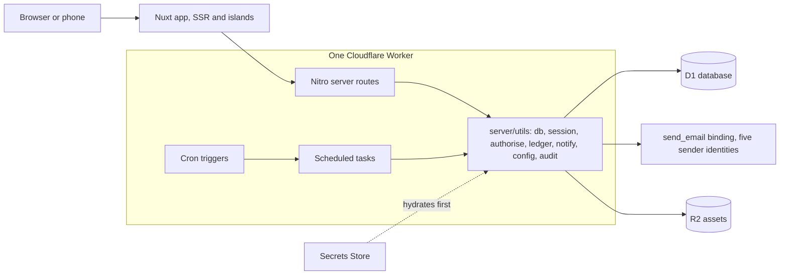
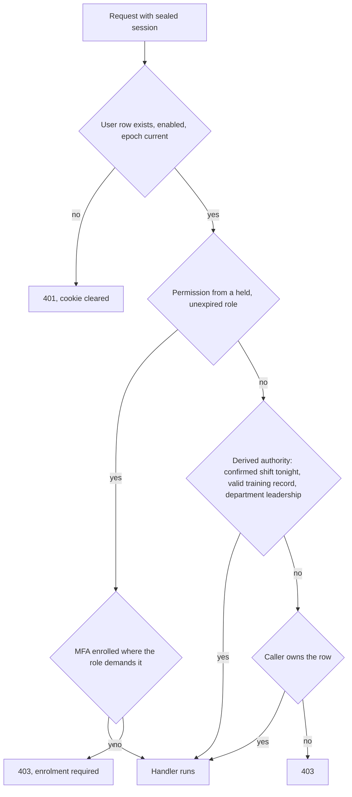

# Architecture

How the unified system is put together. The decisions in `decisions/` are the why; this is
the shape. Companion: `data-model.md` for every table.

## Runtime

One Nuxt 4 application on Cloudflare Workers (`cloudflare_module` preset), one D1 database,
one deployed worker serving `newtheatre.org.uk`. There are no other services: no queues, no
Durable Objects, no cross-app calls. Email leaves through the `send_email` binding (Email
Service, decision 0002) as one of five sender identities on the single onboarded domain
`newtheatre.org.uk`, none of them a `no-reply` (0020); files (posters, venue images) live in
R2; secrets shared beyond one worker live in the account Secrets Store, hydrated by the
first-registered server plugin before anything reads a session (the `0.` prefix pattern
carried from the estate).



## Code layout

Modules from the backlog map one-to-one onto directories. Nothing imports across module
boundaries except through `server/utils/` and `shared/`.

```
app/                    pages, components, composables, plugins (grouped per module)
server/
  api/<module>/         one route per file, Nitro conventions
  utils/                the shared spine: db, session, authorise, ledger, notify,
                        config, audit, conditional-write helpers
  tasks/                scheduled tasks (below)
  plugins/              0.secrets-store, authorisation resolver
shared/utils/           zod schemas, permission map, enums, pure domain logic
                        (Europe/London dates, expiry arithmetic, pricing resolution,
                        validity). Auto-imported into both the application and the server,
                        because a time shown to a member is pinned the same way as one the
                        server reasons about.
shared/types/           types shared across the same boundary
content/                Nuxt Content: editorial pages, policy pages with config tokens
migration/              the SP-3 tooling (standalone, never imported by the app)
tests/                  unit / integration / e2e, bun test
```

### The shared registries

Eight files in `shared/utils/` are appended to by every module: `ledger.ts` (line kinds),
`notifications.ts` (message types), `audit-actions.ts` and `audit-coverage.ts`, `config.ts`,
`personal-data.ts`, `site-nav.ts` and `personas.ts`. Each is divided by one-line banners naming
the backlog modules that have entries there or are expected to (`// Module F: bar`), and an
addition goes inside its own module's section, so two branches adding at once land in different
hunks instead of the same one. A banner with nothing under it is a section waiting for its module,
not an oversight; a module with nothing to add to a registry has no banner in it, and adds one
when it does. `tests/unit/registry-banners.test.ts` holds the banners to the module letters, and
holds every audit action, ledger kind and module-named route to the section it belongs in.

## Routes and shells

A prefix names the domain; the shell follows the posture of the work rather than the URL (0040).
`/admin` means System and nothing else.

| Prefix | Shell | Who |
| --- | --- | --- |
| `/`, `/sign-in`, `/register`, `/verify`, `/reset`, `/magic`, every `content/*.md` path | `default` | Anybody |
| `/rooms`, `/rooms/mine`, `/account/*` | `member` | A member, about themselves |
| `/rooms/manage/*`, `/people/*`, `/box-office/*`, `/bar/*`, `/money/*`, `/admin/*` | `console` | Somebody working for the theatre |
| `/tonight/*` | `tonight` | Somebody on shift, on a phone |

A domain with both audiences puts the member's screens at the top and the console's under `manage`
(`/rooms` against `/rooms/manage/requests`). A domain with no member surface sits flat
(`/people/accounts`, `/bar/products` and `/bar/stock`). Every navigable destination is declared once
in `shared/utils/site-nav.ts`, which the console sidebar renders and the console middleware guards
from, so a deep link and the sidebar cannot disagree.

### Route namespaces

Which stream owns which routes while the MVP is built in parallel (`build-order.md`). Ownership is
about who edits a file, not about who may link to it: a stream adds a route inside its own
namespace, and asks the owner for one anywhere else.

| Stream | Routes and files owned |
| --- | --- |
| Box office | `/whats-on`, `/shows/[slug]`, `/book`, `/qr` (retrieval, resend and self-service edit and cancel while unpaid: D-108, D-110), `/passes` (a pass's own QR retrieval, D-124), `/account/passes`, `/my/bookings`, `/box-office/**`, `/tonight/door`, `content/`, `app/pages/[...slug].vue` (the content catch-all, D-103) |
| Show night | `/rota` and `/rota/manage/**` (templates, rota administration, the venue emergency card and the backstage board's own milestone types and presets at `/rota/manage/backstage`), the `/tonight` hub, `/tonight/incidents`, `/tonight/register`, `/tonight/checklist`, `/tonight/board`, `/tonight/close`, `/board`, `/api/tonight/**`, `/api/admin/rota/**`, `/api/admin/backstage/**`, `/api/board/**` and `server/utils/night-authority.ts`. The console screens sit under `/rota/manage`, never `/admin`: `/tonight` is the phone-first shell rather than a console prefix (0040, 0046). |
| Bar | `/tonight/till`, `/tonight/till/comps`, `/bar/**`, `/bar/stock/**` |
| Platform | `/policies/**`, `/admin/config`, `/admin/docs`, `/admin/backups`, `/admin/retention`, `migration/**`, `app/components/Night*.vue`, `app/composables/useNightCache.ts`, `app/composables/useWriteQueue.ts`, `tests/helpers/race.ts` |
| Communications | `/account/notifications`, `/comms/**`, `server/utils/notify.ts`, `server/utils/notification-preferences.ts`, `shared/utils/notifications.ts`, `shared/utils/senders.ts` |
| Finance | `/money/**`, `/api/admin/finance/**`, `server/utils/finance-reports.ts` (build-order.md split module I into its own stream once the finance tail started) |

`/tonight` is the one prefix three streams write under, which is why the shell below is owned by
one of them and settled before any of the screens are built. The hub page itself was written by
platform far enough to exercise the shell, and its content belongs to show night from E-112.

### The content catch-all

One page, `app/pages/[...slug].vue`, renders every markdown file under `content/`: a page's route
is its path under `content/` (`content/about.md` is `/about`), found through the `content`
collection declared in `content.config.ts` and rendered with `ContentRenderer`. A path with no
matching file is a 404, never a blank screen. This is the pipeline D-103's editorial pages and
J-110's policy pages share: J-110 adds files under `content/`, not a second route.

A page carrying `placeholder: true` in its frontmatter renders a banner saying so (D-103); it is
how copy the committee has not yet supplied reaches the site honestly rather than not at all.

### Policy tokens (J-110, 0012)

A policy page writes `{{ROOM_MAX_BOOKING_HOURS}}` in its prose and the page renders the live value
of that setting, so the published rule and the rule the write path enforces are one document. The
number is never in the markdown, so changing a setting changes the page with no content edit.

The markdown parser reads `{{KEY}}` as MDC interpolation and leaves a `binding` node in the parsed
page, which renders as **blank** if nothing resolves it: that is the failure J-110 criterion 4
forbids, and it is why the resolver handles the binding node rather than trusting the raw text.

| Piece | Where | Does |
| --- | --- | --- |
| The token rules | `shared/utils/policy-tokens.ts` | Finds tokens in a parsed page, formats a value for what its key measures (hours, minutes, days, weeks, months, years, pence, per cent, yes or no, a list read as a sentence), and decides what a page may quote at all. Pure, so the CI check, the endpoint and the page cannot disagree. |
| The build check | `scripts/check-content-tokens.ts` | Refuses a token naming a key the schema does not have, and refuses one naming a key that holds personal data, before it can reach a page a visitor reads. |
| The values | `GET /api/policies/values?path=...` | Answers with the live value of every setting **that page** names, keyed on the page rather than on a list of keys from the caller, so it cannot become a way to read the settings surface. Never cached. |
| The rendering | `app/pages/[...slug].vue` | Substitutes each token before `ContentRenderer` sees the page. |

Three things a token can be, and all three are visible on the page rather than silent:

- **Resolved**: the live value, formatted for its unit.
- **Stated but unenforced**: the value, marked "not enforced yet". A key is enforced when the
  server actually reads it, which `ENFORCED_KEYS` records and a test greps the server to verify,
  so the mark cannot drift from the truth (criterion 5).
- **Unresolvable**: a visible error naming the key, never a blank and never stale text. The build
  check makes this unreachable from the repository, so it is the last line of defence for a key
  unset after the page was written or a stale content database (criterion 4).

A setting that holds personal data (`isSensitive`) can never appear on a policy page: CI refuses
the token and the endpoint refuses the key, so neither a preview nor a deploy can publish it.

## The identity screens

`/sign-in` and `/register` are the two entry points, and each carries its own steps rather than
sending the visitor to a URL that means nothing on reload: the MFA challenge, the forgotten-password
and sign-in-link requests, and the check-your-email panel are all states of the page the person is
already on. Only three routes exist because an email points at them, and each is reached with a
token in the query string:

| Route | Consumes |
| --- | --- |
| `/verify?token=` | `POST /api/auth/verify`, offering a fresh send on a 410. A token issued by an address change is bound to that address and confirms no other (A-115) |
| `/reset?token=` | `POST /api/auth/password/reset` |
| `/magic?token=` | `POST /api/auth/magic-link/consume`, which may answer with an MFA attempt |

Who is signed in is read once during rendering by `app/plugins/account.server.ts` into the
`nnt-account` state, and re-read by `useAccount().refresh()` after anything that changes the
session. A component awaiting that read instead would hold Suspense open and ship a page that never
becomes interactive.

## Identity and authorisation

- Sealed first-party session cookie (nuxt-auth-utils), 30 days, epoch-revoked (0007).
  Privileged requests re-verify the user row every time; there is no staleness window.
- Authorisation resolves from three sources, in order:
  1. **Permissions** from held, unexpired roles via the static permission map in `shared/`.
     `server/utils/authorise.ts` owns this, and `requirePermission` is the guard.
  2. **Derived authority**: tonight's confirmed shift (04:00 to 04:00 London, `showNightOf`), a currently
     valid training record, department leadership. Computed by joins at request time, never
     cached beyond the request (0009). It resolves in the module utility that owns the fact it
     derives from, behind a guard of its own: `server/utils/training.ts` reads department
     leadership, and `requireCatalogueReader` and `requireCatalogueAuthority` are its guards.
     Trainer and supervisor standing resolve in the same file, through `trainerStandingOf` and
     the `requireTrainer` guard: somebody is a trainer if and only if they currently hold a
     record on a module marked trainer-granting, and expiring counts as held. It is never a role
     and never a flag, so revoking the certification is the whole of taking the standing away
     (0037, G-111). Show-night authority resolves in `server/utils/night-authority.ts` behind
     `requireNightAuthority`, and has a section of its own below.
  3. **Ownership**: the row's own user id.
- Guards are server-side and fail closed; route middleware is rendering convenience only.
- `nuxt-authorization` abilities (`shared/utils/abilities.ts`) are named views over the same
  permission map, used to decide what the chrome shows. Two resolvers hand an ability its viewer:
  `server/plugins/authorisation.ts` from the account row and its live grants,
  `app/plugins/authorization.ts` from the account snapshot. Neither reads authority from the
  cookie, and neither replaces `requirePermission`, which also holds the MFA gate (0040).
- MFA (TOTP + passkeys) is enforced at guard level for permission-bearing roles (0008).
- A passkey is a complete sign-in and no challenge follows it: the authenticator verified the
  person before it would sign, so the credential step and the second step happened at once
  (A-105). `nuxt-auth-utils` verifies both ceremonies with `requireUserVerification: false`, so
  that rule is enforced in `shared/utils/passkeys.ts` and checked in both handlers.



## Money and the ledger

Every monetary fact posts to `ledger_entries` (+ `ledger_lines`) in the same batch as its
domain write (0004). `server/utils/ledger.ts` is the only writer. Reconciliation, dashboards
and exports are queries over the ledger; no module keeps its own money totals.

### The posting contract

`postEntry(input, at?)` validates the entry, computes its total from its lines and **returns the
statements the caller batches**. It performs no write of its own, because money and the thing it
paid for commit together or not at all (0001, I-102 criterion 6), and only the caller knows what
the other half of the batch is. Nothing else writes to the ledger tables: `check ledger` fails the
build on any file under `server/` other than `server/utils/ledger.ts` that does, and on any script
that reaches the tables in raw SQL.

Three rules follow, and every money path obeys them:

- The entry's total is the sum of its lines, never supplied by the caller. A comp is zero with its
  full price on the line, so foregone value is a figure rather than an absence (I-103).
- A correction is a new entry naming what it corrects in `reversesEntryId`, with negative amounts.
  Nothing is edited; the triggers refuse it (0010).
- The screen sends its expected total in pence, and the route that takes the money refuses a
  mismatch quoting both figures (0005). That check belongs to the money-taking route, not to
  `postEntry`, which has no view of what the screen was showing.

Two columns the entry form does not yet carry, because the module that fills them is not built:
`void_of_entry_id`, which F-109 sets when it voids a tab charge, and the discount snapshots
F-117 writes. Both are on `ledger_entries` already, so adding them is a change to the form and
the helper, never to the table (0010).

Every caller batches `postEntry()`'s statements through `runLedgerBatch()`, not `db.batch()`
directly, so a closed period refuses with a 409 wherever the write is attempted rather than in
whichever call site remembered to catch it (I-107, and see "Period close" below).

### Period close (I-107)

A period (a term, a season, any range the treasurer names) closes as a row in `period_locks`,
never as a flag on the entries it covers: closing cannot mutate what it closes, the same rule
that keeps the ledger itself append-only (0010). The enforcement is a single trigger,
`ledger_entries_refuses_a_closed_period`, `BEFORE INSERT ON ledger_entries`: a day is locked if
the latest `period_locks` row covering it (ordered by `created_at`) is `CLOSED`, whatever its
close and reopen history. `runLedgerBatch()` catches the trigger's refusal and turns it into a
409; every one of the six modules that call `postEntry()` now goes through it, so a closed period
is refused at the write for the whole estate, not for whichever caller remembered to check.

Reopening (criterion 4, an administrator only, `finance.reopen`) inserts a new `REOPENED` row for
the same range rather than editing the `CLOSED` one; re-closing after that is another new row.
Nothing is ever superseded by reference, because "the latest row for this range" is already a
well-defined answer without one. The typed confirmation is the range itself, read back from the
lock being reopened and compared against what the caller submits, the same shape A-123's merge
confirmation uses.

Closing warns before it commits (criterion 5): `blockingConditionsFor()` lists nights in the
range with no Z reading at all, and nights whose reading still carries an open variance, both
read from I-104's own outstanding-night queries rather than reimplemented. A warning is not a
refusal; the treasurer closes past it if that is the right call.

A term, unlike a season, has no fixed formula, so `periods` (`POST /api/admin/finance/terms`)
names one ahead of closing it: a label and a range, defined once. `shared/utils/season-dashboard.ts`'s
`periodBounds()` gains a `TERM` kind that takes the range directly, the same as `DAY` and `WEEK`
already do, so the file stays a pure function reading nothing from the database itself; the
caller resolves a term's dates from `GET /api/admin/finance/terms` before asking for its bounds.
Closing a term reads its range from that same list and posts it through the ordinary close, which
has no notion of "term" at all: a lock is a range and an optional label, whatever named it.

### SU accounting exports (I-108)

A period export (`GET /api/admin/finance/export?fromDay=...&toDay=...`) is one CSV row per
ledger line in the range, categorised against `su_nominal_mappings`. Decision 0025 refuses a
config key that holds a record, so the mapping from a `(kind, source)` pair to an SU nominal code
is its own table, seeded from the posting table below and only ever `UPDATE`d, the same shape
`incident_severity_config` already uses: nothing here creates or removes a pair, only changes
what one maps to, and every change is audited with the from and to values (`finance.nominal-mapping.changed`).

Nothing in the export is a computed total. Each row carries a ledger line's own signed
`amount_pence`, exactly as `ledger_lines` stores it; a refund line is already negative at the
source (`server/utils/refunds.ts`), so summing a category's rows reaches the same net figure
I-106 reports for the same lines without this route deriving it a second way. A line whose pair
has no mapping still exports, on its own row with an explicit `UNMAPPED` code (criterion 3),
never dropped. The row count is capped (`SU_EXPORT_ROW_CAP`) and the nominal code column runs
through `toCsv`'s formula-injection guard (D-129) like every other user-typed export cell.

**An open period exports anyway, permitted but marked, never refused.** A treasurer may need a
figure before closing (a return is due, a close is still being prepared), and refusing until
close would make I-108 depend on a close that has its own separate warnings and workflow
(I-107). `isRangeClosed()` checks the requested range against `period_locks` the same way a day
is checked, and the response carries the answer as `x-period-status: closed|open` rather than a
CSV column, so the file itself stays exactly the shape the SU's own import expects. A range only
partly closed reads as open: nothing here assumes a term is closed in one row.

### The money paths

The triple every path posts under. A module adding a money path adds a row here in the same pull
request; a unit test reads this table, so a kind in the code and not in a row is drift. `source`
and `tender` are database CHECKs and cannot be widened; `kind` is the enum in
`shared/utils/ledger.ts` (0033). `SYSTEM` is reserved for an entry no person took: no MVP path
posts one.

**Every row below carries the financial day for calendar grouping, never the show night.**
`london_day` is the plain London calendar day of `happened_at`, written by `londonDayOf` in
`shared/utils/ledger.ts`; a month or season total groups by it. Reconciliation to the reader's own
Z is scoped to the show night instead, not the calendar day: the reader is read once per night,
not once per calendar day, so a night that crosses midnight would otherwise split one physical
reading across two days and read as a discrepancy every time it happens. F-118's till close and
I-104's own daily reconciliation both resolve the night from `showNightBounds` (E-110, 0014) and
never from `london_day`; the ledger holds no night column and gains none.

| Money path | Posts when | Module | Source | Tender | Kind |
| --- | --- | --- | --- | --- | --- |
| Desk collection | The reader is paid at collection, never at reservation (D-114) | ticketing | `DESK` | `CARD` | `TICKET_COLLECTION` |
| Comp admission | A comp is issued at collection (D-114); gated behind an approved `ticket_comp_requests` row, claimed atomically at collection, rather than the `ticketing.manage` permission it once was (D-117) | ticketing | `DESK` | `COMP` | `TICKET_COLLECTION` |
| Walk-up sale | Reservation and payment in one desk flow (D-115) | ticketing | `DESK` | `CARD` | `WALK_UP` |
| Refund | The money is handed back, one entry per ticket (D-116) | ticketing | `DESK` | `CARD` | `REFUND` |
| Pass sale | A pass is issued and paid for at the desk (D-124); or a Fellowship is awarded, which issues one at zero value in the same batch, nobody at a desk (D-130, 0023) | ticketing | `DESK`, `SYSTEM` | `CARD`, `NONE` | `PASS_SALE` |
| Pass admission | A pass covers a seat, online or at the door (D-125, D-126); a Fellow's own entitlement rides the identical path (D-130) | ticketing | `SELF_SERVE`, `DESK` | `NONE` | `PASS_ADMISSION` |
| Bar item | The sale, its lines and its stock movements commit together (F-105); a sale after midnight is the calendar day it happened on, not the night's; a discount, if any, is net into `amount_pence` and snapshotted alongside it (F-117) | bar | `TILL` | `CARD`, `COMP`, `TAB` | `BAR_ITEM` |
| Tab charge | Credit extended, not money taken (F-108); the entry stamps the debtor and stays outstanding until settled, capped per holder unless a duty manager or bar manager overrides it | bar | `TILL` | `TAB` | `BAR_ITEM` |
| Comp given | Requires a prior request with a reason, approved by tonight's duty manager or the bar manager, never the requester (F-110); the same policy D-117 states for a comp admission, that giving away value takes more than the operational access that lets you sell. `amount_pence` is zero and `unit_price_pence` stays the retail price, so the foregone value is queryable | bar | `TILL` | `COMP` | `BAR_ITEM` |
| Tab settlement | A tab is settled on the reader, bounded to the charges it covers (F-109); the settlement's own calendar day, not the charges' | bar | `TILL` | `CARD` | `TAB_SETTLEMENT` |
| Void of a tab charge | An unsettled charge is voided with a reason (F-109); the calendar day of the void, not of the charge | bar | `TILL` | `TAB` | `BAR_ITEM` |
| Imported history | Six years of the old estate load as opening history (I-109, K-114) | finance | `IMPORT` | `CARD`, `NONE` | `IMPORT` |

Reading the table:

- A refund, a void and any other correction carry negative amounts and set `reversesEntryId` to
  the entry they correct. A void additionally names the tab charge in `void_of_entry_id`, which
  no other path sets. Both rows stay, and what is owed is the sum across them.
- A comp and a pass admission both total zero. The comp keeps the full price in
  `unit_price_pence` so foregone revenue is queryable; the pass admission is genuinely free, and
  its value is the pass sale that already posted.
- The door is the desk: `source` names the surface money was taken on, and `DESK` covers both.
  What tells a walk-up from a collection is the kind, and the reservation's own `DOOR` source.
- `IMPORT` tenders `NONE` where the old estate recorded none. Imported history lands into closed
  periods (I-109 criterion 3), keeping each entry's original calendar day.
- Once the import has run in an environment, `ledger_entries` and `ledger_lines` carry six years
  of real rows. Anything asserting on ledger contents there scopes to what it wrote, never to an
  assumed-empty table.
- The night a performance belongs to comes from the performance, and a till session's night comes
  from `showNightOf` (E-110). Neither is read off `london_day`, and no path writes both.

## Concurrency on D1 (0003, 0006)

- Atomicity is `db.batch` only. The contended claims (seat capacity, shift claim, register
  delivery, waiting-list offers, promotion notifications) are conditional writes: the guard
  predicate rides on the INSERT or UPDATE, zero-rows-affected is disambiguated explicitly
  (gone versus beaten), and at-most-once rules are unique indexes.
- Parameter discipline: chunk at 90, scope by subquery, never an IN list from a result set.
  Compound SELECTs also cap low on D1; use scalar subqueries for multi-count reads.
- Each claim has a racing test in CI (0016).
- A constraint violation is refused, not rethrown as a 500: `shared/utils/constraint-refusal.ts`
  exports `constraintRefusal(table, error)`, anchored to the two real D1 error shapes. Each
  module keeps its own `ConstraintRefusal[]` table beside the write path it guards, and calls the
  shared function; there is no central list to append to (0047).

## Scheduled tasks

All Nitro scheduled tasks mirrored in wrangler cron triggers. The system notices, humans
decide (principle P6): no task ever awards a record, approves a request or takes money.

`sessions:sweep` is the one remaining stub, reporting the story it is waiting for and doing
nothing else; the rest do their work, `holds:release` from D-106 and D-107, `backup` from K-108
and J-107, `health:watch` from J-106, `retention:sweep` from K-111 (which is A-126, built
without naming it), and `nights:close` from E-125.

| Cron (UTC) | Task | Does |
| --- | --- | --- |
| `*/10 * * * *` | `holds:release` | Sends pre-expiry hold reminders (`HOLD_REMINDER_MINUTES_BEFORE`, 60 by default), then releases expired reservation holds (D-106, D-107). The one task that changes booking state, and only ever in the direction the customer was warned about. The waiting-list cascade is D-113's, not yet built. |
| `*/10 * * * *` | `health:watch` | Opens a `health_incidents` row on the first unhealthy `/api/health` check, notifies the IT Manager through the notification centre once `HEALTH_ALERT_WINDOW_MINUTES` has passed with it still open, and closes it the moment a check recovers so the next failure alerts again from cold (J-106 criterion 5). The CI-side "after every deploy" half of criterion 3 is `.github/workflows/health-watch.yml` and `migrate.yml`'s own `health` job, both outside the application. |
| `*/10 * * * *` | `notifications:retry` | Sends failed messages again, one claimed row at a time, when the doubling backoff since enqueue has passed (`NOTIFICATION_RETRY_BACKOFF_MINUTES`, 10 by default); marks an entry `FAILED_FINAL` once `NOTIFICATION_MAX_ATTEMPTS` is spent, so five attempts span about two and a half hours. Every guard runs again on each attempt, so an address change, a preference change or an erasure in between is honoured (H-105, 0056). Capped at 100 rows a run. |
| `*/10 * * * *` | `notifications:digest` | Claims and sends every topic-and-person digest whose window has passed (`NOTIFICATION_DIGEST_WINDOW_<TOPIC>_MINUTES`, 60 minutes each by default), one email per pair, capped at 100 pairs a topic a run (H-104). |
| `0 6 * * *` | `training:expiry-sweep` | Expiry warnings and digests (dry-run gated). |
| `0 7 * * *` | `shifts:escalate` | Emails whoever holds `rota.write` one digest of every performance inside seven days with an open shift or an unconfirmed duty manager, the second flagged distinctly on its own line; sends nothing when the week is fully staffed (E-108). |
| `0 8 * * *` | `rooms:sweep` | Tells the approvers about room requests that have been waiting, once each, and lapses the ones that waited too long (C-108). Union requests are chased the same way but never lapse: expiry frees a held slot, and a union request holds none (0036). |
| `0 9 * * *` | `sessions:sweep` | Session reminders and unmarked-register nags (G-119, not yet built). |
| `0 10 * * *` | `shifts:remind` | Tomorrow's confirmed shift holders, one message per shift with a calendar attachment carrying the call time (E-109). Idempotent per shift, read from `notification_log`'s claim column rather than a column on `shifts`. |
| `0 11 * * *` | `passes:expire-requests` | Lapses a pending pass request once its product's own sales window has closed unfulfilled, capped per run like `holds:release` (`PASS_REQUEST_EXPIRE_BATCH_CAP`, D-124 criterion 3). |
| `0 17 * * *` | `rooms:remind` | Tomorrow's room bookings, one message per member however many they hold, with the calendar file attached (C-113). Idempotent: a second run the same London day sends nothing, read from `notification_log` rather than a column. |
| `12 0 * * *` | `nights:close` | Any performance still open 24 hours after its own show night ended is frozen as `SYSTEM`, no signatory, distributed under a distinct subject line, and told to whoever holds `night.manage`, once each (E-125). Distribution rides `sendRaw()`, not `notifyAddress()`, so a failed send is not retried by `notifications:retry` (`docs/known-issues.md`). |
| `0 4 * * *` | `daily:sweeps` | Comp expiry tidy, backstage free-text purge, withdrawn access profiles, lapsed rate limits, lapsed MFA attempts, unclaimed sign-in tokens, the send-log prune at `NOTIFICATION_LOG_RETENTION_MONTHS` (H-105 criterion 5, and retries are `notifications:retry`'s rather than this task's), the digest entries a pruned send left behind (H-104, 0061), unverified account expiry (0026), and the role-lapse work: one warning per holder covering every grant of theirs inside `ROLE_LAPSE_NOTICE_DAYS`, claimed per grant and expiry so moving a date re-arms it; a monthly digest to administrators on the first, carrying what is lapsing, what lapsed inside the prune window and every permanent grant; and the tidying of grants lapsed longer ago than `ROLE_GRANT_PRUNE_DAYS`. Both the warning and the tidy write the trail with no actor, which is what attributes them to system (A-119, 0009). |
| `0 5 * * 1` | `backup` | A row-count and ledger-total manifest to R2 (the `BLOB` binding), independent of D1. A failure audits `backup.export-failed` rather than only logging. Point-in-time restore is D1 Time Travel, already automatic; the restore drill and its cadence are administered at `/admin/backups` (K-108, J-107). |
| `0 4 1 * *` | `retention:sweep` | Two independent warnings (window and final) for an account approaching its inactivity threshold, a sign-in re-arming the claim by carrying `lastLoginAt` in its key; exempts a current member, a live role holder and an unsettled tab debtor; warns neither an unverified address nor an unclaimed guest, which are anonymised on their own clock without ever being written to; anonymises what is past its threshold, reusing `eraseAccount()`. Warnings and anonymisations carry a cap each (`RETENTION_WARNING_CAP`, `RETENTION_SWEEP_CAP`), and a run that hits one reports the figure in the digest rather than deferring the surplus. The digest always sends, dry-run or armed, since it is what the IT Manager reviews before arming (0011, A-126, K-111). |

## Notifications

One centre (`server/utils/notify.ts`, decision 0013): per-topic preferences, transactional
always delivers, digest coalescing, full send log with retries, undeliverable and anonymised
addresses dropped before the provider. Channels: email now, in-app inbox now, push when it
actually delivers.

### Preferences and the inbox (H-102, 0054)

Five topics, two switchable channels, one row per person per topic, and a row only where the
member has chosen. An absent row means the configured default
(`NOTIFICATION_EMAIL_DEFAULT_TOPICS`, `NOTIFICATION_PUSH_DEFAULT_TOPICS`), which is why nothing is
seeded at registration: a workshop changing a default still reaches everybody who never chose.
The screen is `/account/notifications` and shows every cell with its default beside it.

### Retries (H-105, 0056)

A failed send keeps the rendered message on its own row in `retry_payload` and is sent again by
`notifications:retry` when the doubling backoff has passed, up to `NOTIFICATION_MAX_ATTEMPTS`
attempts, after which it is `FAILED_FINAL` and waits for a person. Every attempt updates the row
the first one wrote, so a count of messages of a type is still a count of rows (0048). The payload
is cleared by every terminal outcome, so a row at rest holds no message body, and a send carrying
an attachment is never retried because the attachment was the caller's and is not on the row.
`resend()` in the centre is the only thing that sends a stored payload, and it re-runs every guard
`notify()` ran. A suppression is terminal and never enters the sweep: the predicate is `FAILED`
alone, and retrying a muted topic would send the thing a member switched off.

`notifyAddress()` is the way to send to a configured address rather than an account (E-124's night
report recipients). It logs a row with no `user_id`, carries the recipient inside the retry payload
because no account will resolve one next time, and is retried exactly like any other send, judged
on its address alone. It still needs a registered type.

The prune deletes from `notification_log` and nothing else. Nothing in that table is kept
indefinitely, which is what makes age the whole rule here; the backstage board's own purge is the
one that must exclude milestone rows, and it does so by predicate and by trigger (0010).

Order inside `notify()`, which is what the criteria turn on: resolve the account, render, write
the inbox entry, then judge the email. A topic switched off is logged `SUPPRESSED_PREFERENCE` and
never handed to the provider; a transactional type is not asked about at all. The inbox entry is
written first and unconditionally (except for an anonymised account), so no preference, unproven
address or provider failure can make a message unfindable. Every type carrying a topic declares
the `INBOX` channel, and a unit test fails the build where one does not.

### Digests (H-104)

An unclaimed, topic-bearing message that would otherwise be emailed now joins the next digest for
its topic instead: `notify()` writes a `notification_digest_entries` row and returns
`HELD_FOR_DIGEST` rather than sending, and writes no `notification_log` row for that call at all.
The inbox entry above already went out, so nothing about criterion 4 depends on this branch. A
claimed call (already its own batch, 0048) and a message carrying an attachment (nothing to
reattach later, the same reasoning 0056 gives for a retry) bypass the hold and send as before.
`joinsDigest()` in `shared/utils/notifications.ts` is where those three conditions live, so a new
call site never has to re-derive them: transactional (`topic: null`) never coalesces at all,
because that is what marks a deadline a digest interval would consume, such as a hold expiring or
an offer waiting to be claimed before it lapses to the next entry (D-113).

`notifications:digest` claims every topic-and-person pair whose window has passed with one
conditional `UPDATE ... WHERE digest_log_id IS NULL`, the same claim-before-send shape the retry
sweep uses (0003, 0048), then sends the coalesced list through `notify()` again under a digest
type carrying the pre-claimed id. The digest types (`digest.bookings`, `digest.shifts`,
`digest.training`, `digest.rooms`, `digest.announcements`) are transactional and email-only, so a
digest can never hold itself for the next one and never duplicates the inbox. The window is five
scalar keys, `NOTIFICATION_DIGEST_WINDOW_<TOPIC>_MINUTES`, shipped at 60 minutes each, and it
opens at the earliest still-unclaimed entry, not the latest.

An entry survives exactly as long as the `notification_log` row it was claimed into, so "was I
told about X" is answerable from the entry until the send itself ages out (H-105 criterion 5).
There is no foreign key from `digest_log_id` to that row: `notification_log` is rebuilt on every
status it gains, and a cascading dependent on a table `check:migrations` already rebuilds is
exactly what that check refuses. `daily:sweeps` prunes an entry whose log row is gone instead,
by `NOT EXISTS`, capped and scoped like every other sweep (0061).

## Operator documentation (J-109)

One page per module under `content/docs/`, a second Nuxt Content collection (`content.config.ts`)
alongside the public one D-103 built, excluded from its glob so operator documentation is never
reachable through the public catch-all. `/docs` lists every page; `/docs/[...slug]` renders one,
gated on nothing but a session (`signed-in` middleware), so an operational-only shift with no
standing permission can still read the page for the screen in front of them (criterion 1). Both
routes sit in `SHELL_NAV` alongside Tonight and Manage.

**The in-app editor criterion 2 asks for does not exist,** the same interim state 0051 left the
public pages in: a page is edited by editing the file and merging, and `updatedOn`/`updatedBy`
frontmatter is set by whoever makes that edit rather than stamped by a system that does not exist
yet (criterion 3's display half). What criterion 3 asks of an in-app edit, being audited, has
nothing to audit until that editor is built; `docs/known-issues.md` names this rather than the
route pretending to satisfy it.

**Reporting drift is real.** Every page carries a "Report this page as out of date" action,
`POST /api/docs/report-drift` (`server/api/docs/report-drift.post.ts`): a `docs.drift-reported`
audit entry naming the page, and a transactional notification to every live `ADMIN`
(`liveAdmins()`, the same audience `health:watch` already reaches) through the same `notify()`
every other message goes through. There is no open-items list yet, the way safety's incidents or
health's own alerting have one; today "visible to the IT Manager" means an immediate notification
and a permanent line in the trail, not a triaged, closeable queue (criterion 4, `known-issues.md`).

## Settings, and a wide-blast-radius save (J-104, J-105)

`CONFIG_KEYS` (`shared/utils/config.ts`) declares every operational number: a Zod schema, a
default where the workshop register proposed one, and the workshop it belongs to.
`configValue(event, key)` reads a `config` row if one exists, the default otherwise, and 503s a
key with neither (J-104). `PUT /api/admin/config/[key]` and the read side, `GET
/api/admin/config`, are the whole surface; `/admin/settings.vue` renders every key from the second
and writes through the first.

**A key named in `WIDE_BLAST_RADIUS_KEYS`**, itself a `config` row and so itself audited (criterion
5), needs a live preview and a typed echo before it saves (criteria 1, 2). `blastRadiusPreview()`
(`server/utils/blast-radius.ts`) is one function per key: `REFUND_PAID_REQUIRES_MANAGER` counts
box office officers who would gain or lose self-approval, `RETENTION_ARMED` counts accounts
already due anonymisation, read with no side effect at all
(`dueForAnonymisation()`, `server/utils/retention-candidates.ts`). `GET
/api/admin/config/[key]/blast-radius` answers with the count and its category; `PUT` requires a
`confirmation` field matching the key's own name or the previewed count
(`confirmationMatches()`, `shared/utils/blast-radius.ts`, pure and shared with the client), 400ing
otherwise. `RETENTION_ARMED` additionally refuses arming until a dry-run digest has actually sent
(`hasSentRetentionDigest()`), criterion 4, built before this pull request.

**Any setting reverts in one action** (criterion 3), `POST /api/admin/config/[key]/revert`: no
second history table, `priorConfigValue()` reads the value a key stood at immediately before its
own last `config.changed` audit entry, ordered by `created_at` then `rowid` to break a same-second
tie, the way `bar.ts`'s own effective-price lookups already do. A sensitive key's audit detail is
a hash pair (0024), which cannot be reverted to, and priorConfigValue says so (409) rather than
guessing. A save and a revert are one write path, `writeConfigValue()`
(`server/utils/config-write.ts`): both run the digest gate and the pair rules, so a revert cannot
bypass what a save must satisfy.

`retention-candidates.ts` exists apart from `retention.ts` so a reader of only the candidate query
never pulls `retention.ts`'s own `useRuntimeConfig` usage into the Bun compile graph behind it
(0057): `tests/` reaches the first file and never the second.

## The show night (0014, E-110)

The operational day runs 04:00 to 04:00 Europe/London, and `shared/utils/show-night.ts` is its
only definition. A night is a label, `YYYY-MM-DD`, naming the London day it began; the 04:00
boundary is a constant in that file, never a configuration key.

| Function | Answers |
| --- | --- |
| `showNightOf(at: Date): string` | Which night an instant belongs to. A performance's night is `showNightOf(curtain)`, so a late show ending at 01:00 is one night. |
| `showNightBounds(night: string): { from, to }` | The instants a night runs between: `from` inclusive, `to` exclusive, both 04:00 London. The night the clocks change is a real 23 or 25 hours. A malformed label throws. |
| `currentShowNight(): string` | Tonight, from the runtime clock. The only place a night is read off the clock rather than off a stored instant. |
| `isShowNight(value: string): boolean` | Whether a string is a real night label, for validating a `night` query parameter. |

Shift authority, the door, the till, the tonight screens, board codes, night reports and the
cache label must call these as they are built; a second implementation is a defect (0014), and
`tests/unit/show-night.test.ts` fails on one. The financial day is not the show night: the
ledger and the Z reconciliation group by London calendar day (I-104).

### Show-night authority (E-111, 0044)

`requireNightAuthority(event, role, scope?)` in `server/utils/night-authority.ts` is what every
show-night route calls, and it is the only thing that refuses one. Hiding a link is never the
enforcement (E-111 criterion 5, restated in 0040): the three abilities in
`shared/utils/abilities.ts` decide what the chrome shows and nothing else.

| Piece | What it is |
| --- | --- |
| `NightRole` | `DUTY_MANAGER`, `DOOR` or `BAR`. A door shift does not open the till, and neither does the front of house officer's role. |
| `NightScope` | `{ night?, venueId?, performanceId? }`. All optional: the common case is tonight, at the one venue running. |
| The resolution | `{ account, night, role, venueId, performanceIds, via, shiftId? }`, where `via` is `SHIFT` or `OFFICER`. |
| A refusal | 403 naming both ways in, the shift and the officer role. An administrator is never offered as the way out. |

`night` comes from `currentShowNight()` and nothing else, so authority expires at 04:00 with
nothing to revoke. A caller may name the night it believes it is working, which is how a screen
left open past the boundary is refused rather than quietly resolved against a new one. The venue is
always resolved to exactly one: a night running two venues with nothing to narrow it is a 400
asking for the venue, because an officer covering two houses at once is not a thing to invent.
`performanceIds` is what the request covers, and it is never empty: a cancelled performance is
filtered out, so a venue whose only performance tonight is cancelled resolves no authority at all.

`SHIFT` is tried first: `confirmedShiftsTonight()` in `server/utils/rota.ts` reads a confirmed
shift of the asked-for role, held by the caller, on a performance inside the night's own bounds
(`showNightBounds`), narrowed by `venueId` or `performanceId` when the caller names one. Its query
re-checks the holder's own `disabled` and `anonymised_at` rather than trusting the shift row: a
disabled account's session already ends on its next request (`sessionIsCurrent`, 0007), but
authority built on a shift should not depend on a reader tracing that path to believe it (0009).
A shift never needs the second-factor gate the officer branch carries, because a shift is not a
standing grant to begin with (0044); it also writes no audit row of its own, because the rota's own
`shift.claimed` and `shift.confirmed` entries are already the record of how the account came to
hold it. Only when no shift covers the request does the guard fall through to `OFFICER`, which
stands on the permissions `night.door`, `night.till` and `night.manage`, held by `FOH_MANAGER`
(door and manage) and `BAR_MANAGER` (till), the one named exception to standing permissions being
administrative only (0009, 0044). Planning the rota is not one of them: `rota.read` and
`rota.write` are ordinary administrative permissions, held by `FOH_MANAGER` and `ADMIN`, and they
are what open `/rota/manage/**` (0046). Every officer resolution writes `night.officer-bypass`
once per account, night, venue and role, held by a partial unique index rather than by reading
before writing; the row's detail carries every performance that venue ran that night. Holding one
of the three does not admit anybody to the console: `reachConsole` reads the standing permissions
that are not in `OPERATIONAL_PERMISSIONS`, or an officer would be shown a sidebar in which every
screen answers 403 (0040, 0044).

A shift's own coverage is never widened to the venue's whole night the way an unnarrowed officer
request is: the shift already names its one performance (or, when the same account holds a second
confirmed shift of the same role at the same venue that night, both), so `performanceIds` is what
the shift covers and nothing wider. An account holding confirmed shifts at two different venues on
one night with nothing to narrow the request is refused the same 400 an officer covering two
houses gets, because resolving both at once would be inventing authority nobody asked for. A
released or reassigned shift stops resolving on its very next request, because the query reads
`shifts.status` live rather than a snapshot taken at sign-in (E-111 criterion 3).

`GET /api/tonight/authority?role=&night=&venueId=&performanceId=` is that resolution as a route. It
returns the allow-listed shape above and is the pattern every other `/api/tonight/**` and
`/api/till/**` route follows; `tests/unit/night-authority.test.ts` fails when a route under either
namespace does not call the guard.

## The rota (E-101, E-102, E-106, 0046)

A venue's shift template is one row per role with a count, and stamping expands it into one open
shift per slot on a performance. `shift_templates` and `shifts` are in `docs/data-model.md`;
`server/utils/rota.ts` is how the rest of the system reads and writes them, and
`shared/utils/rota.ts` holds the vocabulary and the rules with no database in them.

| Function | Answers |
| --- | --- |
| `templateRefusal(slots)` | Why a template may not be saved, or null. A venue template names each role once and holds exactly one duty manager, which correlates rows and so cannot be a CHECK (E-101 criterion 1). |
| `stampPerformanceStatement(performanceId)` | The stamp for one performance, batched with the INSERT that creates it, so a performance can never exist staffed by nothing (E-102 criterion 1). |
| `backfillVenueStatement(venueId, from)` | The same stamp over every performance at a venue from a given instant. `ON CONFLICT DO NOTHING` against the slot uniqueness makes a second run a no-op (E-102 criterion 2). |
| `cancelShiftsStatement(performanceId)` | Cancels a performance's shifts, batched with the cancellation itself (E-102 criterion 4). |
| `cancelOrphanedShiftsStatement(performanceId, newVenueId)` | On a venue move, cancels only the held shifts whose role the new venue's template does not staff at all; a role it staffs with fewer slots than before still carries over (E-101, E-102, committee direction 4 September 2026). |
| `activeShifts(performanceId)` | Every shift not already cancelled, open or held: what a cancellation or a move has to notify or count, in one query (E-102 criterion 4). |
| `shiftConstraintRefusal(error)` | A refused write as a 409 a volunteer can act on, or null for anything unrecognised, which the caller rethrows (E-106 criterion 3). The rota's own table of refusals, matched by platform's shared `constraintRefusal(table, error)` (0047). |
| `openShiftsQuery(filters, now, limit, offset)` / `countOpenShiftsQuery(filters, now)` | The open-shift list a member reads at `/rota`, paged in SQL and filterable by role and date range (E-103 criterion 5). Neither shift nor performance count grows the bound parameter list: the filters and the page bounds are the only parameters, whatever the diary holds. |
| `myShiftsQuery(userId, now)` | A member's own upcoming, uncancelled shifts. Bounded by `LIMIT 100` rather than paged: nobody holds enough shifts at once to need a second page. |

Neither statement binds per performance or per slot: the slot ordinals come from a recursive count
over the templates rather than from a list built in the application, so the parameter count is
fixed whatever the diary holds (0003, 0006). A shift belongs to exactly one performance, and the
confirmed duty manager index is per performance, so two performances running at once need two
confirmed duty managers and the same person may hold shifts on both (E-127 criterion 1).

Moving a performance to another venue carries a claimed or confirmed shift with it: the holder is
told the venue changed and pointed at their rota to release it if it does not suit, which `/rota`'s
release action now does (E-107 criterion 1). A held shift in a role the new venue's template does
not staff at all cannot travel, so it is cancelled and its holder told instead, the same way a
cancelled performance tells them (E-101, E-102, committee direction 4 September 2026).

Templates are administered at `/rota/manage/templates` under `rota.read` and `rota.write`. A
member's own `/rota` (E-103) shows what they already hold and the open shifts on the diary, each
carrying live eligibility rather than a cached one.

### Claiming, confirming and declining (E-104, E-105)

`claimShiftStatement(shiftId, userId, status)` is the whole of E-104's race safety: the UPDATE's
own WHERE clause asserts both that the shift is still `OPEN` and, by a correlated `NOT EXISTS`
against the shift's own `performance_id`, that this member holds no other claimed or confirmed
shift on that performance, so two simultaneous claims settle to exactly one winner and a double
booking is refused the same way (criteria 1 to 3). Neither predicate is a read followed by a
write. The `status` written, `CLAIMED` or `CONFIRMED`, comes from
`SHIFT_CLAIM_AUTO_CONFIRM` (E-105 criterion 1), read fresh on every claim, never cached.

Winner or loser is read from the write's own `RETURNING`, never by comparing the caller against a
stored actor: that comparison cannot tell a losing racer from the winner when both are the same
account, which is exactly what a retried claim looks like. A losing write's audit insert is
suppressed by predicating on `changes() = 1`, this connection's own preceding row count, not on
the row's resulting state, which a winner has already set, the same shape `performances/[id]/index.put.ts` uses.

`GET /api/admin/rota/approvals`, `POST /api/admin/rota/approvals/[id]/approve` and
`.../decline` are E-105's queue, gated on `rota.write`, the audience E-101 already gave the
templates to (module E open question 1). Approving and declining both ride the same
`changes() = 1` shape; a decline's reason lands on `shifts.decline_reason`, which the claimant is
emailed, never in the audit trail, which keeps only that the status changed (0011). A declined
shift still stays off the open list rather than reopening itself, but it is no longer invisible:
`GET /api/admin/rota/shifts` (`/rota/manage/shifts`) lists every `OPEN` or `DECLINED` shift on a
performance still to come, which is what an officer now reassigns from (E-107 criterion 3).

### Release and reassignment (E-107)

`POST /api/rota/shifts/[id]/release` is a holder's own release, up to the start of the shift's
show night rather than up to its curtain: the boundary is E-111's, because release is exactly the
window authority itself is not gone yet. `releaseShiftStatement` rides the same predicated-UPDATE
shape as claiming, returning the row to `OPEN` with nobody named. A release inside
`SHIFT_RELEASE_NOTICE_HOURS` of the performance, or of a `DUTY_MANAGER` shift at any distance,
emails every `rota.write` holder immediately; further out it is left for E-108's own seven-day
query to pick up, because a fully-staffed week still sends nothing (E-107 criterion 2).

`POST /api/admin/rota/shifts/[id]/assign` is the officer's side: `assignShiftStatement` is one
UPDATE on the row that already exists, whether it was `OPEN`, `CLAIMED` or `DECLINED`, setting the
new holder and `CONFIRMED` in the same statement. Replacing a confirmed duty manager is therefore
atomic for free: the partial unique index that allows only one `CONFIRMED` `DUTY_MANAGER` row per
performance never sees a second row appear, because there was never a second row to begin with
(E-107 criterion 4). The predicate is the same `NOT EXISTS` claiming uses, so a member cannot be
assigned onto a second shift on a performance they already hold one on; the assignment re-checks
the same live eligibility gate self-claiming does, and refuses the same way a self-claim would.
A disabled account is refused before either check runs: a training gap and a disabled account are
different reasons, and the route names the one that actually applies (0009). Both the outgoing and
the incoming holder are emailed (`shift.removed`, `shift.assigned`), and
`GET /api/admin/rota/shifts/[id]/candidates?search=` is the narrow, `rota.write`-scoped member
search the assignment screen picks a name from, distinct from the account directory that
`accounts.read` gates (E-107 criterion 5); its search term is escaped against `%` and `_` before
it reaches `LIKE`, the same guard every other search route in the app applies.

### Eligibility (E-103)

`server/utils/rota-eligibility.ts` and its pure twin `shared/utils/rota-eligibility.ts` decide
whether a member currently qualifies for a shift role, recomputed on every request against
`modulesHeldBy()`, the training module's own derived-validity query, never a copy of it (criterion
3). There is no cache and no network seam: the old estate's 45-second cached call to stage-door,
falling open on failure, is exactly what this replaces (criterion 1).

Which training module gates which role is committee configuration, three keys,
`SHIFT_ELIGIBILITY_DUTY_MANAGER_MODULE`, `SHIFT_ELIGIBILITY_DOOR_MODULE` and
`SHIFT_ELIGIBILITY_BAR_MODULE`, each nullable and shipping null (`docs/workshops.md`). Reading
`eligibilityRefusal(requiredModuleId, held)` against a null rule refuses eligibility rather than
granting it to everyone: an unnamed or unreadable rule is the safer failure (criterion 4).

`GET /api/rota/shifts?role=&from=&to=&page=` is the open-shift list, paged in SQL and gated live;
each locked row carries the module id and name that would unlock it, or neither when the
committee has not named one yet (criterion 2). `GET /api/rota/mine` is a member's own shifts. Both
are member-facing reads with no write and so carry no audit row (`shared/utils/audit-coverage.ts`).

`server/utils/rota-escalation.ts` is `shifts:escalate`'s query: every performance inside seven
days of a run with an open shift or a `DUTY_MANAGER` shift that is not `CONFIRMED`, the second
counted whether or not it is also `CLAIMED`, because only a confirmed one satisfies the legal
requirement (E-108 criteria 1 and 2). `rotaOfficers()` reads the same permission `rota.write`
templates are administered under, rather than a named role, so an administrator is chased
alongside the FOH officer. One digest per officer per London day, read from `notification_log`
rather than a column, the same idempotency `remindTomorrow` uses for room bookings (E-108
criterion 4 read together with C-113).

### The day-before reminder (E-109)

`shared/utils/shift-reminders.ts` holds `tomorrowsShiftNight(at)`, the pure half: the show night
after the one `at` falls in, never the calendar day, so it agrees with `showNightOf` on both
sides of a clock change (criterion 2). `server/utils/shift-reminders.ts` reads every `CONFIRMED`
shift on that night and sends one reminder per shift, not one per holder: a member working a
matinee and an evening tomorrow gets two mails, each with its own idempotency, because criterion
3 asks for one send per shift rather than per person per day (unlike `remindTomorrow`'s own
per-day claim for rooms). Idempotency rides `claimNotification()`'s `claim` column keyed
`shift.reminder:<shiftId>`, the same primitive `shift.venue-changed` claims by, rather than a
read-then-write. `shift.reminder` is its own message type, carrying the `SHIFTS` topic rather
than going out transactionally: it is the first shift message that is a courtesy and not an
outcome, so a preference may govern it (criterion 4). The call time is the venue's `doors_at`
where one is set, curtain otherwise: nothing else records a time distinct from either.

### The duty manager's tonight screen (E-112)

`GET /api/tonight/duty-manager`, guarded by `requireNightAuthority(event, 'DUTY_MANAGER')` like
every other show-night route, is `/tonight` itself once a caller resolves that authority: the
hub becomes the screen rather than linking out to one. `server/utils/tonight.ts` holds three
query builders, each bound to one performance id and nothing that grows with a table's size
(0003): `tonightHouseQuery` for the live numbers, `tonightTeamQuery` for the roster,
`tonightPerformanceQuery` for the show and its warnings. "Sold" rides `heldSeatsSubquery` from
`server/utils/capacity.ts`, never a second count of `tickets`, which
`tests/unit/capacity-guard.test.ts` refuses outright (D-105 criterion 2); "admitted" is
`reservations.status = 'DOOR'`, set by a pass scan (D-126) or an ordinary ticket scan (E-127
criterion 3) at `/tonight/door`, both below.

`readTeamRow()` is the roster's pure half: `OPEN`, `DECLINED` and an unconfirmed `CLAIMED` all
read as unfilled, because "who is actually coming" is the question the screen answers, never a
blank name for an open slot (criterion 2). A filled slot's phone shows only when
`shift_contact_preferences.visible` is set, a new table rather than a `users` column so nothing
here is a NOT NULL addition to a table build-order.md fixes; the toggle lives on
`/account/profile` beside the phone number it governs, through the same `profileForm` and
`saveProfile()` the rest of the profile already uses. Consent is read fresh on every load, so
withdrawing it takes effect on the screen's next poll rather than the holder's next shift.

The screen polls every 20 seconds while open (criterion 3, an interpretation: the criterion
names the behaviour and not a number). A poll that fails leaves the last-fetched values on
screen and turns `NightStale` amber rather than clearing anything, because a spinner is
exactly what criterion 3 refuses; only the very first load shows one, before there is anything
stale to fall back to. A caller `requireNightAuthority` refuses is shown the hub's own fallback
links instead of a failure banner, which is how `/tonight` still serves a DOOR or BAR shift
holder who is not tonight's duty manager. Content warnings, the latecomer policy and the age
guidance are read straight from `showWarnings()` and the show row, the same source the public
show page reads, so neither can drift from the other.

A quick link to the backstage board is not on the screen yet: E-120 has not built its destination
(`docs/known-issues.md`). Till, the incident log, the Challenge 25 register and the checklist are
all linked now, the last three from a plain button grid in the scrollable content rather than the
sticky action slot, which K-102 criterion 2 reserves for the one primary action (Till). Near-miss
reporting reaches through a second tap on the incident log screen rather than a first tap from
`/tonight` itself, an interpretation of E-117 criterion 1 recorded in the known issue.

### Cross-season report queries (E-126)

Two result sets, both scoped by `periodBounds` (`server/utils/season-dashboard.ts`, I-103
through I-107), reused as-is rather than a second resolver of when a season starts: the risk
0009 and this story both depend on is three answers to that question, not the absence of a
helper. `GET /api/admin/reports/incidents` groups `incidents` by category, severity and venue
inside the range, with each dimension an optional filter; `GET /api/admin/reports/performances`
reads one row per performance, `sold` from `heldSeatsSubquery` the same way `tonight.ts` does,
`admitted` and `noShows` from `reservations.status`, `unfilledSlots` from any `shifts` row still
`OPEN` or `DECLINED`, and `officerBypass`/`autoClosed` from `audit_log` and `night_reports.
signed_via` respectively. Both page in SQL (`shared/utils/pagination.ts`) and export to CSV
through `toCsv()`, which already carries the formula-injection guard D-129 built.

Criterion 3's "officers and administrators" is `reports.read`, held by `FOH_MANAGER`,
`SAFETY_OFFICER` and `COMMITTEE`; `ADMIN` holds it automatically like every permission. Every
figure reads live from the operational tables, never the frozen `night_reports.report` blob:
`incidents`, `age_checks` and `shifts` are already performance-keyed and queryable directly,
where the frozen report is one night's own snapshot rather than a queryable history. "Erased
identities anonymised" needs no special-casing: `eraseAccount()` overwrites `users.name` to
`TOMBSTONE_NAME` in place, so any join already reads it back that way.

Criterion 4, historical night reports imported from the old estate, is resolved rather than
unbuilt: K-115's withdrawal (26 August 2026) already established that the old estate's incident
log, Challenge 25 register and night reports hold no entries, the same fact E-118's own
criterion 5 was resolved against. There is nothing of this shape to import, and no `source`
column exists on any of these tables to mark one with, since none is needed yet (0015).

### Two shows, one venue, one day (E-127)

All six criteria: 2, 5, 6, and 1 for everything except the checklist here; criterion 4 (the
checklist tables) closed separately by E-128, and criterion 3 (the wrong-performance door
refusal) by the door-scan work below. `shared/utils/tonight.ts`'s
`activePerformanceId(performances, at)` is the one pure function underneath criterion 2: a
performance is active from its own doors (or curtain, with none set) until the next one's doors
begin, so it needs no duration estimate, and the edges resolve to "next one to come" before the
first door and "still closing" after the last. `/tonight` lists every performance already
(`GET /api/tonight/duty-manager`'s own `performances` array, in `performancesOnNight`'s running
order); a venue running more than one gets a tab bar above the list, the active one filled and
badged, and a tap scrolls to its section rather than filtering the others away, since a duty
manager covering both houses still wants both in view.

`incidents`, `age_checks` and `shifts` were already performance-keyed before this story; E-123's
own report reads `performance_id` throughout. `tests/integration/night-keying.test.ts` checks this
against the real schema rather than trusting the claim. Criterion 4, `checklist_stamps` and
`checklist_closes` still carrying `venue_id` and `night`, was deliberately deferred rather than
rebuilt here, and closed separately once E-128's own migration rebuilt both by hand
(`docs/decisions/0063-hand-authored-table-rebuilds.md`).

`GET /api/tonight/report` (E-123) already refuses ambiguity when asked with no `performanceId` and
more than one performance is running, so the "every scan, admit and register entry lands against
the performance selected" half of criterion 2 is answered wherever a screen resolves its own
performance: `/tonight/incidents` and `/tonight/age-checks` already carry a picker when
`performanceIds.length > 1` (E-115, E-118, predating this story). `POST /api/till/sale` accepts and
correctly narrows on `performanceId` too, but `/tonight/till` never sends one yet, so a bar sale on
a day with more than one performance currently lands unattributed to either report's bar summary,
even though the shared till session itself is correct by design (criterion 5, `till_sessions` keyed
to `venue_id` and `night` exactly as the criterion asks). Recorded in `docs/known-issues.md` for
bar's own stream, since the fix is a picker on a page this stream does not own.

Criterion 3 (a wrong-performance scan refuses loudly, naming the correct one) waited on D-126
building `/tonight/door` at all, corrected onto this story's own dependency line, which omitted
it; D-126 itself only ever scanned a pass. `POST /api/tonight/door/tickets/scan` is the ordinary
ticket half: `reservationForDoorQuery()` reads a reservation by reference alone, not scoped to a
performance, and `doorTicketOutcome()` (`shared/utils/reservations.ts`) asks whether it matches
the door's own `performanceId` only when the reservation is still live (`PENDING` or
`COLLECTED`); every other state, cancelled, lapsed, no-show or already admitted, explains itself
regardless of which door asked. A mismatch answers `This ticket is for <show>, <when>.`, reusing
the reservation's own joined columns rather than a second lookup. This is also D-108 criterion
5's own fifth state, "wrong night", built at the door as that criterion always named it: four of
its five states now read distinctly there, reusing `qrStatusDisplay()` for cancelled, unpaid and
already-admitted; "exchanged" still reads as an ordinary cancellation until D-111 lands
(`docs/known-issues.md`). `/tonight/door` tries the reference as a ticket first and falls back to
a pass only on "no such booking", since the two share one reference alphabet and a scanner cannot
tell them apart before asking. `tests/e2e/door-ticket-scan.test.ts` covers admission, the wrong-
performance refusal (including against an unpaid ticket, where wrong performance still answers
first), unpaid, cancelled, an unknown reference and the door role itself.

`tests/e2e/night-two-performances.test.ts` is criterion 6's own fixture: one venue, a matinee
and an evening, the same person holding a shift on both (criterion 1's own clause), two age checks,
one till session, a sale named to the matinee, and two independently-read reports proving neither
crosses into the other.

### The Challenge 25 register (E-118)

`server/db/schema/show-night.ts` adds `age_checks`, append-only like `incidents` (0010): hand-
authored triggers refuse `UPDATE` and `DELETE` outright, and `age_checks_outcome_shape` ties
`id_type` and `reason` to `outcome` so a row is never accepted-with-a-reason or refused-with-an-
ID. `server/utils/age-checks.ts` holds two statement builders, neither of which writes on its
own: `recordAgeCheck(checkedBy, input, id)` for a fresh entry (no predicate, nothing else can
have created it) and `supersedeAgeCheck(checkedBy, entryId, input, id)` for a correction,
predicated `WHERE EXISTS (that entry) AND NOT EXISTS (a correction of it already)` and decided
from the statement's own `RETURNING` via `auditedWrite()` (0049, read onto an INSERT rather than
an UPDATE). The partial unique index `age_checks_one_correction` is the same guarantee a second
time, in case a future caller ever bypasses the predicate.

`recordAgeCheck()` is what F-106 is waited on for (build-order.md's own seam): it returns
`{ id, statement }`, the same shape `postEntry()` returns, so a till sale and its inline age
check commit in one `db.batch` or not at all. It is safe to consume now, ahead of E-115 and
E-117: nothing in it depends on either, and the only story it depends on is E-111, already
merged. `POST /api/tonight/age-checks`, `GET /api/tonight/age-checks` and
`POST /api/tonight/age-checks/[id]/supersede` are guarded by the new
`requireAnyNightAuthority(event, roles)` in `server/utils/night-authority.ts`, which tries each
role in turn and returns the first that resolves, for the screens more than one role reaches
(criterion 4: bar or door staff, and the duty manager's own tonight screen). A signed-out caller
is told that on the first attempt rather than asked again for every role.

The officer bypass still resolves against `coverage()`, which needs a venue running something
tonight; an age check's own `performance_id` may be null regardless of what authority resolved
against, which is how criterion 4's "bar can check outside a show" is read here: the check
itself never has to name a performance, even on a night that has one.

`/tonight/age-checks` is criterion 4's standalone half from the tonight screen: log a check,
correct one, and read tonight's register, linked from `/tonight`. The till-inline half is
F-106's, folding an outcome into a sale. The door half waited on a door screen existing at all
(issue #457); `/tonight/door` links to the register the same way `/tonight` already does, once
D-126 and E-127 criterion 3 gave it something to link from and into.

### The incident log and near-miss reporting (E-115, E-117)

`incidents` follows the age-checks template exactly: `server/utils/incidents.ts` holds
`recordIncidentStatement()` and `supersedeIncidentStatement()`, pure statement builders returning
`{ id, statement }`, and `POST /api/tonight/incidents`, `GET /api/tonight/incidents` and
`POST /api/tonight/incidents/[id]/supersede` are guarded by
`requireAnyNightAuthority(event, ['DUTY_MANAGER', 'DOOR', 'BAR'])`, writing through
`auditedWrite()` (0049). The register is append-only by the same pair of hand-authored triggers
and the same partial unique index (`incidents_one_correction`) as `age_checks`.

A near miss (E-117) is not a second table: `severity = 'NEAR_MISS'` on the same `incidents` row
is criterion 3's "distinct type". `POST /api/tonight/incidents/near-miss` takes `nearMissForm`,
which asks for a category and a sentence and nothing else (criteria 1, 2): no `severity` field
exists on the input, no `happenedAt` either, since a near miss is always logged as it happens,
against the trigger it would otherwise block. The route fixes `severity` itself; anything a
caller sends under that name is ignored, never trusted.

`happenedAt` is optional on a full incident and defaults to now; when set, it is checked at the
write path against `showNightBounds(currentShowNight())`, never a static CHECK, because "tonight"
moves. The same check runs again on a supersede, against the correction's own `happenedAt` (or
the original entry's, if the correction does not change it).

Two gaps neither criterion closes yet, both recorded in `docs/known-issues.md`: criterion 5
asks that free text naming an erased person be scrubbed on erasure, and the mechanical erasure
system only matches a single FK column against the erased id, not an arbitrary name appearing
inside `body`; and no "safety officer" role exists in `shared/utils/roles.ts` to scope a
historical, cross-night read separate from tonight's own log, which is why the read endpoint
here is tonight-only, the same scope E-118's register already carries.

### Severity routing to follow-up (E-116)

`incident_severity_config` is committee configuration, one row per severity, seeded by the
migration with `requires_follow_up = false` on all four: nothing routes until a committee
member deliberately opts a severity in, deliberately not the generic `CONFIG_KEYS` system,
which would 503 on every incident write until all four keys were configured by hand
(criterion 1). `PUT /api/admin/safety/severities/[severity]` flips one, guarded by
`safety.write` (a new standing permission on a new `SAFETY_OFFICER` role); the route is always
an UPDATE, never a create, since every severity already exists.

`notifySafetyOfficersIfNeeded()` (`server/utils/incident-safety.ts`) is called once, after the
write, from the three places an incident's severity can land or change:
`POST /api/tonight/incidents`, `POST /api/tonight/incidents/near-miss` (against the fixed
`NEAR_MISS` severity E-117 always writes) and `POST /api/tonight/incidents/[id]/supersede`
(against the correction's own severity, so a correction can move an incident into follow-up
territory or out of it; only the new entry's severity is ever checked). It reads
`incident_severity_config`, and if the severity is routed, notifies every live holder of
`safety.write` (`safetyOfficers()`, mirroring `rotaOfficers()`'s established shape) as a
transactional message with no incident free text in it, per 0011 (criterion 2).

`GET /api/admin/safety/open-items` is the safety officer's list: every incident at a routed
severity with no closure yet, across every night, not scoped to tonight. `POST
/api/admin/safety/incidents/[id]/close` requires a resolution note and writes
`incident_followup_closures`, append-only and `UNIQUE(incident_id)`: a second closure attempt
matches nothing and 409s, the same predicated-write shape as everywhere else in this codebase
(0049, criterion 3). Flagging an open or closed follow-up on the night report (criterion 4)
waits on `night_reports` (E-123, `docs/known-issues.md`).

### The licensing export (E-119)

`GET /api/admin/age-checks/export` is gated on `age-checks.export`, a new standing permission
on `FOH_MANAGER` alone: an officer role, never a shift, per criterion 4; the bar manager who
can log a check cannot export the register. `exportQuery()` (`server/utils/age-checks-export.ts`)
takes a half-open `[from, to)` range in epoch seconds (`startOfLondonDay()` on each edge) and
left-joins `performances`/`venues` so a bar-only check with no performance still appears, with
its venue name null rather than dropped; every superseded entry and its correction both appear,
linked by `supersedesId`/`supersededBy`, nothing filtered out (criteria 1, 2).

CSV goes through `toCsv()`/`csvField()` (`server/utils/csv.ts`), the codebase's one
formula-injection guard (D-129), not `admin/audit/export.get.ts`'s own older, unguarded `cell()`
helper. PDF goes through a new hand-built table renderer on `pdf-lib`
(`server/utils/pdf.ts`, `buildTablePdf()`): pure JS, no native bindings, so it runs on Workers,
paginating rather than overflowing past its first page. Its content streams compress
(`FlateDecode`), so nothing in the codebase or its tests should string-search the raw PDF bytes
for drawn text; `PDFDocument.load(bytes)` and pdf-lib's own API is the only way to inspect one.
Both formats state venue (or venues, deduplicated, falling back to "Bar (no performance)" for a
null one), period and generation date in the header, and cover exactly the same rows, since the
output format is the point of the story: an inspector opens either without explanation
(criterion 1). Every export writes an `age-checks.exported` audit entry naming the actor, the
range, the format and the row count, before the file body is built (criterion 3).

### The pre and post-show checklist (E-114)

`checklist_items` is the committee's own configuration, one row per venue and phase, mutable
like `shift_templates` rather than append-only: ticking a box is a state a duty manager moves
through once, not a record a correction supersedes. `checklist_stamps` is the E-101 pattern
applied a second time: `ensureStamped()` snapshots every active item onto a performance the
first time `GET /api/tonight/checklist` reads it, resolving the venue's active items through
the performance it is given (criterion 1, keyed to a performance since E-128, never a venue and
a night). An edit to `checklist_items` afterwards changes nothing already stamped. Ticking
(`POST .../tick`) and exempting (`POST .../exempt`) are both predicated `UPDATE`s decided from
`RETURNING` via `auditedWrite()` (0049); a system-verified stamp's `system_check IS NULL`
predicate is what refuses a hand-tick outright, matched by its own CHECK at the schema layer too.

A system-verified item's done state is never stored: `noShowHoldsReleased()` and
`incidentsReviewed()` (`server/utils/checklist.ts`) run live against this performance's own
`reservations` and `incidents`/`audit_log` on every read, so a matinee's checklist never waits
on the evening's data (E-128). Reviewing an incident (`POST
/api/tonight/incidents/[id]/review`) writes an `incident.reviewed` audit entry rather than a
column on `incidents`, which cannot be touched post-insert; acknowledgement, not E-116's later
severity-routed resolution, which is a separate workflow this does not build.

`POST /api/tonight/checklist/close` recomputes every required item across both phases; anything
neither ticked nor exempted refuses with a 409 naming it by label (criterion 4), and a second
close reads back the first's `checklist_closes` row rather than refusing (idempotent, matching
`night_reports`' own PK guarantee). `/tonight` shows a warning banner for incomplete required
pre-show items from house open, `doors_at` where a performance sets one, curtain otherwise
(criterion 6). None of the four routes carries a performance picker yet (`docs/known-issues.md`),
so a matinee day falls back to the same single-performance resolution `GET /api/tonight/report`
uses and refuses ambiguity outright once a second performance is running.

`/rota/manage/checklists` is the committee's own screen; `/tonight/checklist` is the duty
manager's. Both, and the pure statement and query builders they call, are guarded the same way
their siblings are: `checklist.read`/`checklist.write` (a new, paired standing permission on
`FOH_MANAGER`, alongside `rota.read`/`rota.write`) for configuration, `requireNightAuthority(event,
'DUTY_MANAGER')` for the tonight screen, since criterion 1 names the checklist as the duty
manager's own, unlike the incident log's wider `BAR`/`DOOR`/`DUTY_MANAGER` reach.

Two gaps recorded in `docs/known-issues.md`: criterion 5's exception reason now prints in the
report `compileNightReport()` builds (E-123) and the frozen row E-124 signs, but still has no
FOH digest of its own; and `noShowHoldsReleased()` can never clear itself in production until
D-126 builds a door to move a reservation off `PENDING`/`COLLECTED`.

**Also closes a standing gap from E-106/E-107**: `POST /api/rota/shifts/[id]/dismiss` lets a
member clear a declined claim off their own `/rota` list. It returns the shift to `OPEN`, naming
nobody, exactly as `releaseShiftStatement` does, not `CANCELLED`: the position stays fillable,
only the member's own name comes off it. The known-issues row asking whether this was a member's
call or an officer's is resolved in the member's favour and removed.

### The venue emergency card (E-113)

`venue_emergency_info` moves from one row per venue to append-only: `recordCardStatement()` is
a bare INSERT with no predicate, and the latest row per venue by `updated_at` is the current
card (`currentCardQuery()`, `currentCardsQuery()` for the committee's own overview across every
venue, a venue with none included). Migration 0071 rebuilds the table rather than altering it
(no `ALTER COLUMN`), and the generated copy-forward `INSERT` needed a hand correction: it named
a source column, `id`, the old single-row table never had, since drizzle-kit's diff treated the
new primary key as something to copy rather than to invent. Corrected to `lower(hex(randomblob(16)))`
per migrated row; the append-only triggers are hand-added after generation, as this whole family
of tables requires (0010).

`GET /api/tonight/emergency` reads the current card for whichever venue
`requireAnyNightAuthority(event, ['DUTY_MANAGER', 'DOOR', 'BAR'])` resolves; `PUT
/api/admin/venues/[id]/emergency` writes a new version, gated by a new standing permission pair,
`emergency-card.read`/`write`, granted to `FOH_MANAGER` alongside `checklist.*` and `rota.*`.

**Closes K-103 criterion 3's own gap, cited from that section**: `app/layouts/tonight.vue`
(platform's, `onMounted`) fetches `/api/tonight/emergency` once and calls `primeNightCache()`
with a whole-night key, so any show-night screen, not only `/tonight/emergency` itself, leaves
the card cached from the first screen a shift holder opens. `/tonight/emergency` then reads
that same key through `useNightCache`, which is what makes the card open with no round trip
after a device restart, exactly the old estate's gap the criterion names. Whole-night rather
than venue-scoped: a shift holder resolves exactly one venue a night (0044), so nothing here
has to learn which before it can prime or read.

### The backstage board's join (E-120)

`shared/utils/backstage.ts`'s `deriveBoardCode(secret, night, venueId, epoch)` is the whole of
the code: HMAC-SHA256 over `backstage-board:${night}:${venueId}:${epoch}`, truncated to six
digits the same way `shared/utils/totp.ts` truncates a TOTP step. Nothing stores the result; a
row only ever holds the `epoch` a code was derived at and the `failed_attempts` count that moves
it, both on `backstage_nights` (one row per venue per night, made the first time anybody needs
it, the E-101 stamping pattern again). The secret is a new worker secret,
`NUXT_BACKSTAGE_BOARD_SECRET` (`runtimeConfig.backstageBoardSecret`), read fresh on every call
rather than imported as a `CryptoKey` the way `access-profile-crypto.ts` does, since HMAC signs
from the raw string directly.

`recordFailedAttemptStatement()` is one `UPDATE` whose `SET` clauses all read the row's
pre-update values, so incrementing the counter and rolling the epoch over at the tenth failure
happen atomically in a single statement rather than a read-then-write (0049's own reasoning,
applied to arithmetic instead of a predicate). A correct guess resets the counter without moving
the epoch, the same shape a login lockout uses.

`POST /api/board/join` is deliberately public: no account and no personal data are asked for,
so it carries no `requireNightAuthority` call and, for that reason, lives outside
`server/api/tonight/**` entirely, in its own `server/api/board/` namespace. Every route under
`/api/tonight/**` is required to check show-night authority itself
(`tests/unit/night-authority.test.ts`, E-111 criterion 5); a route that legitimately never does
does not belong in that namespace at all, matching the separate `/board` entry the route
ownership table already carries. The join tries every venue running tonight against the
submitted code, since a crew member gives only the code, never a venue; a wrong guess counts as
a failed attempt against each venue tried, so nothing about the response tells an attacker which
venue they were closest to. `GET /api/tonight/board/code` is the opposite: guarded, and reachable
only from the duty manager's own `/tonight`, revealed on tap rather than shown by default or
polled (criterion 5).

### Milestones, presets and acknowledgements (E-121)

`POST /api/board/messages` is one route for all three of a milestone, a preset and free text,
distinguished by `postMessageForm`'s own refinement (exactly one of `milestoneTypeId`,
`presetId` or `body`), rather than three routes: the write is identical either way, only where
the wording comes from differs. The wording itself is resolved server-side
(`milestoneLabel()`/`presetBody()`), never trusted from the caller, so a message always carries
the committee's current copy at the moment it was sent, and a retired or unknown id refuses
before anything is written.

`requireDevice()` is the board's own guard, `getCookie(event, 'nnt-backstage-token')` resolved
against `backstage_devices` the same way a QR reservation cookie resolves against
`requireQrReservationId()` (D-108): no session, so the cookie is the only credential there is. A
revoked device (E-122) is refused at this one point rather than at every route that calls it.

Only a milestone is ever corrected (`supersedeMessageStatement()`'s own predicate refuses
anything else), matching criterion 5's own wording; free text and presets are not, since nothing
in the story asks a "5 minutes please" tap to be retracted. Acknowledgement
(`backstage_acknowledgements`) is `INSERT ... ON CONFLICT DO NOTHING`, the same idempotent shape
a repeated tap anywhere else in this codebase gets, and exempted from the audit trail: a
high-volume presence fact is not the kind of privileged mutation the trail exists for.

The board polls both the message feed and the duty manager's own read of it (`/tonight/board`)
every five seconds, the contract criterion 3 states directly rather than a configuration key.
Ordered by `composed_at`, not `created_at`: a message that queued offline and arrived late still
slots into the position it was actually composed at, which is the whole reason criterion 6 asks
`composed_at` to survive the queue. The client side rides `useWriteQueue` (K-104), unconsumed
until now: a tap enqueues, drains in order, and a genuine refusal (a retired preset) is
distinguished from a dropped connection by status code, never retried blindly.

### Board reset and retention (E-122)

`POST /api/tonight/board/reset` revokes every currently-unrevoked device on the night
(`backstage_devices.revoked_at`) and bumps `backstage_nights.epoch` in the same batch, so no
caller ever observes a moved epoch next to a device that can still act on the old one (criterion
1). The automatic ten-failed-attempt rotation shares the same `epoch` column but never touches
`revoked_at`: that asymmetry is deliberate, restated from E-120's own note, because a rotation
deters guessing and a reset ends a compromised night, and conflating the two would silently
change what a lockout does. `boardResetRecipients()` mirrors `safetyOfficers()`'s shape exactly,
every live holder of `night.manage`; the notification template never names the new code, which
travels by voice only (criterion 2).

Retention is two different rules on one table, both against `backstage_messages`. A milestone
row (`milestone_type_id IS NOT NULL`) is night-report data and is kept forever; everything else
purges after 30 days, both the sweep's own predicate and a hand-added trigger that refuses to
delete a milestone row outright, so a bug in the sweep cannot silently take night-report data
with it (0010's own reasoning, extended to a table that purges by design rather than never
deleting at all). `purgeStaleMessages()` folds into `daily:sweeps`
(`server/tasks/daily/sweeps.ts`) rather than a new cron entry, since it is exactly the "tidy
lapsed rows" job that task already runs nightly.

### The night report compiles itself (E-123)

`GET /api/tonight/report` and `server/utils/night-report.ts`. No table for the draft itself,
deliberately: criterion 2 asks that every figure derive from the ledger and the registers at
read time, never a stored total, so a draft read before close and a frozen read after it
(E-124) run the identical queries; only the freeze stores the result, and only once.
`compileNightReport(performanceId, venueId, night)` runs eight independent
queries together, each its own exported statement builder so an integration test executes the
real SQL:

| Section | Reads | Note |
| --- | --- | --- |
| Attendance | `reservations` | Sold rides `heldSeatsSubquery` (D-105); admitted is `status = 'DOOR'`, a walk-up the same status with `source = 'DOOR'`, a no-show `status = 'NO_SHOW'`, a status nothing yet sets (D-126). |
| Takings | `ledger_entries`, `ledger_lines` | Grouped by tender, summed from `ll.amount_pence` on the lines matched to this performance, never `le.total_pence`, which can span more than one performance or product in a single entry. A reversal's negative line nets against what it reverses in the same sum; nothing is filtered by `void_of_entry_id`, which marks a tab-charge reversal, not something to exclude (0031). |
| Incidents | `incidents`, `incident_severity_config`, `incident_followup_closures` | The full chain, each flagged with its follow-up requirement and closure state whichever way it sits. Closes the known-issues gap E-116 criterion 4 left open. |
| Age checks | `age_checks` | Current (unsuperseded) entries only, accepted and refused counted separately. |
| Milestones | `backstage_messages` | Venue and night, not performance: the board is E-120's own scope, so a matinee day's two reports read the same timeline and the reader judges which call belonged to which house from the clock. Closes the known-issues gap E-121 criterion 1 left open. |
| Staffing | `shifts`, `audit_log` | One row per stamped slot, unfilled ones naming nobody. The officer-bypass flag re-reads the exact audit target `requireNightAuthority` writes (`night:{night}:{venueId}:{role}`), matched against this performance inside the bypass's own recorded `performanceIds`. |
| Bar summary | `ledger_lines` | Revenue and items sold from this performance's `TILL`-sourced lines, alongside takings rather than instead of it. |
| Access | `access_profiles`, `reservations`, `tickets` | A verified count only, never a need or an identity (criterion 3, D-127 criterion 3's own counts-only rule). |

`GET /api/tonight/report` takes an optional `performanceId`; a venue running more than one
performance today must name which one, the same shape `POST /api/tonight/authority` already
refuses ambiguity with (E-127 criterion 1).

### Sign-off, freeze and distribution (E-124)

`POST /api/tonight/report/sign-off`, `POST /api/admin/night-reports/addenda` and
`server/utils/night-signoff.ts`, over three tables, each append-only and trigger-enforced like
`incidents` (0010): `night_reports` (one row per performance, `UNIQUE` on `performance_id`),
`night_report_addenda` (a correction, never an edit) and `night_report_deliveries` (one row per
distribution attempt).

Sign-off is `requireNightAuthority(event, 'DUTY_MANAGER', ...)`, the same shift-or-officer guard
`GET /api/tonight/report` itself uses, so `signedVia` is exactly `resolved.via`: `SHIFT` or
`OFFICER`, flagging an officer standing in for the duty manager without a separate column
(criterion 2). It refuses with 409 until `checklist_closes` carries a row for this performance
(criterion 1, E-114's own gate, performance-scoped since E-128). The insert is `signOffStatement`'s
own predicate, `WHERE NOT EXISTS`, so two concurrent sign-offs for the same performance produce
exactly one row and the loser reads 409, the same race-safety a checklist or till close already
carries.

Distribution is `distributeReport()`: the configured standing list
(`NIGHT_REPORT_RECIPIENTS`, unset until a workshop confirms it) plus the closer's own address,
deduplicated, one `sendRaw()` per recipient and one `night_report_deliveries` row per attempt,
`SENT` or `FAILED` (criterion 4). `sendRaw()` is `notify.ts`'s one sanctioned raw-address path:
the standing list is committee configuration, not necessarily an account, so this bypasses
`notify()`'s per-user preference and topic machinery entirely. Automatic retry until delivered
and the operations-dashboard surfacing criterion 4 also asks for are H-105 and H-106's own scope,
not this route's: H-105 has since shipped `notifyAddress()` for exactly this shape of send, but
this file predates it and is not yet wired to it (`docs/known-issues.md`), so a failed send here
stops after the one attempt, recorded as `FAILED` rather than retried.

An addendum (`POST /api/admin/night-reports/addenda`) is not shift-scoped: a correction can be found
days after the night ends, when nobody holds a live shift on it any more, so the guard is the
standing permission `night.manage` rather than `requireNightAuthority` (criterion 5). It lives
under `/api/admin`, not `/api/tonight`, because that guard is the property `tests/unit/night-authority.test.ts`
enforces of every route in the latter namespace (E-111 criterion 5): a route that cannot use
`requireNightAuthority` does not belong there. It distributes the same way, `addendumId` on its
own `night_report_deliveries` rows distinguishing it from the original send.

`GET /api/tonight/report` reads `night_reports` first: once a performance is signed off, the
frozen `report` column is what returns, verbatim, with `signedOff` and `addenda` alongside it,
rather than the live queries recomputing over data that has moved on since the freeze (criterion
5, "a frozen report is immutable"). Before sign-off, the response is the live draft above with
`signedOff: null` and `addenda: []`, so a caller reads one shape either way.

## The programme (build-order contract d, 0043)

Where we perform, what we perform and when. `venues`, `seasons`, `show_categories`, `shows`,
`content_warnings`, `performances` and the ticket types and price overrides beside them are in
`docs/data-model.md`; `server/utils/performances.ts` is how the rest of the system reads them.

A venue is its own row, never a flagged room (0043). It may point at a room through a nullable
`room_id`, and the only effect of that attachment is that the venue's performances apply blackouts
to that room. Nothing else about a room is inferred from a venue or the reverse.

| Function | Answers |
| --- | --- |
| `performanceNight(curtain: Date \| number): string` | Which show night a performance belongs to. Derived from `showNightOf(curtain)`, so a curtain before 04:00 belongs to the night that began the London day before. A stored curtain is integer seconds; both spellings are accepted. |
| `performancesOnNight(night, venueId?)` | Every performance whose curtain falls inside the night's bounds, across the whole estate, narrowed by venue only when asked. Ordered by curtain, then venue. Two venues may run at once and one venue may run a matinee and an evening. |
| `effectiveCapacity(performance)` | The performance's `capacity_override` if it has one, otherwise the venue's capacity. Null is uncapped; an explicit nought is a closed house, so the resolution is by absence and never by falsiness. |
| `isOnSale(performance, at?, channel?)` | Whether an internal sales path may sell this performance. It is `saleRefusal()` with the reason dropped, so the two can never disagree. |

Ticket types are administered at `/box-office/ticket-types` (D-119), the programme itself at
`/box-office/shows` (D-121), where D-120's overrides attach, and pass products at
`/box-office/pass-types` (D-123), which reads the same show picker to say what a pass covers.
What a type has ever been sold under, and what a performance has sold, are queries over the tables
that point at them, declared in `server/utils/ticket-types.ts` and `server/utils/programme.ts` and
proved against the live foreign keys, never a column on the row itself. A pass product's "ever
issued" and "live coverage" are the same shape, declared in `server/utils/pass-types.ts`.

Access profiles are declared at `/account/access` and verified at `/box-office/access-profiles`
(D-127), the one screen `access.verify` gates rather than any of the box office's ordinary
permissions: an accessibility officer, never general box office. The special-category payload is
one AES-256-GCM blob per row, `server/utils/access-profile-crypto.ts` the only place that touches
the key (0050); `server/utils/access-profiles.ts` is where declaring, verifying, declining,
withdrawing and the door's read all live.

`shared/utils/programme.ts` holds the publish flow and the booking window as pure rules:

| Function | Answers |
| --- | --- |
| `publicShow(show)` | The allow-listed columns a visitor may see, or null for a draft. Every public payload goes through it, so a draft show has no thin version to leak (D-121 criterion 1). |
| `resolveBookingClosesHours(performance, show)` | The window in hours: the performance's own, then the show's default, then curtain-up. NULL means inherit and an explicit nought means this level says curtain-up (D-112 criterion 1). |
| `bookingClosesAt(startsAt, hours)` | The closing instant, measured back from the curtain in seconds, so the clocks changing never moves it relative to the performance (0014). |
| `saleRefusal(performance, at?, channel?)` | Why a sales path may not sell, or null. Cancelled, unpublished, off sale, externally ticketed and closed each name themselves; the closed one quotes the time in Europe/London and points at the door. `DESK` bypasses the customer window and nothing else (D-112 criteria 2 and 3). |

Booking (D-104) is `POST /api/reservations`, `/book/[performanceId]` its one screen.
`server/utils/reservations.ts` holds the write path: `bookableTicketTypes()` resolves prices the
same way the public listing does, `guestAccount()` finds or mints the account a guest attaches to,
and `writeReservation()` is one `db.batch` carrying `ticketInsertQueries()` from
`server/utils/capacity.ts`, so a refused order writes no partial rows. Nothing here posts to the
ledger; no money has moved (0005). `writeReservation()` also sets `hold_expires_at`, which
`server/utils/holds.ts` (D-106, D-107) reads: `releaseHoldStatement()` is the same predicate-on-
the-write shape, decided from its own `RETURNING` rather than a stored actor id, and
`reminderCandidatesQuery()` finds a still-`PENDING` hold inside its reminder window, excluding a
collected or cancelled one by predicate rather than a second check.

A night is a window over the whole estate, not a venue and not a day: everything record-like keys
to a performance (E-127 criterion 1). `performancesOnNightQuery()` is the statement
`performancesOnNight()` runs, exported so an integration test executes the real SQL; it binds two
parameters, or three when narrowed by venue, however many performances the night holds (0006).

### Season ticket export (D-129)

`GET /api/admin/tickets/export`, gated on `ticketing.export`, is the box office's own copy of
season sales: one row per seat, filtered by show, performance, date range or season, and source.
`ticketExportQuery()` (`server/utils/ticket-export.ts`) fetches one row over the 20,000-row cap
(`TICKET_EXPORT_CAP`), so the route can tell "exactly full" from "more exists" without a separate
count; over the cap it 400s naming the guidance to narrow the filter, rather than truncating
silently (criterion 1). The column list is criterion 3 itself: `reference`, the performance
(the show's title and start, resolved rather than stored), the ticket type's name, the price paid,
the source, the reservation's status read through `saysReservationStatus()` and whether the ticket
is refunded; no customer name, no note of either kind, no access-profile data is ever selected.
CSV goes through `toCsv()`/`csvField()` (`server/utils/csv.ts`), the same formula-injection guard
E-119's export already uses. A `season` filter resolves through `resolveSeasonBounds()`
(`shared/utils/ticket-export.ts`) against the `SEASON_START`/`SEASON_END` configuration keys,
1 August to 31 July by default (criterion 5); an explicit `from`/`to` range is the alternative, not
both at once. Every export writes a `tickets.exported` audit entry naming the actor, the filter
and the row count, before the file body is built (criterion 4).

## Show-night resilience (module K)

Operational screens (door, till, registers, tonight view) are phone-first islands that cache
their night's data on open and render fully from cache when the network drops; writes queue
and reconcile with conflicts surfaced, never merged silently. The emergency card caches at
shift start. Mechanism (service worker or client cache layer) is an open question in
`backlog/K-platform.md`; the acceptance criteria bind either way.

### The phone-first shell (K-102)

Three components under `app/components/` are what every show-night screen is assembled from, so
the door, the till and the registers inherit the conditions rather than each remembering them. The
`tonight` layout is settled and is not edited by the screens built on it.

| Component | Props | What it guarantees |
| --- | --- | --- |
| `NightScreen` | `title`, `hint?`, `stale?`, `busy?` | The column caps at `max-w-md` and lays out from 360 pixels up, so the desktop view is the adaptation. Its `actions` slot is pinned to the bottom of the viewport, which is where a thumb rests. |
| `NightAction` | `label`, `icon?`, `color?`, `disabled?`, `loading?`, `to?`, `@press` | At least 48 by 48 pixels, full width, and reachable by a single tap: no hover state, no long press, no second finger. |
| `NightStale` | `at?`, `busy?` | "Last synced HH:MM" in Europe/London, or "Not yet synced" when nothing has loaded. It is never hidden, because a screen holding nothing is when its age matters most. Words and an icon, never colour alone. |

`shared/utils/night-shell.ts` holds `NIGHT_VIEWPORT_PX`, `NIGHT_TAP_TARGET_PX` and
`lastSyncedLabel()`, so the tests and the components read the same numbers. A screen shows its own
age by passing `stale` the instant its data came from, which is what `useNightCache` (K-103)
hands it.

### The night cache (K-103)

`app/composables/useNightCache.ts` is how a show-night screen keeps its night on the device.
`shared/utils/night-cache.ts` holds the rules, so they are testable without a browser and a
server utility can build the same key.

```ts
const cache = useNightCache(
  () => nightCacheKey({ screen: 'door', night, venueId }),
  () => $fetch('/api/tonight/...', { query: { night, venueId } }),
)
```

The loader belongs to the screen: this owns what is kept, where it is kept and what may be
claimed about it, never what a screen fetches. `cache.data` is what the device held before the
network was asked, `cache.cachedAt` is what `NightStale` labels, `cache.live` says the last load
answered, and `cache.error` is the failure that left the screen stale rather than blank.

| Rule | Why |
| --- | --- |
| A key names a venue or a performance, or says `wholeNight` in as many words. | Two venues run one night and one venue runs a matinee and an evening, so a key of the night alone serves a duty manager the other house's screen. Forgetting throws; meaning it is spelled differently. |
| The key is stamped inside the entry as well as outside it. | An entry copied or renamed under another key reads as nothing cached rather than as another venue's night. |
| A failed load never overwrites what the screen is showing. | A dropped connection is a stale screen, never a blank one (criterion 2). |
| A successful load sweeps every other night's entries. | A night ends at 04:00 and takes its cache with it; nothing else on the device is touched. |
| Unreadable, foreign-version or foreign-key entries read as nothing cached. | A screen that throws on an entry an older build wrote is worse than one that reloads. |
| `primeNightCache(key, load)` caches what another screen will need. | The emergency card is cached from the start of the shift rather than from the first visit to it (criterion 3, E-113 criterion 2). |
| The store is `localStorage`, falling back to memory when a device refuses it. | A screen that cannot cache still has to render, and the fallback lives as long as the tab. |

The version is in the key (`nnt.night.1:...`), so changing the envelope retires every entry an
older build wrote instead of reading it wrongly. Only this and `useWriteQueue` (K-104, below)
touch the device store, which a test enforces: the old estate mirrored the emergency card to
`localStorage` from the screen that displayed it, and that is why the card survived a dropped
connection but not a first load.

### The write queue (K-104)

`app/composables/useWriteQueue.ts` is the device-side outbox a scan, an admit or a till sale
queues into while offline. `shared/utils/write-queue.ts` holds the rules, over one queue per
device rather than one per screen: what a duty manager does at the door and what the till takes
both wait their turn in the same order.

```ts
const queue = useWriteQueue<AdmitPayload>(async (action) => {
  const result = await $fetch('/api/tonight/admit', { method: 'POST', body: action.payload })
  return result.ok ? { ok: true } : { ok: false, retry: result.transient, reason: result.reason }
})

queue.enqueue('admit', { ticketId })
```

The caller owns the submit function and its wire format; this owns the queue, the order and what
may be claimed about a pending action, the same split `useNightCache` draws between the loader and
the cache.

| Rule | Why |
| --- | --- |
| A submit answers `ok`, or refuses with `retry: true` or `retry: false`. | A dropped connection and a real refusal look identical to a screen unless the queue is told which one it is. |
| `retry: true` halts the drain; `retry: false` rejects that action and moves to the next. | Submitting in order means a later action must never apply ahead of one still stuck, but an unrelated action is not held hostage by a conflict that is not its own (criterion 1). |
| A rejected action is never retried automatically. | Retrying a conflict is the silent merge criterion 3 refuses; it waits in `queue.rejected` for a human to dismiss. |
| `queue.connection` reads offline whenever anything is pending, never from the browser's own online flag. | A queue that has not yet drained is unsynced whatever the browser claims, and criterion 2 asks for that state, not a network probe. |
| The store is `localStorage`, falling back to memory when a device refuses it. | The same reasoning as the night cache: a screen that cannot persist the queue still has to let the shift carry on. |

No screen adopts this yet: F-103 (till) and D-126 (door) build the writes that will call it. This
is the mechanism K-103 set the precedent for landing ahead of the screens that need it.

## Environments

| | Database | Email | Payments |
| --- | --- | --- | --- |
| Local | D1 local SQLite under `.data/` | logged, and written to `$NUXT_HUB_DIR/mail` (`.data/mail` unset) so a link can be followed | dev tender stub |
| Preview (branch builds) | isolated preview D1 | logged | stub |
| Production | D1 `unified` | Email Service | the physical SumUp reader, always (0005) |

Development never hands a message to a provider, whatever bindings the emulator supplies, and every
emailed link is built from `NUXT_PUBLIC_BASE_URL`, which defaults to the local port in development
so a verification link in the mailbox is one that works.

**That guard rests on `import.meta.dev`, and it MUST be read as the bare literal.** Nitro replaces
that exact expression at build; read through a type assertion it compiles to
`globalThis._importMeta_.dev`, and the dev bundle defines `_importMeta_` as `{ url, env }` only, so
the flag is undefined and both halves lift silently: the emulator's `EMAIL` binding is used and
the mailbox is never written. A unit test refuses the assertion form anywhere under `server/`,
`app/` and `shared/`, and reads the dev bundle for `_importMeta_.dev` when one has been built.
`server/utils/mailbox.ts` is the only place the mailbox path is spelled; the dev tools read it back
from there rather than restating it, and the end-to-end suites read it from `app.mailDir`.

Seed scripts generate credentials at runtime, print once, and refuse to run against remote
databases. `/dev` is the local developer surface: it seeds personas and signs in as any of them
without a password. It is kept out of a production build by `nuxt.config`'s `ignore` rather than by
a runtime guard, because a guard still ships the file, and a test greps the built output to prove
it (K-124).

## Deployment

Merging to `main` (once this branch becomes it) deploys via Workers Builds. Migrations apply from
`.github/workflows/migrate.yml` on push to `main` or `unified/main` when the run touches
`server/db/migrations/**` (restore point first, `nuxt-db migrate`, ledger re-read after), and
`/api/health` returns 503 naming pending migrations whenever the deploy is ahead of its schema.
Applying and deploying cannot be sequenced from CI, so the ordering is a race; the health check is
what makes losing it visible rather than silent.

CI gates, eleven of them: `build`, `typecheck`, `lint`, `typecheck:bun`, `test`, and the six
checkers (comments, migrations, content tokens, ledger, notifications, audit). `typecheck` and
`typecheck:bun` are separate compilers over separate projects, and passing one says nothing about
the other. `test:e2e` is **not** a gate: it runs nightly and on demand (0029).

## Testing (0016)

`bun test` throughout. Unit tests for the pure logic in `shared/`; integration tests run
routes against a real local database and carry the racing tests; end-to-end tests drive the
critical journeys (booking, door, till, register, room request) in a browser. The named
regression suite (K-121) is seeded before feature work and grows monotonically. The racing
cases are split one file per invariant under `tests/integration/races-*.test.ts`, so two
streams filling different todos never edit the same file; `tests/helpers/race.ts` fires
concurrent attempts and asserts exactly one winner (K-105).

A browser test drives the real screen, so it must wait for the page to become interactive and not
merely to render: until Nuxt's Suspense resolves, the markup is server-rendered and a click does
nothing and reports nothing. `visit()` in `tests/helpers/webview.ts` waits for both, and `fill()`
sets a value through the native setter so `v-model` sees the change. One browser backs every view,
so views share a cookie jar: a case that needs a signed-out visitor opens one with
`openSignedOutView()` rather than assuming a new view carries no session.
