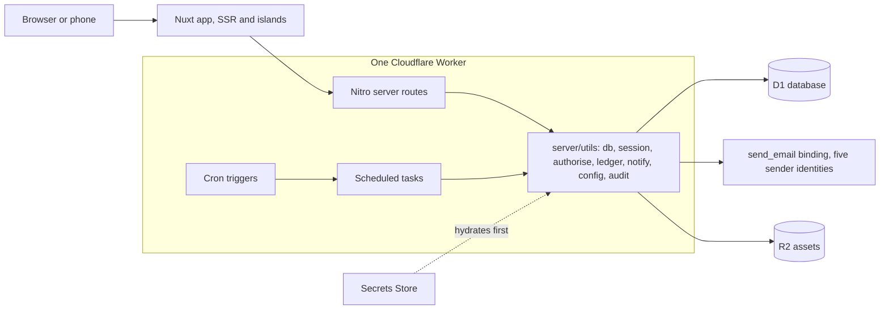
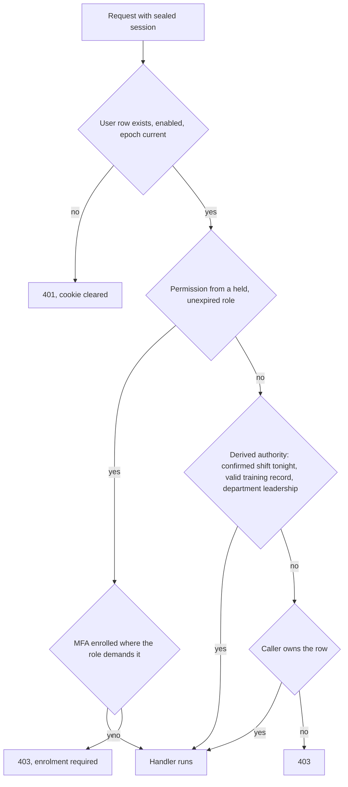

# Architecture

How the unified system is put together. The decisions in `decisions/` are the why; this is
the shape. Companion: `data-model.md` for every table.

## Runtime

One Nuxt 4 application on Cloudflare Workers (`cloudflare_module` preset), one D1 database,
one deployed worker serving `newtheatre.org.uk`. There are no other services: no queues, no
Durable Objects, no cross-app calls. Email leaves through the `send_email` binding (Email
Service, decision 0002) as one of five sender identities on the single onboarded domain
`newtheatre.org.uk`, none of them a `no-reply` (0020); files (posters, venue images) live in
R2; secrets shared beyond one worker live in the account Secrets Store, hydrated by the
first-registered server plugin before anything reads a session (the `0.` prefix pattern
carried from the estate).



## Code layout

Modules from the backlog map one-to-one onto directories. Nothing imports across module
boundaries except through `server/utils/` and `shared/`.

```
app/                    pages, components, composables (grouped per module)
server/
  api/<module>/         one route per file, Nitro conventions
  utils/                the shared spine: db, session, authorise, ledger, notify,
                        config, audit, conditional-write helpers
  tasks/                scheduled tasks (below)
  plugins/              0.secrets-store, authorisation resolver
shared/utils/           zod schemas, permission map, enums, pure domain logic
                        (Europe/London dates, expiry arithmetic, pricing resolution,
                        validity). Auto-imported into both the application and the server,
                        because a time shown to a member is pinned the same way as one the
                        server reasons about.
shared/types/           types shared across the same boundary
content/                Nuxt Content: editorial pages, policy pages with config tokens
migration/              the SP-3 tooling (standalone, never imported by the app)
tests/                  unit / integration / e2e, bun test
```

## Identity and authorisation

- Sealed first-party session cookie (nuxt-auth-utils), 30 days, epoch-revoked (0007).
  Privileged requests re-verify the user row every time; there is no staleness window.
- Authorisation resolves in `server/utils/authorise.ts` from three sources, in order:
  1. **Permissions** from held, unexpired roles via the static permission map in `shared/`.
  2. **Derived authority**: tonight's confirmed shift (04:00 to 04:00 London), a currently
     valid training record, department leadership. Computed by joins at request time, never
     cached beyond the request (0009).
  3. **Ownership**: the row's own user id.
- Guards are server-side and fail closed; route middleware is rendering convenience only.
- MFA (TOTP + passkeys) is enforced at guard level for permission-bearing roles (0008).



## Money and the ledger

Every monetary fact posts to `ledger_entries` (+ `ledger_lines`) in the same batch as its
domain write (0004). `server/utils/ledger.ts` is the only writer. Reconciliation, dashboards
and exports are queries over the ledger; no module keeps its own money totals.

## Concurrency on D1 (0003, 0006)

- Atomicity is `db.batch` only. The contended claims (seat capacity, shift claim, register
  delivery, waiting-list offers, promotion notifications) are conditional writes: the guard
  predicate rides on the INSERT or UPDATE, zero-rows-affected is disambiguated explicitly
  (gone versus beaten), and at-most-once rules are unique indexes.
- Parameter discipline: chunk at 90, scope by subquery, never an IN list from a result set.
  Compound SELECTs also cap low on D1; use scalar subqueries for multi-count reads.
- Each claim has a racing test in CI (0016).

## Scheduled tasks

All Nitro scheduled tasks mirrored in wrangler cron triggers. The system notices, humans
decide (principle P6): no task ever awards a record, approves a request or takes money.

| Cron (UTC) | Task | Does |
| --- | --- | --- |
| `*/10 * * * *` | `holds:release` | Releases expired reservation holds, cascades waiting-list offers, sends pre-expiry reminders. The one task that changes booking state, and only ever in the direction the customer was warned about. |
| `0 6 * * *` | `training:expiry-sweep` | Expiry warnings and digests (dry-run gated). |
| `0 9 * * *` | `sessions:sweep` | Session reminders, unmarked-register nags, lapsed practice windows. |
| `0 10 * * *` | `shifts:remind` | Tomorrow's rota with calendar attachments. |
| `12 0 * * *` | `nights:close` | Auto-closes unsigned night reports inside 24 hours, retries unsent report emails. |
| `0 4 * * *` | `daily:sweeps` | Comp expiry tidy, backstage free-text purge, withdrawn access profiles, lapsed rate limits, lapsed MFA attempts, unclaimed sign-in tokens, notification retries. |
| `0 5 * * 1` | `backup` | Weekly export to R2 (plus provider Time Travel). |
| `0 4 1 * *` | `retention:sweep` | Inactivity warnings and anonymisation (ships dry-run, armed by config with typed confirmation). |

## Notifications

One centre (`server/utils/notify.ts`, decision 0013): per-topic preferences, transactional
always delivers, digest coalescing, full send log with retries, undeliverable and anonymised
addresses dropped before the provider. Channels: email now, in-app inbox now, push when it
actually delivers.

## Show-night resilience (module K)

Operational screens (door, till, registers, tonight view) are phone-first islands that cache
their night's data on open and render fully from cache when the network drops; writes queue
and reconcile with conflicts surfaced, never merged silently. The emergency card caches at
shift start. Mechanism (service worker or client cache layer) is an open question in
`backlog/K-platform.md`; the acceptance criteria bind either way.

## Environments

| | Database | Email | Payments |
| --- | --- | --- | --- |
| Local | D1 local SQLite under `.data/` | logged to console | dev tender stub |
| Preview (branch builds) | isolated preview D1 | logged | stub |
| Production | D1 `unified` | Email Service | the physical SumUp reader, always (0005) |

Seed scripts generate credentials at runtime, print once, and refuse to run against remote
databases. There is a `/dev-login` guarded by `import.meta.dev` using `replaceUserSession`.

## Deployment

Merging to `main` (once this branch becomes it) deploys via Workers Builds. Migrations apply
from a GitHub Actions job on push (restore point first, ledger re-read after, `nuxt-db
migrate`), and `/api/health` returns 503 naming pending migrations whenever the deploy is
ahead of its schema. CI gates: lint, typecheck, the three test layers, comment rules, the
append-only migration check, and the content-token check against the configuration schema
(0012).

## Testing (0016)

`bun test` throughout. Unit tests for the pure logic in `shared/`; integration tests run
routes against a real local database and carry the racing tests; end-to-end tests drive the
critical journeys (booking, door, till, register, room request) in a browser. The named
regression suite (K-121) is seeded before feature work and grows monotonically.
