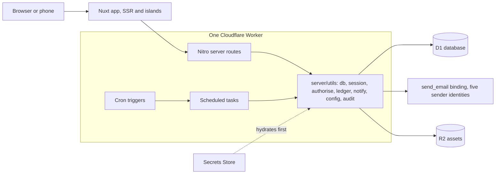
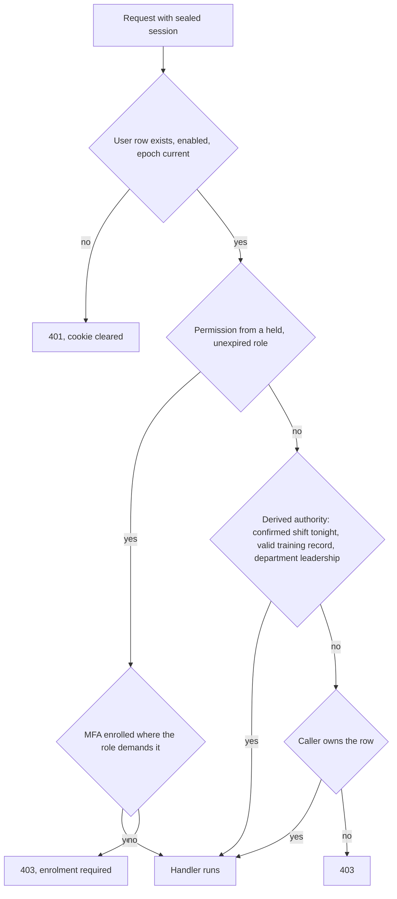

# Architecture

How the unified system is put together. The decisions in `decisions/` are the why; this is
the shape. Companion: `data-model.md` for every table.

## Runtime

One Nuxt 4 application on Cloudflare Workers (`cloudflare_module` preset), one D1 database,
one deployed worker serving `newtheatre.org.uk`. There are no other services: no queues, no
Durable Objects, no cross-app calls. Email leaves through the `send_email` binding (Email
Service, decision 0002) as one of five sender identities on the single onboarded domain
`newtheatre.org.uk`, none of them a `no-reply` (0020); files (posters, venue images) live in
R2; secrets shared beyond one worker live in the account Secrets Store, hydrated by the
first-registered server plugin before anything reads a session (the `0.` prefix pattern
carried from the estate).



## Code layout

Modules from the backlog map one-to-one onto directories. Nothing imports across module
boundaries except through `server/utils/` and `shared/`.

```
app/                    pages, components, composables, plugins (grouped per module)
server/
  api/<module>/         one route per file, Nitro conventions
  utils/                the shared spine: db, session, authorise, ledger, notify,
                        config, audit, conditional-write helpers
  tasks/                scheduled tasks (below)
  plugins/              0.secrets-store, authorisation resolver
shared/utils/           zod schemas, permission map, enums, pure domain logic
                        (Europe/London dates, expiry arithmetic, pricing resolution,
                        validity). Auto-imported into both the application and the server,
                        because a time shown to a member is pinned the same way as one the
                        server reasons about.
shared/types/           types shared across the same boundary
content/                Nuxt Content: editorial pages, policy pages with config tokens
migration/              the SP-3 tooling (standalone, never imported by the app)
tests/                  unit / integration / e2e, bun test
```

### The shared registries

Eight files in `shared/utils/` are appended to by every module: `ledger.ts` (line kinds),
`notifications.ts` (message types), `audit-actions.ts` and `audit-coverage.ts`, `config.ts`,
`personal-data.ts`, `site-nav.ts` and `personas.ts`. Each is divided by one-line banners naming
the backlog modules that have entries there or are expected to (`// Module F: bar`), and an
addition goes inside its own module's section, so two branches adding at once land in different
hunks instead of the same one. A banner with nothing under it is a section waiting for its module,
not an oversight; a module with nothing to add to a registry has no banner in it, and adds one
when it does. `tests/unit/registry-banners.test.ts` holds the banners to the module letters, and
holds every audit action, ledger kind and module-named route to the section it belongs in.

## Routes and shells

A prefix names the domain; the shell follows the posture of the work rather than the URL (0040).
`/admin` means System and nothing else.

| Prefix | Shell | Who |
| --- | --- | --- |
| `/`, `/sign-in`, `/register`, `/verify`, `/reset`, `/magic` | `default` | Anybody |
| `/rooms`, `/rooms/mine`, `/account/*` | `member` | A member, about themselves |
| `/rooms/manage/*`, `/people/*`, `/box-office/*`, `/bar/*`, `/admin/*` | `console` | Somebody working for the theatre |
| `/tonight/*` | `tonight` | Somebody on shift, on a phone |

A domain with both audiences puts the member's screens at the top and the console's under `manage`
(`/rooms` against `/rooms/manage/requests`). A domain with no member surface sits flat
(`/people/accounts`, `/bar/products` and `/bar/stock`). Every navigable destination is declared once
in `shared/utils/site-nav.ts`, which the console sidebar renders and the console middleware guards
from, so a deep link and the sidebar cannot disagree.

### Route namespaces

Which stream owns which routes while the MVP is built in parallel (`build-order.md`). Ownership is
about who edits a file, not about who may link to it: a stream adds a route inside its own
namespace, and asks the owner for one anywhere else.

| Stream | Routes and files owned |
| --- | --- |
| Box office | `/whats-on`, `/shows/[slug]`, `/book`, `/my/bookings`, `/box-office/**`, `/tonight/door`, `content/` |
| Show night | `/rota` and `/rota/manage/**` (templates, rota administration and the venue emergency card at `/rota/manage/venues/[id]/emergency`), the `/tonight` hub, `/tonight/incidents`, `/tonight/register`, `/tonight/checklist`, `/tonight/board`, `/tonight/close`, `/board`, `/api/tonight/**`, `/api/admin/rota/**` and `server/utils/night-authority.ts`. The console screens sit under `/rota/manage`, never `/admin`: `/tonight` is the phone-first shell rather than a console prefix (0040, 0046). |
| Bar | `/tonight/till`, `/tonight/till/comps`, `/bar/**`, `/bar/stock/**` |
| Platform | `/account/notifications`, `/comms/**`, `/money/**`, `/policies/**`, `/admin/config`, `/admin/docs`, `/admin/backups`, `/admin/retention`, `migration/**`, `app/components/Night*.vue`, `app/composables/useNightCache.ts`, `tests/helpers/race.ts` |

`/tonight` is the one prefix three streams write under, which is why the shell below is owned by
one of them and settled before any of the screens are built. The hub page itself was written by
platform far enough to exercise the shell, and its content belongs to show night from E-112.

## The identity screens

`/sign-in` and `/register` are the two entry points, and each carries its own steps rather than
sending the visitor to a URL that means nothing on reload: the MFA challenge, the forgotten-password
and sign-in-link requests, and the check-your-email panel are all states of the page the person is
already on. Only three routes exist because an email points at them, and each is reached with a
token in the query string:

| Route | Consumes |
| --- | --- |
| `/verify?token=` | `POST /api/auth/verify`, offering a fresh send on a 410. A token issued by an address change is bound to that address and confirms no other (A-115) |
| `/reset?token=` | `POST /api/auth/password/reset` |
| `/magic?token=` | `POST /api/auth/magic-link/consume`, which may answer with an MFA attempt |

Who is signed in is read once during rendering by `app/plugins/account.server.ts` into the
`nnt-account` state, and re-read by `useAccount().refresh()` after anything that changes the
session. A component awaiting that read instead would hold Suspense open and ship a page that never
becomes interactive.

## Identity and authorisation

- Sealed first-party session cookie (nuxt-auth-utils), 30 days, epoch-revoked (0007).
  Privileged requests re-verify the user row every time; there is no staleness window.
- Authorisation resolves from three sources, in order:
  1. **Permissions** from held, unexpired roles via the static permission map in `shared/`.
     `server/utils/authorise.ts` owns this, and `requirePermission` is the guard.
  2. **Derived authority**: tonight's confirmed shift (04:00 to 04:00 London, `showNightOf`), a currently
     valid training record, department leadership. Computed by joins at request time, never
     cached beyond the request (0009). It resolves in the module utility that owns the fact it
     derives from, behind a guard of its own: `server/utils/training.ts` reads department
     leadership, and `requireCatalogueReader` and `requireCatalogueAuthority` are its guards.
     Trainer and supervisor standing resolve in the same file, through `trainerStandingOf` and
     the `requireTrainer` guard: somebody is a trainer if and only if they currently hold a
     record on a module marked trainer-granting, and expiring counts as held. It is never a role
     and never a flag, so revoking the certification is the whole of taking the standing away
     (0037, G-111). Show-night authority resolves in `server/utils/night-authority.ts` behind
     `requireNightAuthority`, and has a section of its own below.
  3. **Ownership**: the row's own user id.
- Guards are server-side and fail closed; route middleware is rendering convenience only.
- `nuxt-authorization` abilities (`shared/utils/abilities.ts`) are named views over the same
  permission map, used to decide what the chrome shows. Two resolvers hand an ability its viewer:
  `server/plugins/authorisation.ts` from the account row and its live grants,
  `app/plugins/authorization.ts` from the account snapshot. Neither reads authority from the
  cookie, and neither replaces `requirePermission`, which also holds the MFA gate (0040).
- MFA (TOTP + passkeys) is enforced at guard level for permission-bearing roles (0008).
- A passkey is a complete sign-in and no challenge follows it: the authenticator verified the
  person before it would sign, so the credential step and the second step happened at once
  (A-105). `nuxt-auth-utils` verifies both ceremonies with `requireUserVerification: false`, so
  that rule is enforced in `shared/utils/passkeys.ts` and checked in both handlers.



## Money and the ledger

Every monetary fact posts to `ledger_entries` (+ `ledger_lines`) in the same batch as its
domain write (0004). `server/utils/ledger.ts` is the only writer. Reconciliation, dashboards
and exports are queries over the ledger; no module keeps its own money totals.

### The posting contract

`postEntry(input, at?)` validates the entry, computes its total from its lines and **returns the
statements the caller batches**. It performs no write of its own, because money and the thing it
paid for commit together or not at all (0001, I-102 criterion 6), and only the caller knows what
the other half of the batch is. Nothing else writes to the ledger tables: `check:ledger` fails the
build on any file under `server/` other than `server/utils/ledger.ts` that does, and on any script
that reaches the tables in raw SQL.

Three rules follow, and every money path obeys them:

- The entry's total is the sum of its lines, never supplied by the caller. A comp is zero with its
  full price on the line, so foregone value is a figure rather than an absence (I-103).
- A correction is a new entry naming what it corrects in `reversesEntryId`, with negative amounts.
  Nothing is edited; the triggers refuse it (0010).
- The screen sends its expected total in pence, and the route that takes the money refuses a
  mismatch quoting both figures (0005). That check belongs to the money-taking route, not to
  `postEntry`, which has no view of what the screen was showing.

Two columns the entry form does not yet carry, because the module that fills them is not built:
`void_of_entry_id`, which F-109 sets when it voids a tab charge, and the discount snapshots
F-117 writes. Both are on `ledger_entries` already, so adding them is a change to the form and
the helper, never to the table (0010).

### The money paths

The triple every path posts under. A module adding a money path adds a row here in the same pull
request; a unit test reads this table, so a kind in the code and not in a row is drift. `source`
and `tender` are database CHECKs and cannot be widened; `kind` is the enum in
`shared/utils/ledger.ts` (0033). `SYSTEM` is reserved for an entry no person took: no MVP path
posts one.

**Every row below groups by the financial day, never by the show night.** `london_day` is the
plain London calendar day of `happened_at`, written by `londonDayOf` in `shared/utils/ledger.ts`,
because the reader's Z total is a calendar-day figure (I-104). A 01:00 bar sale is the previous
night's takings and the new day's Z, and both readings are correct. A report that wants the night
resolves it from the performance or from `showNightOf` (E-110) and never from `london_day`; the
ledger holds no night column and gains none.

| Money path | Posts when | Module | Source | Tender | Kind |
| --- | --- | --- | --- | --- | --- |
| Desk collection | The reader is paid at collection, never at reservation (D-114) | ticketing | `DESK` | `CARD` | `TICKET_COLLECTION` |
| Comp admission | An approved comp is issued (D-117) | ticketing | `DESK` | `COMP` | `TICKET_COLLECTION` |
| Walk-up sale | Reservation and payment in one desk flow (D-115) | ticketing | `DESK` | `CARD`, `COMP` | `WALK_UP` |
| Refund | The money is handed back, one entry per ticket (D-116) | ticketing | `DESK` | `CARD` | `REFUND` |
| Pass sale | A pass is issued and paid for at the desk (D-124) | ticketing | `DESK` | `CARD` | `PASS_SALE` |
| Pass admission | A pass covers a seat, online or at the door (D-125, D-126) | ticketing | `SELF_SERVE`, `DESK` | `NONE` | `PASS_ADMISSION` |
| Bar item | The sale, its lines and its stock movements commit together (F-105); a sale after midnight is the calendar day it happened on, not the night's | bar | `TILL` | `CARD`, `COMP`, `TAB` | `BAR_ITEM` |
| Tab settlement | A tab is settled on the reader, bounded to the charges it covers (F-109); the settlement's own calendar day, not the charges' | bar | `TILL` | `CARD` | `TAB_SETTLEMENT` |
| Void of a tab charge | An unsettled charge is voided with a reason (F-109); the calendar day of the void, not of the charge | bar | `TILL` | `TAB` | `BAR_ITEM` |
| Imported history | Six years of the old estate load as opening history (I-109, K-114) | finance | `IMPORT` | `CARD`, `NONE` | `IMPORT` |

Reading the table:

- A refund, a void and any other correction carry negative amounts and set `reversesEntryId` to
  the entry they correct. A void additionally names the tab charge in `void_of_entry_id`, which
  no other path sets. Both rows stay, and what is owed is the sum across them.
- A comp and a pass admission both total zero. The comp keeps the full price in
  `unit_price_pence` so foregone revenue is queryable; the pass admission is genuinely free, and
  its value is the pass sale that already posted.
- The door is the desk: `source` names the surface money was taken on, and `DESK` covers both.
  What tells a walk-up from a collection is the kind, and the reservation's own `DOOR` source.
- `IMPORT` tenders `NONE` where the old estate recorded none. Imported history lands into closed
  periods (I-109 criterion 3), keeping each entry's original calendar day.
- The night a performance belongs to comes from the performance, and a till session's night comes
  from `showNightOf` (E-110). Neither is read off `london_day`, and no path writes both.

## Concurrency on D1 (0003, 0006)

- Atomicity is `db.batch` only. The contended claims (seat capacity, shift claim, register
  delivery, waiting-list offers, promotion notifications) are conditional writes: the guard
  predicate rides on the INSERT or UPDATE, zero-rows-affected is disambiguated explicitly
  (gone versus beaten), and at-most-once rules are unique indexes.
- Parameter discipline: chunk at 90, scope by subquery, never an IN list from a result set.
  Compound SELECTs also cap low on D1; use scalar subqueries for multi-count reads.
- Each claim has a racing test in CI (0016).

## Scheduled tasks

All Nitro scheduled tasks mirrored in wrangler cron triggers. The system notices, humans
decide (principle P6): no task ever awards a record, approves a request or takes money.

Every name in the table has a handler under `server/tasks/`, because a cron pointing at one that
does not exist errors on every firing. Seven of them are stubs that report the story they are
waiting for and do nothing else; only `daily:sweeps` does work today.

| Cron (UTC) | Task | Does |
| --- | --- | --- |
| `*/10 * * * *` | `holds:release` | Releases expired reservation holds, cascades waiting-list offers, sends pre-expiry reminders. The one task that changes booking state, and only ever in the direction the customer was warned about. |
| `0 6 * * *` | `training:expiry-sweep` | Expiry warnings and digests (dry-run gated). |
| `0 8 * * *` | `rooms:sweep` | Tells the approvers about room requests that have been waiting, once each, and lapses the ones that waited too long (C-108). Union requests are chased the same way but never lapse: expiry frees a held slot, and a union request holds none (0036). |
| `0 9 * * *` | `sessions:sweep` | Session reminders and unmarked-register nags (G-119, not yet built). |
| `0 10 * * *` | `shifts:remind` | Tomorrow's rota with calendar attachments. |
| `0 17 * * *` | `rooms:remind` | Tomorrow's room bookings, one message per member however many they hold, with the calendar file attached (C-113). Idempotent: a second run the same London day sends nothing, read from `notification_log` rather than a column. |
| `12 0 * * *` | `nights:close` | Auto-closes unsigned night reports inside 24 hours, retries unsent report emails. |
| `0 4 * * *` | `daily:sweeps` | Comp expiry tidy, backstage free-text purge, withdrawn access profiles, lapsed rate limits, lapsed MFA attempts, unclaimed sign-in tokens, notification retries, unverified account expiry (0026). |
| `0 5 * * 1` | `backup` | Weekly export to R2 (plus provider Time Travel). |
| `0 4 1 * *` | `retention:sweep` | Inactivity warnings and anonymisation (ships dry-run, armed by config with typed confirmation). |

## Notifications

One centre (`server/utils/notify.ts`, decision 0013): per-topic preferences, transactional
always delivers, digest coalescing, full send log with retries, undeliverable and anonymised
addresses dropped before the provider. Channels: email now, in-app inbox now, push when it
actually delivers.

## The show night (0014, E-110)

The operational day runs 04:00 to 04:00 Europe/London, and `shared/utils/show-night.ts` is its
only definition. A night is a label, `YYYY-MM-DD`, naming the London day it began; the 04:00
boundary is a constant in that file, never a configuration key.

| Function | Answers |
| --- | --- |
| `showNightOf(at: Date): string` | Which night an instant belongs to. A performance's night is `showNightOf(curtain)`, so a late show ending at 01:00 is one night. |
| `showNightBounds(night: string): { from, to }` | The instants a night runs between: `from` inclusive, `to` exclusive, both 04:00 London. The night the clocks change is a real 23 or 25 hours. A malformed label throws. |
| `currentShowNight(): string` | Tonight, from the runtime clock. The only place a night is read off the clock rather than off a stored instant. |
| `isShowNight(value: string): boolean` | Whether a string is a real night label, for validating a `night` query parameter. |

Shift authority, the door, the till, the tonight screens, board codes, night reports and the
cache label must call these as they are built; a second implementation is a defect (0014), and
`tests/unit/show-night.test.ts` fails on one. The financial day is not the show night: the
ledger and the Z reconciliation group by London calendar day (I-104).

### Show-night authority (E-111, 0044)

`requireNightAuthority(event, role, scope?)` in `server/utils/night-authority.ts` is what every
show-night route calls, and it is the only thing that refuses one. Hiding a link is never the
enforcement (E-111 criterion 5, restated in 0040): the three abilities in
`shared/utils/abilities.ts` decide what the chrome shows and nothing else.

| Piece | What it is |
| --- | --- |
| `NightRole` | `DUTY_MANAGER`, `DOOR` or `BAR`. A door shift does not open the till, and neither does the front of house officer's role. |
| `NightScope` | `{ night?, venueId?, performanceId? }`. All optional: the common case is tonight, at the one venue running. |
| The resolution | `{ account, night, role, venueId, performanceIds, via, shiftId? }`, where `via` is `SHIFT` or `OFFICER`. |
| A refusal | 403 naming both ways in, the shift and the officer role. An administrator is never offered as the way out. |

`night` comes from `currentShowNight()` and nothing else, so authority expires at 04:00 with
nothing to revoke. A caller may name the night it believes it is working, which is how a screen
left open past the boundary is refused rather than quietly resolved against a new one. The venue is
always resolved to exactly one: a night running two venues with nothing to narrow it is a 400
asking for the venue, because an officer covering two houses at once is not a thing to invent.
`performanceIds` is what the request covers, and it is never empty: a cancelled performance is
filtered out, so a venue whose only performance tonight is cancelled resolves no authority at all.

Only the `OFFICER` branch resolves today. It stands on the permissions `night.door`, `night.till`
and `night.manage`, held by `FOH_MANAGER` (door and manage) and `BAR_MANAGER` (till), which are the
one named exception to standing permissions being administrative only (0009, 0044). Planning the
rota is not one of them: `rota.read` and `rota.write` are ordinary administrative permissions, held
by `FOH_MANAGER` and `ADMIN`, and they are what open `/rota/manage/**` (0046). Every officer
resolution writes `night.officer-bypass` once per account, night, venue and role, held by a partial
unique index rather than by reading before writing; the row's detail carries every performance that
venue ran that night. The `SHIFT` branch arrives in show night wave 3 and fills a case, with no
change to anything above. Holding one of the three does not admit anybody to the console:
`reachConsole` reads the standing permissions that are not in `OPERATIONAL_PERMISSIONS`, or an
officer would be shown a sidebar in which every screen answers 403 (0040, 0044).

`GET /api/tonight/authority?role=&night=&venueId=&performanceId=` is that resolution as a route. It
returns the allow-listed shape above and is the pattern every other `/api/tonight/**` and
`/api/till/**` route follows; `tests/unit/night-authority.test.ts` fails when a route under either
namespace does not call the guard.

## The rota (E-101, E-102, E-106, 0046)

A venue's shift template is one row per role with a count, and stamping expands it into one open
shift per slot on a performance. `shift_templates` and `shifts` are in `docs/data-model.md`;
`server/utils/rota.ts` is how the rest of the system reads and writes them, and
`shared/utils/rota.ts` holds the vocabulary and the rules with no database in them.

| Function | Answers |
| --- | --- |
| `templateRefusal(slots)` | Why a template may not be saved, or null. A venue template names each role once and holds exactly one duty manager, which correlates rows and so cannot be a CHECK (E-101 criterion 1). |
| `stampPerformanceStatement(performanceId)` | The stamp for one performance, batched with the INSERT that creates it, so a performance can never exist staffed by nothing (E-102 criterion 1). |
| `backfillVenueStatement(venueId, from)` | The same stamp over every performance at a venue from a given instant. `ON CONFLICT DO NOTHING` against the slot uniqueness makes a second run a no-op (E-102 criterion 2). |
| `cancelShiftsStatement(performanceId)` | Cancels a performance's shifts, batched with the cancellation itself (E-102 criterion 4). |
| `shiftConstraintRefusal(error)` | A refused write as a 409 a volunteer can act on, or null for anything unrecognised, which the caller rethrows (E-106 criterion 3). |

Neither statement binds per performance or per slot: the slot ordinals come from a recursive count
over the templates rather than from a list built in the application, so the parameter count is
fixed whatever the diary holds (0003, 0006). A shift belongs to exactly one performance, and the
confirmed duty manager index is per performance, so two performances running at once need two
confirmed duty managers and the same person may hold shifts on both (E-127 criterion 1).

Templates are administered at `/rota/manage/templates` under `rota.read` and `rota.write`. A
member's own `/rota` arrives with E-103.

## The programme (build-order contract d, 0043)

Where we perform, what we perform and when. `venues`, `seasons`, `show_categories`, `shows`,
`content_warnings`, `performances` and the ticket types and price overrides beside them are in
`docs/data-model.md`; `server/utils/performances.ts` is how the rest of the system reads them.

A venue is its own row, never a flagged room (0043). It may point at a room through a nullable
`room_id`, and the only effect of that attachment is that the venue's performances apply blackouts
to that room. Nothing else about a room is inferred from a venue or the reverse.

| Function | Answers |
| --- | --- |
| `performanceNight(curtain: Date \| number): string` | Which show night a performance belongs to. Derived from `showNightOf(curtain)`, so a curtain before 04:00 belongs to the night that began the London day before. A stored curtain is integer seconds; both spellings are accepted. |
| `performancesOnNight(night, venueId?)` | Every performance whose curtain falls inside the night's bounds, across the whole estate, narrowed by venue only when asked. Ordered by curtain, then venue. Two venues may run at once and one venue may run a matinee and an evening. |
| `effectiveCapacity(performance)` | The performance's `capacity_override` if it has one, otherwise the venue's capacity. Null is uncapped; an explicit nought is a closed house, so the resolution is by absence and never by falsiness. |
| `isOnSale(performance, at?, channel?)` | Whether an internal sales path may sell this performance. It is `saleRefusal()` with the reason dropped, so the two can never disagree. |

Ticket types are administered at `/box-office/ticket-types` (D-119) and the programme itself at
`/box-office/shows` (D-121), which is where D-120's overrides and D-123's pass products attach.
What a type has ever been sold under, and what a performance has sold, are queries over the tables
that point at them, declared in `server/utils/ticket-types.ts` and `server/utils/programme.ts` and
proved against the live foreign keys, never a column on the row itself.

`shared/utils/programme.ts` holds the publish flow and the booking window as pure rules:

| Function | Answers |
| --- | --- |
| `publicShow(show)` | The allow-listed columns a visitor may see, or null for a draft. Every public payload goes through it, so a draft show has no thin version to leak (D-121 criterion 1). |
| `resolveBookingClosesHours(performance, show)` | The window in hours: the performance's own, then the show's default, then curtain-up. NULL means inherit and an explicit nought means this level says curtain-up (D-112 criterion 1). |
| `bookingClosesAt(startsAt, hours)` | The closing instant, measured back from the curtain in seconds, so the clocks changing never moves it relative to the performance (0014). |
| `saleRefusal(performance, at?, channel?)` | Why a sales path may not sell, or null. Cancelled, unpublished, off sale, externally ticketed and closed each name themselves; the closed one quotes the time in Europe/London and points at the door. `DESK` bypasses the customer window and nothing else (D-112 criteria 2 and 3). |

A night is a window over the whole estate, not a venue and not a day: everything record-like keys
to a performance (E-127 criterion 1). `performancesOnNightQuery()` is the statement
`performancesOnNight()` runs, exported so an integration test executes the real SQL; it binds two
parameters, or three when narrowed by venue, however many performances the night holds (0006).

## Show-night resilience (module K)

Operational screens (door, till, registers, tonight view) are phone-first islands that cache
their night's data on open and render fully from cache when the network drops; writes queue
and reconcile with conflicts surfaced, never merged silently. The emergency card caches at
shift start. Mechanism (service worker or client cache layer) is an open question in
`backlog/K-platform.md`; the acceptance criteria bind either way.

### The phone-first shell (K-102)

Three components under `app/components/` are what every show-night screen is assembled from, so
the door, the till and the registers inherit the conditions rather than each remembering them. The
`tonight` layout is settled and is not edited by the screens built on it.

| Component | Props | What it guarantees |
| --- | --- | --- |
| `NightScreen` | `title`, `hint?`, `stale?`, `busy?` | The column caps at `max-w-md` and lays out from 360 pixels up, so the desktop view is the adaptation. Its `actions` slot is pinned to the bottom of the viewport, which is where a thumb rests. |
| `NightAction` | `label`, `icon?`, `color?`, `disabled?`, `loading?`, `to?`, `@press` | At least 48 by 48 pixels, full width, and reachable by a single tap: no hover state, no long press, no second finger. |
| `NightStale` | `at?`, `busy?` | "Last synced HH:MM" in Europe/London, or "Not yet synced" when nothing has loaded. It is never hidden, because a screen holding nothing is when its age matters most. Words and an icon, never colour alone. |

`shared/utils/night-shell.ts` holds `NIGHT_VIEWPORT_PX`, `NIGHT_TAP_TARGET_PX` and
`lastSyncedLabel()`, so the tests and the components read the same numbers. A screen shows its own
age by passing `stale` the instant its data came from, which is what `useNightCache` (K-103)
hands it.

### The night cache (K-103)

`app/composables/useNightCache.ts` is how a show-night screen keeps its night on the device.
`shared/utils/night-cache.ts` holds the rules, so they are testable without a browser and a
server utility can build the same key.

```ts
const cache = useNightCache(
  () => nightCacheKey({ screen: 'door', night, venueId }),
  () => $fetch('/api/tonight/...', { query: { night, venueId } }),
)
```

The loader belongs to the screen: this owns what is kept, where it is kept and what may be
claimed about it, never what a screen fetches. `cache.data` is what the device held before the
network was asked, `cache.cachedAt` is what `NightStale` labels, `cache.live` says the last load
answered, and `cache.error` is the failure that left the screen stale rather than blank.

| Rule | Why |
| --- | --- |
| A key names a venue or a performance, or says `wholeNight` in as many words. | Two venues run one night and one venue runs a matinee and an evening, so a key of the night alone serves a duty manager the other house's screen. Forgetting throws; meaning it is spelled differently. |
| The key is stamped inside the entry as well as outside it. | An entry copied or renamed under another key reads as nothing cached rather than as another venue's night. |
| A failed load never overwrites what the screen is showing. | A dropped connection is a stale screen, never a blank one (criterion 2). |
| A successful load sweeps every other night's entries. | A night ends at 04:00 and takes its cache with it; nothing else on the device is touched. |
| Unreadable, foreign-version or foreign-key entries read as nothing cached. | A screen that throws on an entry an older build wrote is worse than one that reloads. |
| `primeNightCache(key, load)` caches what another screen will need. | The emergency card is cached from the start of the shift rather than from the first visit to it (criterion 3, E-113 criterion 2). |
| The store is `localStorage`, falling back to memory when a device refuses it. | A screen that cannot cache still has to render, and the fallback lives as long as the tab. |

The version is in the key (`nnt.night.1:...`), so changing the envelope retires every entry an
older build wrote instead of reading it wrongly. Nothing else in `app/` touches the device store,
which a test enforces: the old estate mirrored the emergency card to `localStorage` from the
screen that displayed it, and that is why the card survived a dropped connection but not a first
load.

## Environments

| | Database | Email | Payments |
| --- | --- | --- | --- |
| Local | D1 local SQLite under `.data/` | logged, and written to `.data/mail` so a link can be followed | dev tender stub |
| Preview (branch builds) | isolated preview D1 | logged | stub |
| Production | D1 `unified` | Email Service | the physical SumUp reader, always (0005) |

Development never hands a message to a provider, whatever bindings the emulator supplies, and every
emailed link is built from `NUXT_PUBLIC_BASE_URL`, which defaults to the local port in development
so a verification link in `.data/mail` is one that works.

Seed scripts generate credentials at runtime, print once, and refuse to run against remote
databases. `/dev` is the local developer surface: it seeds personas and signs in as any of them
without a password. It is kept out of a production build by `nuxt.config`'s `ignore` rather than by
a runtime guard, because a guard still ships the file, and a test greps the built output to prove
it (K-124).

## Deployment

Merging to `main` (once this branch becomes it) deploys via Workers Builds. Migrations apply from
`.github/workflows/migrate.yml` on push to `main` or `unified/main` when the run touches
`server/db/migrations/**` (restore point first, `nuxt-db migrate`, ledger re-read after), and
`/api/health` returns 503 naming pending migrations whenever the deploy is ahead of its schema.
Applying and deploying cannot be sequenced from CI, so the ordering is a race; the health check is
what makes losing it visible rather than silent.

CI gates, eleven of them: `build`, `typecheck`, `lint`, `typecheck:bun`, `test`, and the six
checkers (comments, migrations, content tokens, ledger, notifications, audit). `typecheck` and
`typecheck:bun` are separate compilers over separate projects, and passing one says nothing about
the other. `test:e2e` is **not** a gate: it runs nightly and on demand (0029).

## Testing (0016)

`bun test` throughout. Unit tests for the pure logic in `shared/`; integration tests run
routes against a real local database and carry the racing tests; end-to-end tests drive the
critical journeys (booking, door, till, register, room request) in a browser. The named
regression suite (K-121) is seeded before feature work and grows monotonically.

A browser test drives the real screen, so it must wait for the page to become interactive and not
merely to render: until Nuxt's Suspense resolves, the markup is server-rendered and a click does
nothing and reports nothing. `visit()` in `tests/helpers/webview.ts` waits for both, and `fill()`
sets a value through the native setter so `v-model` sees the change. One browser backs every view,
so views share a cookie jar: a case that needs a signed-out visitor opens one with
`openSignedOutView()` rather than assuming a new view carries no session.
