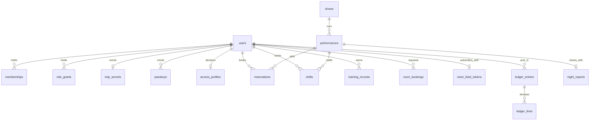
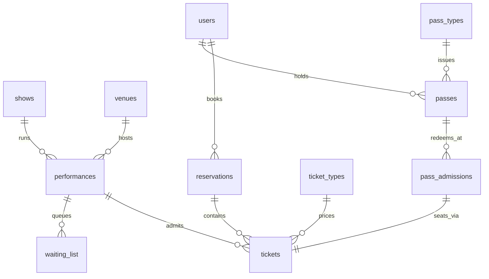
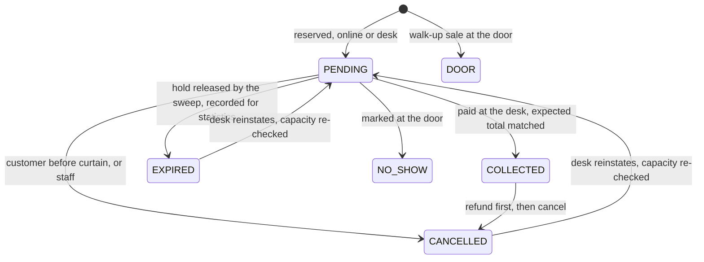
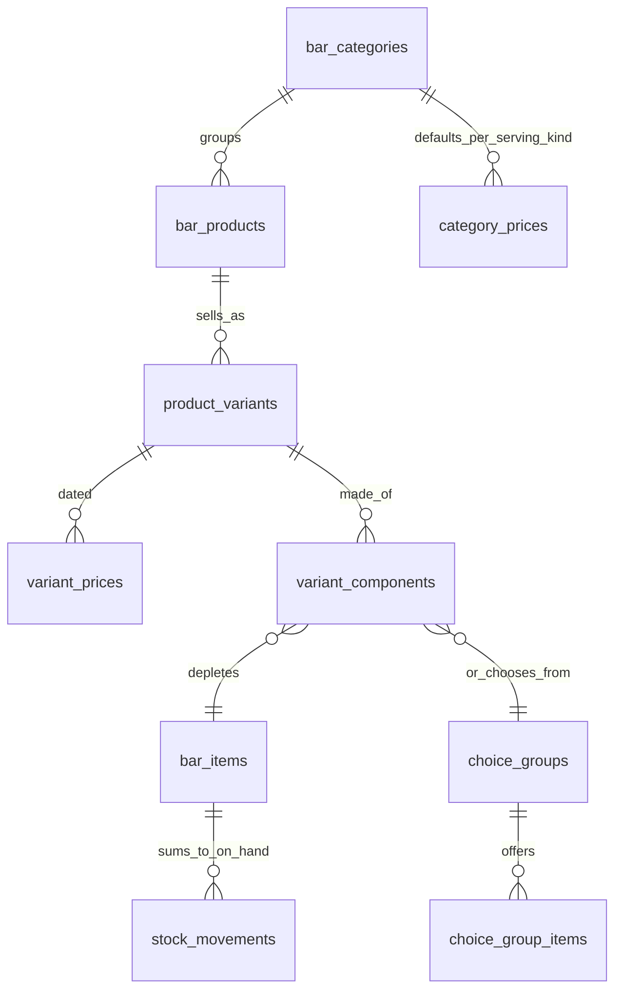
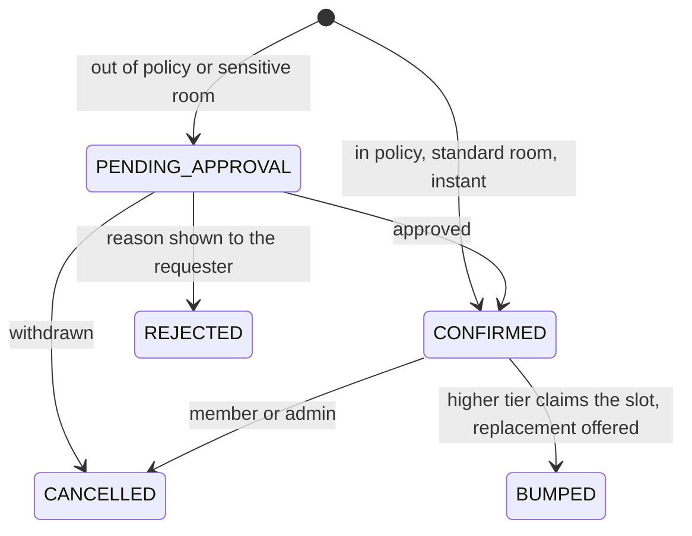
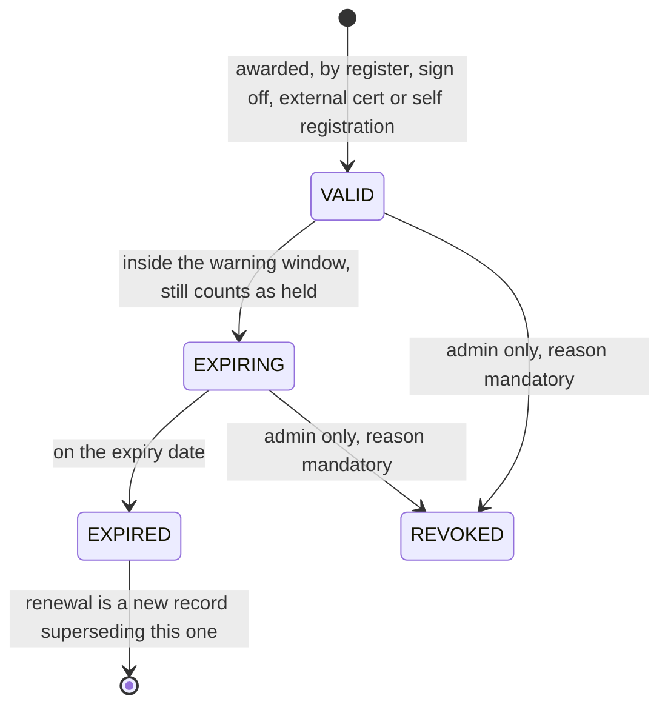

# Data model

Every table in the unified database, by module. `architecture.md` is the shape of the system;
this is its memory. The migration tooling (`migration/`) loads into exactly this model.

## Conventions

- **Ids** are text nanoids, generated by the application. Every imported row takes a fresh id;
  the live schema carries no legacy identifiers (decision 0015).
- **Instants** are integer seconds UTC (`*_at`), which is what `unixepoch()` returns. **Civil dates** (a performance day, a
  price's effective date) are ISO `YYYY-MM-DD` text, meaning the Europe/London day (0014).
- **Money** is integer pence (0004). **Booleans** are integers 0/1.
- **Enums** are text with a CHECK constraint; the values below are exhaustive.
- **Append-only tables** (marked APPEND-ONLY) refuse UPDATE and DELETE by trigger, with the
  narrow named exceptions listed in each entry (0010).
- **Scrub columns** (marked scrub) hold personal free text and are cleared by erasure (0011).
  Classification lives in `shared/utils/personal-data.ts`, one entry per table naming what the
  export carries and what erasure scrubs, deletes or leaves; `tests/unit/personal-data.test.ts`
  refuses a table that names a person and is not classified. The classification is per table
  today, not per column.
- FKs: `restrict` where history must survive (money, records), `cascade` for owned children,
  `set null` where the reference is optional colour.

## The shape at a glance

Everything hangs off `users`; the ledger and the programme are the other two centres of
gravity.

## Identity and membership (module A)

### users
`id` PK · `email` UNIQUE lowercased · `name` · `pronouns` (optional, scrub) · `password`
(scrypt PHC, NULL for guest or Google-only; **never non-NULL on an @newtheatre.org.uk
address**, import-enforced, 0008) · `phone` NULL (scrub) · `password_set_at` NULL · `password_last_used_at` NULL ·
`google_sub` UNIQUE NULL · `google_linked_at` NULL · `google_last_used_at` NULL ·
`pending_google_email` UNIQUE NULL (admin-set claim marker) · `student_id` UNIQUE NULL (how the committee finds somebody on the
SU's list: names do not always match and the address is often personal, 0031) · `verified` bool ·
`disabled` bool · `session_epoch` int ·
`anonymised_at` NULL · `last_login_at` · `created_at` · `updated_at`.
Anonymisation rewrites `email` to `deleted-<id>@anonymised.invalid`, `name` to `Deleted
user`, clears `pronouns`, `phone`, `password`, `student_id`, `google_sub`, `pending_google_email` and the four
credential timestamps, and bumps
`session_epoch`. Every write path guards on `anonymised_at IS NULL`, and the
`users_tombstone_guard` trigger refuses an identifying UPDATE on an anonymised row whether the
path remembered to guard or not (0011, A-125 criterion 3): a guard in a handler is a guard one
handler can forget.
The four `*_at` credential columns are what the account's own screen lists as when each way in
was added and last used (A-113). They are NULL on a row that predates them, and on an imported
one where the old estate never recorded it: the screen says so rather than inventing a date.
Indexed on `disabled`, `verified`, `anonymised_at`, `last_login_at` and `name`, which are what
the admin directory filters and sorts on (A-121); without them every filter is a scan.

### emergency_contacts
`user_id` PK → users cascade · `name` (scrub) · `phone` (scrub) · `relation` (scrub) ·
`updated_at`. Readable only by tonight's duty manager and safety officers while the person
holds a shift or production role (A-3). Neither a shift nor a production role exists yet, so
until they do it is readable by its owner and nobody else: the audience opens when there is
something to evaluate it against, never wider than the story allows (A-114).
Written through `PUT /api/account/profile`, which removes the row when the contact's name is
cleared: a contact with no name is nobody, and an emptied row reads like an answer.

### memberships
`id` PK · `user_id` → users cascade · `starts_on` / `expires_on` (London dates: a term of one or
three years running from the purchase, not a committee year) · `source` CHECK `MANUAL|ROSTER` (no
purchase source: membership is bought at the SU only) · `evidence` (grant note or import run id) ·
`granted_by` · `confirmed_at` / `confirmed_by` (checked against the SU's list afterwards; a check
never gates money) · `renewal_notice_at` · `created_at`.
CHECK `expires_on > starts_on`. Current membership = today inside the term or inside
`MEMBERSHIP_GRACE_DAYS` after it, read at query time (0031). A renewal is another row: history is
never rewritten.

### fellowships
`id` PK · `user_id` → users restrict · `awarded_on` (date, London) · `awarded_by` (the
committee or meeting that resolved it, not an individual) · `citation` (the public wording of
what it was awarded for) · `revoked_at` NULL · `revoked_by` NULL · `revocation_reason` scrub ·
`created_at`. `pass_id` → passes (the lifetime entitlement, 0023) arrives with module D as a
nullable column: the roll is recorded first, because the committee assembles it before the box
office exists.
UNIQUE (`user_id`): a person is a Fellow once. `restrict` rather than `cascade` on purpose, so
deleting a user cannot silently remove an award from the theatre's own record; erasure
anonymises the person and the award stands.
A revoked fellowship stops future admissions and rewrites nothing (0023).

### role_grants
`id` PK · `user_id` → users cascade · `role` (namespace-free officer role, validated against
the permission map in code) · `expires_at` NULL = permanent (default: next 31 July, London) ·
`granted_by` · `granted_at` · `note` scrub · `expiry_warned_at`.
UNIQUE (`user_id`, `role`). Enforced at read time; the last-administrator guard is a write
check, not a constraint.

### totp_secrets
`user_id` PK → users cascade · `secret` · `confirmed_at` NULL until proven ·
`last_used_step` (replay block) · `created_at`.

### passkeys
`id` PK · `user_id` → users cascade · `credential_id` UNIQUE · `public_key` · `counter` ·
`transports` JSON · `backed_up` bool · `label` · `created_at` · `last_used_at`.
Relying-party id is the unified domain; nothing imports from the old estate (0008, SP-4).
Enrolment asks for a discoverable credential with user verification required, so sign-in is
usernameless and one passkey stands for both the credential and the second factor (A-105).
`counter` is written on every use and a value that fails to advance is refused as a copied
authenticator, which is the only reason keeping the count is worth anything.

### passkey_challenges
`id` PK (the attempt id the browser echoes back) · `challenge` · `user_id` → users cascade,
NULL while signing in because a usernameless attempt does not know whose it is · `expires_at` ·
`created_at`. Indexed on `expires_at`, and swept on each write rather than on a schedule.
A challenge is taken, not read: verifying anything against it removes it, so a response cannot
be replayed. Its own table rather than a kind on `auth_tokens`, because that column carries a
CHECK and widening one in SQLite is a full rebuild of a table holding live tokens (A-105).

### recovery_codes
`id` PK · `user_id` → users cascade · `code_hash` · `used_at` NULL. Eight per set; a new set
retires the old in the same batch.

### auth_tokens
`id` PK · `user_id` → users cascade · `kind` CHECK
`EMAIL_VERIFY|PASSWORD_RESET|MAGIC_LINK|SET_PASSWORD` · `token_hash` UNIQUE · `email` (bound
address for verify) · `expires_at` · `created_at`. One outstanding per (user, kind);
delete-as-claim on redemption. Transient: never migrated, swept when expired.

### access_profiles
`user_id` PK → users cascade · `status` CHECK `PENDING|VERIFIED|EXPIRED|DECLINED|WITHDRAWN` ·
the nine need flags below · `companions` int 0..2 · `access_card_number` (evidence sighted,
value not retained beyond the reference) · `requester_note` scrub, never shown to the door ·
`foh_note` (agreed operational wording, shown to the holder) · `consent_foh_at` NULL = the
door sees nothing · `verified_by` · `verified_at` · `expires_at`.
Special category data: encrypted at rest, deleted outright on erasure and 30 days after
withdrawal (D-6).

The nine flags follow the Access Card categories run by Nimbus Disability, so a patron who
already carries one recognises our questions and we recognise their card:

| Flag | What it means |
| --- | --- |
| `standing` | Standing for long periods is difficult or impossible. |
| `crowds` | Crowded settings cause overwhelm. |
| `level_access` | Wheelchair accessible facilities, or level access, are required. |
| `distance` | Moving more than short distances is restricted. |
| `urgent_toilet` | Prompt toilet access is needed, without queueing. |
| `essential_companion` | Access is significantly difficult without support from another person. |
| `visual_information` | Visual information is a barrier; alternative formats are needed. |
| `audible_information` | Audible information is difficult to access or process. |
| `other` | Anything the categories above do not cover, such as photosensitive epilepsy. |

**A card is evidence, not a requirement.** An Access Card number is the quickest way to confirm
a profile because Nimbus has already done the assessment, and it is one route among several. A
patron without one is verified on other evidence and gets the same profile; nothing in the
booking path may ask whether a card exists.

These are our column names, chosen to match Nimbus's meanings rather than to mirror its
vocabulary. The scheme's published symbol set has changed before (an assistance dog symbol has
come and gone, and crowds were added), so the mapping is ours to maintain and a change there is
a documentation change here, not a migration.

## Programme (shared by ticketing and show night)

### venues
`id` PK · `name` UNIQUE · `address` · `capacity` int NULL = uncapped · `is_external` bool ·
`image_key` (R2) · `description` · `created_at`. General admission only; no seat-map tables
exist and nothing may assume them (constraint 4).

### venue_features / venues_to_features
Feature vocabulary and junction (both cascade).

### venue_emergency_info
`venue_id` PK → venues cascade · assembly point, exits, isolation points, what3words, notes
(free text, safe: describes the building, never a person) · `updated_by` · `updated_at`.

### seasons
`id` PK · `name` UNIQUE · `starts_on` · `ends_on` · `sort` · `archived` bool. The financial
season is 1 August to 31 July.

### show_categories
`id` PK · `name` UNIQUE · `sort`.

### shows
`id` PK · `slug` UNIQUE · `title` · `subtitle` · `description` · `long_description` ·
`poster_key` (R2) · `category_id` → show_categories restrict · `season_id` → seasons set
null · `age_guidance` · `latecomer_policy` CHECK enum · `warnings_confirmed_none` bool
(distinct from "no rows") · `content_notes` · `status` CHECK `DRAFT|PUBLISHED` · timestamps.
`production_id` NULL, reserved: module B attaches here later without a rebuild (B preclusion).

### content_warnings / show_content_warnings
Vocabulary (`slug` UNIQUE, `title` UNIQUE, `kind` CHECK `TECHNICAL|GENERAL`, `category`,
`description`, `icon`, `sort`, `archived`) and junction (UNIQUE pair, `level` CHECK
`MENTIONED|DISCUSSED|DEPICTED` NULL exactly when TECHNICAL).

### performances
`id` PK · `show_id` → shows cascade · `venue_id` → venues restrict · `starts_at` ·
`doors_at` · `duration_minutes` · `interval_count` · `interval_minutes` ·
`capacity_override` NULL = venue capacity · `booking_closes_hours_before` (NULL and 0 both
mean curtain-up) · `hold_release_minutes_before` NULL = config default ·
`external_booking_url` NULL · `status` CHECK `DRAFT|ON_SALE|CANCELLED` · `notes` (internal,
safe) · timestamps.
Sold-out and completed are derived, never stored.

## Ticketing (module D)

The reservation lifecycle, including the hold release the old estate never had:

### ticket_types
`id` PK · `name` UNIQUE global · `description` · `price` pence (base) · `kind` CHECK
`SINGLE|PASS_ADMISSION` · `access_kind` CHECK `ACCESS|COMPANION` NULL · `archived` bool ·
`active_by_default` bool.
Archive, never delete, once sold (FK restrict from tickets).

### show_ticket_overrides / performance_ticket_overrides
UNIQUE (parent, ticket_type) · `price` NULL = inherit · `active` NULL = inherit. Resolution:
performance, then show, then base.

### reservations
`id` PK · `reference` UNIQUE (6 chars, no-look-alike alphabet; a retrieval key, never a
credential) · `performance_id` → performances restrict · `user_id` → users restrict ·
`status` CHECK `PENDING|COLLECTED|DOOR|EXPIRED|CANCELLED|NO_SHOW` · `source` CHECK
`WEB|DESK|DOOR` (the door writes DOOR, fixing the old blur) · `hold_expires_at` (set while
PENDING; the release sweep moves PENDING to EXPIRED and records it for no-show statistics) ·
`cancelled_by` CHECK `CUSTOMER|STAFF` NULL · `customer_notes` scrub · `staff_notes` scrub ·
`qr_token_hash` (the one stable QR credential, D-108) · timestamps.
Indexes: (`performance_id`, `status`), (`user_id`, `created_at`), `hold_expires_at`.

### tickets
`id` PK · `reservation_id` → reservations restrict · `performance_id` → performances
restrict · `ticket_type_id` → ticket_types restrict · `price_paid` pence snapshot ·
`price_source` CHECK `VARIANT|OVERRIDE|BASE|IMPORT` · `refunded_at` NULL.
**The capacity rule** (0006): a ticket counts toward capacity while its reservation status is
`PENDING|COLLECTED|DOOR` and `refunded_at IS NULL`; inserts carry the capacity predicate on
the statement. Index (`performance_id`, `refunded_at`).

### waiting_list
`id` PK · `performance_id` → performances cascade · `user_id` NULL → users · `email`
(guests) · `joined_at` · `status` CHECK `WAITING|OFFERED|CLAIMED|LAPSED|LEFT` ·
`offered_at` · `offer_expires_at` · `claimed_reservation_id` NULL.
Partial UNIQUE (`performance_id`, `email`) WHERE status IN ('WAITING','OFFERED'). Offers
cascade in join order; the claim is a conditional write.

### pass_types / pass_type_prices / pass_type_shows
As the old model: product (`slug` UNIQUE, `status` CHECK `DRAFT|ON_SALE|CLOSED`, validity and
sales windows, `max_issued`), price points (UNIQUE (type, label)), covered shows (UNIQUE
pair). Desk-sold only (0005).

### passes
`id` PK · `reference` UNIQUE · `pass_type_id` restrict · `pass_type_price_id` restrict ·
`user_id` → users restrict · `price_paid` snapshot · `status` CHECK
`ACTIVE|CANCELLED|EXPIRED` · `issued_by` · `notes` scrub · timestamps.
Issuing posts a `PASS_SALE` ledger entry in the same batch (fixing the old estate's silent
pass money).

### pass_admissions  APPEND-ONLY
`id` PK · `pass_id` restrict · `performance_id` restrict · `ticket_id` UNIQUE restrict ·
`admitted_at` · `admitted_by` NULL (self-serve).
**UNIQUE (`pass_id`, `performance_id`) is the once-per-performance rule.**

### pass_requests
`id` PK · request → decision workflow (`status` CHECK `PENDING|FULFILLED|DECLINED|EXPIRED`,
`note` scrub, `decided_by`, `pass_id` NULL). A request is not a pass.

## The ledger (module I)

### ledger_entries  APPEND-ONLY
`id` PK · `happened_at` · `london_day` (civil date, computed server-side) · `source` CHECK
`DESK|TILL|SELF_SERVE|IMPORT|SYSTEM` · `tender` CHECK `CARD|COMP|TAB|NONE` · `actor_id` →
users restrict NULL (system) · `total_pence` (0 on a COMP; negative on a reversal) ·
`reverses_entry_id` NULL self-FK (a correction points at what it corrects) · `comp_reason`
NULL, **no CHECK** until module D decides its values (0033) · `comp_approved_by` NULL · `discount_id` NULL · `discount_percent` /
`discount_pence` snapshots · `tab_debtor_id` NULL → users restrict · `tab_settled_at` ·
`tab_settlement_entry_id` NULL self-FK · `void_of_entry_id` NULL (tab charges only; a
reversing entry, 0031's rule carried) · `created_at`.
Exception to append-only: none. Even voids and refunds are new reversing rows, and
`ledger_entries_no_self_reversal` refuses an entry that claims to reverse itself.
`server/utils/ledger.ts` is the only writer; `check:ledger` fails the build on any other file
that inserts into either table. `postEntry` returns statements rather than writing them, so
money and the thing it paid for commit in one batch (0001, I-102 criterion 6).

### ledger_lines  APPEND-ONLY
`id` PK · `entry_id` → ledger_entries cascade · `kind`, **no CHECK**, held as an enum in
`shared/utils/ledger.ts` and enforced at the one write path, because a CHECK on an append-only
table can never be widened (0033):
`TICKET_COLLECTION|WALK_UP|BAR_ITEM|PASS_SALE|TAB_SETTLEMENT|REFUND|IMPORT` ·
`amount_pence` gross · `reservation_id` NULL · `performance_id` NULL · `ticket_id` NULL ·
`product_variant_id` NULL · `qty` · `unit_price_pence` · `price_ref` (which price row and
level resolved, F-121) · `choices` JSON.

### z_readings
`london_day` PK · `reader_pence` (typed from the SumUp display) · `expected_pence` (computed
at entry, snapshot) · `variance_pence` · `entered_by` · `note` · `created_at`. The daily
reconciliation record (I-104); a variance is a fact to explain, not an error to suppress.

### periods
`id` PK · `kind` CHECK `TERM|SEASON` · `starts_on` · `ends_on` · `closed_at` NULL ·
`closed_by`. A closed period locks its ledger days; corrections post into the open period.

## Show night (module E)

### shift_templates
`id` PK · `venue_id` NULL = fallback · `role` CHECK `DUTY_MANAGER|DOOR|BAR` · `count`.
UNIQUE (`venue_id`, `role`).

### shifts
`id` PK · `performance_id` → performances cascade · `role` CHECK as above · `user_id` NULL →
users restrict · `status` CHECK `OPEN|CLAIMED|CONFIRMED|DECLINED` · `needs_review` bool
(training gate could not be evaluated) · `assigned_by` · `claimed_at` · `confirmed_at` ·
`notes` (describes the slot, safe).
CHECK: OPEN implies `user_id` NULL, non-OPEN implies NOT NULL. Partial UNIQUE
(`performance_id`) WHERE role='DUTY_MANAGER' AND status='CONFIRMED'. Claims are conditional
writes gated live on training records (E-1).

### incidents  APPEND-ONLY
`id` PK · `performance_id` restrict · `reported_by` restrict · `body` (operational free
text; people by role, never diagnosis) · `severity` CHECK `NOTE|NEAR_MISS|INCIDENT|SERIOUS` ·
`supersedes_id` NULL self-FK · `created_at`. Follow-ups live in V2's workflow tables.

### age_checks  APPEND-ONLY
`id` PK · `performance_id` restrict NULL (bar can check outside a show) · `checked_by`
restrict · `outcome` CHECK `ACCEPTED|REFUSED` · `reason` CHECK enum (mandatory on REFUSED) ·
`description` (appearance, never a name) · `product` · `notes` · `supersedes_id` NULL ·
`created_at`. The licensing register; exports span CSV and PDF.

### night_reports
`performance_id` PK → performances restrict · `payload` JSON (attendance, takings by tender,
incidents, milestones, staffing, bar summary, access counts only) · `closing_note` ·
`closed_by` NULL (auto-close) · `auto_closed` bool · `closed_at` · `emailed_at` NULL = retry
queue. UNIQUE by PK makes closing idempotent.

### backstage_nights / backstage_devices / backstage_messages / backstage_presets
As the estate's proven design: the join code is derived (HMAC of night + epoch + secret) and
never stored; devices hold a token hash and the epoch they joined at; messages carry
`direction`, optional `milestone` CHECK enum, snapshot `label`, acknowledgement; presets are
committee-editable. Free text purges at 30 days; milestones persist into the night report.

### foh_contacts
`id` PK · `kind` CHECK `COMMITTEE|VENUE|SECURITY|TAXI|OTHER` · `label` · `phone` · `note` ·
`sort`.

## Bar (module F)

One stocked thing sells at many sizes; price resolves variant first, category default second
(0017). Stock only ever moves through the append-only ledger.

### bar_items  (stocked things)
`id` PK · `name` · `unit` CHECK `ML|ITEM` · `container_ml` NULL for whole items, **immutable
once movements exist** · `par_qty` · `age_restricted` bool default true · `allergen_notes` ·
`status` CHECK `ACTIVE|RETIRED` · `created_at`.

### bar_categories
`id` PK · `name` · `sort` · `colour`.

### bar_products  (sellable things)
`id` PK · `category_id` → bar_categories restrict · `name` · `status` CHECK
`ACTIVE|HIDDEN|RETIRED` · `staffed_only` bool (not on self-serve tabs) · `sort`.

### product_variants
`id` PK · `product_id` → bar_products cascade · `serving_kind` (the price-resolution key:
`bottle`, `125ml`, `175ml`, `250ml`, `single`, `double`, `pint`, `half`, `item`…) · `label` ·
`sort`. UNIQUE (`product_id`, `serving_kind`).

### variant_components
`id` PK · `variant_id` → product_variants cascade · `item_id` NULL → bar_items restrict ·
`choice_group_id` NULL (exactly one of the two) · `qty` in the item's real units ·
`included_in_price` bool (the free mixer, 0017).

### choice_groups / choice_group_items
`id` PK · `name` (e.g. Mixers); members reference bar_items.

### variant_prices  APPEND-ONLY
`id` PK · `variant_id` cascade · `price_pence` · `effective_from` civil date · `created_at` ·
`created_by`. Latest row on or before today wins; same-day rows resolve by `created_at`
(fixing the old one-row-per-day trap).

### category_prices  APPEND-ONLY
`id` PK · `category_id` cascade · `serving_kind` · `price_pence` · `effective_from` ·
`created_at` · `created_by`. Resolution: variant price first, category default second,
refuse-to-sell if neither (0017, F-121).

### bar_discounts
`id` PK · `name` · `percent` 1..100 · `status`. Snapshotted onto entries; bar lines only.

### bar_sessions / bar_session_performances
One open session per venue per London night (partial UNIQUE (night, venue) WHERE
`closed_at IS NULL`); may span a matinee and evening (E-127); checklist JSON on close.

### stock_movements  APPEND-ONLY
`id` PK · `item_id` → bar_items restrict · `qty` signed, real units · `kind` CHECK
`DELIVERY|SALE|COMP|STOCKTAKE|WASTAGE|TRANSFER|ADJUST|REVERSAL` · `ref_table` / `ref_id` ·
`actor_id` · `created_at`. On-hand is always `SUM(qty)`. Partial UNIQUE (`ref_id`) WHERE
ref_table='stocktake_lines' (a duplicate finish rolls the batch back).

### stock_deliveries / stock_delivery_lines / stocktakes / stocktake_lines
As the estate's proven design: deliveries at cost; one open stocktake (partial unique);
counted NULL distinct from counted zero; finishing posts movements atomically.

### comp_requests
`id` PK · lines JSON snapshot · `gross_pence` · `status` CHECK
`PENDING|APPROVED|DECLINED|EXPIRED` (expiry derived at read, 10 minutes) · `requested_by` ·
`decided_by` · `ledger_entry_id` NULL · `note` scrub · `created_at`.

## Rooms (module C)

### rooms
`id` PK · `name` UNIQUE · `description` · `capacity` NULL = uncapped, CHECK `> 0` · `is_active`
bool · `sensitive` bool (books via the approval queue regardless of policy) · `created_at` ·
`updated_at` · `min_booking_minutes` / `max_booking_hours` / `notice_hours` / `horizon_weeks` /
`active_bookings_cap`, each NULL falling back to the estate setting of the same name; nought is an
override meaning none needed, so resolution tests absence rather than falsiness (C-106 criterion 1)
· `is_external` bool · `campus` · `building` · `contact` (free text: a name, an
address, whatever gets the room booked). Indexed on `is_active`, which is what a member-facing
calendar filters on, and on `is_external`.
**External, not "venue".** A `venue` here is where a performance happens, and an internally managed
room may be one: the auditorium is booked for rehearsals and hosts performances. So the noun is
always *room*, and `is_external` says only who arranges it (C-101). An external room is an SU room:
a member's booking for one is always a request, because the Theatre Manager books it by filling in
the SU's form. Venues outside the SU are hired for performances and are module B's, not these.
`sensitive` and `is_external` therefore both send a booking to the approval queue whatever the
policy says, and for the same reason: a person has to do something before the room is really held.
Retired, never deleted: a booking made last term still names something (C-101 criterion 2), and
there is no delete endpoint at all rather than one that refuses. Capacity is compared against a
booking's attendee count as a **warning, never a refusal**: the old estate recorded both and
compared neither.

### room_hours
`id` PK · `room_id` cascade · `weekday` 0..6 CHECK · `opens` `HH:MM` · `closes` `HH:MM`, CHECK
`closes > opens`. **No rows at all = open whenever**: most rooms have no restriction worth
recording, and making an officer fill in seven days to say so is the wrong default. Once a room
has any hours, they are exhaustive, so a weekday with no row is then a day it is shut. Zero-padded so the two compare and sort as
strings, which is why no part of the opening-hours rules involves a date or a timezone.
Replaced wholesale on an edit rather than patched: seven days is small enough that a diff would
be more code than value.

### room_blackouts
`id` PK · `room_id` NULL = all rooms · `starts_at` · `ends_at` · `reason` (shown to members)
· `created_by`. Booking inside one is refused; existing bookings cancel with notification.

### room_bookings
`id` PK · `room_id` → rooms restrict · `user_id` → users restrict · `title` · `attendees` int NULL
· `starts_at` · `ends_at` (half-open interval; CHECK `ends_at > starts_at`) · `tier`, **no CHECK**,
enum in `shared/utils/bookings.ts` · `status` CHECK
`CONFIRMED|PENDING_APPROVAL|REJECTED|CANCELLED|BUMPED` · `rejection_reason` scrub · `notes`
scrub · `reason` scrub (why an exception is asked for, the member's own words, C-108) ·
`escalated_at` NULL (when the approvers were told it was waiting, so a sweep tells them once) ·
`decided_by` → users NULL, `decided_at` NULL (who answered the request, and when) ·
`no_show_recorded_at` NULL · timestamps. Indexed on `status`, which the request sweep reads. Indexed on `(room_id, starts_at, ends_at)`, which
is exactly what the clash predicate reads, and on `user_id` for the active-bookings cap.
`tier` carries no CHECK because `ROOM_PRIORITY_TIERS` is committee-editable, and a constraint
behind an editable list breaks writes the moment the list is used (0033's reasoning, C-115).
`series_id`, `occurrence` and `bumped_to_booking_id` arrive with C-110 and C-115; adding a column
is not a rebuild, and this table is not append-only in any case.
Erasure scrubs `notes`, `reason` and `rejection_reason` to null and `title` to `Erased booking`,
and keeps the row: the room was used, which is a fact about the room rather than about the person
(0011). `title` is NOT NULL, and nulling it would fail the whole erasure batch, so the register
names what a non-nullable scrubbed column becomes instead (`scrubTo`).
A member cancels through `POST /api/rooms/bookings/[id]/cancel`, which is **a status change and
never a deletion**: no member-facing delete path exists at all, rather than one that refuses
(C-112 criterion 2, audit RM-3). The write is guarded on the status it read, so two cancels racing
leave one success. `CANCELLED`, `REJECTED` and `BUMPED` are terminal, and the row stays in the
member's own list with its status (criterion 5).
Occupancy: `CONFIRMED` and `PENDING_APPROVAL` hold their slot; the clash rule is half-open
and rides the write as a predicate. `server/utils/bookings.ts` is the only writer, and it is one
guarded `INSERT ... SELECT ... WHERE NOT EXISTS ... RETURNING id`: a row returned is the win, and
no rows is disambiguated by a single read into gone (410) or beaten (409), the pattern 0003 names.
A request lands `PENDING_APPROVAL`, which already holds its slot in both the clash predicate and the
availability sweep, so a decision in progress cannot be booked out from under (C-108 criterion 2).
`rooms:sweep` tells the approvers once when a request has waited past `ROOM_REQUEST_ESCALATE_HOURS`
and lapses it past `ROOM_REQUEST_EXPIRE_HOURS`, both guarded on the status they read so an approver
deciding at the same moment wins. Approvers are whoever holds `rooms.write`; there is no approver
role, and C-109's queue reads it the same way.

The queue is `GET /api/admin/rooms/requests`, gated on `rooms.write`, and it **re-judges every
waiting request as it reads it** rather than recalling the verdict from when it was written: a
request made on Monday may have run out of notice by Thursday, and the officer deciding needs what
is true now (C-109 criterion 1). The requester's standing is what it judges against, never the
reader's.

`POST /api/admin/rooms/requests/decide` answers one or up to a hundred at once. Each decision is
**its own guarded statement**, never one `UPDATE` over an id list: the clash rule rides the
approving write, so an approval beaten to the slot returns a conflict listing what took it rather
than confirming a double booking (criterion 3, audit RM-4). No statement's parameter count grows
with the batch; the read that fetches the rows first chunks at 90 (0003). A zero-row write is
disambiguated by one read into missing, already settled, room gone, or beaten, so a partly refused
batch says which ones and why rather than reading as a success.
`REJECTED`, `CANCELLED` and `BUMPED` are terminal for everyone, officers included: reopening is
refused because the slot may already be somebody else's (criterion 5). An approval may move the
booking into a different room, one at a time, and the clash rule is asserted against the room it is
going into.
Decisions notify **once per member per action**: five approvals for one person in one batch are
five lines of one email, not five emails (criterion 4). A rejection reason is shown to the
requester word for word, in the message and in their own booking list (criterion 2), and stays out
of the audit trail, which records the room and the decision only (0011).
There is no override, deliberate or otherwise: blackouts (C-114) and priority tiers (C-115) are how
a legitimate double-booking happens, and each leaves a record of what happened and why.
Read back through `GET /api/rooms/availability`, which takes a span of London days, counts the
sweep before fetching it and refuses past `ROOM_AVAILABILITY_ROW_BOUND` rather than truncating: half
a sweep would show a taken slot as free (C-103 criterion 1). Every conflict it returns is masked by
the same helper the booking refusal uses, so a member reads "Booked" and nothing else unless the
booking is their own (criteria 4 and 5). Conflict responses mask titles and identities from
non-admins ("Booked"). In-policy bookings for standard rooms confirm instantly (C-1).

### room_feed_tokens
`id` PK · `user_id` → users cascade, UNIQUE · `token_hash` UNIQUE · `last_fetched_at` NULL ·
`created_at`. One live feed per person, and minting replaces the row, which is what revokes the
old URL: the hash it would be looked up by is gone, so nothing compares or expires anything
(C-104 criterion 3). The URL carries the plaintext and the database holds only its hash, so a
leaked backup grants no calendar. The plaintext is returned once, in the response that mints it,
and is readable nowhere afterwards; `GET /api/account/room-feed` answers only whether one exists.

`GET /rooms/feed/<token>/calendar.ics` is a Nitro route rather than an API one, because a calendar
client fetches it with no session and no cookie: the token is the whole authorisation, and it
reaches that one member's bookings and nothing else. A token that names no account gets the same
404 as one that was never issued. It carries `ROOM_FEED_WEEKS` ahead, because a subscription is
polled forever and the horizon is what stops the file growing without end. A cancelled, rejected
or bumped booking is still sent, marked `CANCELLED` with `SEQUENCE:1`, so a client that already
holds the event strikes it out rather than leaving a rehearsal on somebody's phone (criterion 5).

Every time is a London wall clock carrying a `VTIMEZONE`, never a UTC instant, so a 19:00 booking
reads 19:00 in both halves of the year (criterion 4). `shared/utils/ics.ts` builds the file and is
pure, so both transitions are unit cases rather than a hope.

`GET /api/rooms/bookings/[id]/ics` is the same builder for one booking, and the confirmation email
carries that file as an attachment (criterion 1).

### room_series
`id` PK · recurrence descriptor (frequency, interval, days, count, until) · `created_at`.
Occurrences are expanded at creation, checked before any row is written; London wall-clock
arithmetic throughout.

Equipment (C V2) tables are deliberately not designed yet; nothing above precludes an asset
register referencing `users` and training records.

## Training (module G)

Carries the old rehearsal design nearly verbatim (0018), with delivery modes added.

### departments / department_leads
`code` PK vocabulary; leads UNIQUE (`department`, `user_id`) with provenance.

### modules
`id` PK (published human id, e.g. `TECH-111`) · `department` restrict · `kind` CHECK
`MODULE|CERTIFICATION|BRIEF` · `name` · `description` · `notes` (lead-only) ·
`delivery_mode` CHECK `IN_PERSON|SELF_DIRECTED|HYBRID` (safety-critical may never be
SELF_DIRECTED, write-enforced) · `materials_url` · `expiry_mode` CHECK
`NONE|MONTHS|ACADEMIC_YEAR` · `expiry_months` · `allows_external` bool ·
`external_evidence` · `safety_critical` bool · `signoff_required` bool · `grants_trainer` /
`grants_supervisor` bool (frozen while unrevoked records exist) · `self_registrable` bool
(BRIEF only, G-208) · `status` CHECK `DRAFT|ACTIVE|RETIRED` · `sort` · timestamps.

### module_prerequisites
Direct edges only, UNIQUE pair, cycle-checked at write.

### training_sessions / session_modules / session_attendees
As proven: sessions carry `held_on` civil date, status CHECK
`PLANNED|OPEN|FULL|DELIVERED|CANCELLED`, capacity, register stamps; attendees UNIQUE
(session, user) with status CHECK `SIGNED_UP|CANCELLED|ATTENDED|ABSENT`, sign-up order is
the derived waitlist; the register opens on the day, marks must cover it exactly, and
delivery is a single-winner conditional write.

Validity is derived at read time, never stored; the diagram is the derivation, not a status
column:

### training_records  APPEND-ONLY (exception: revocation stamps `revoked_*` once)
`id` PK · `user_id` restrict · `module_id` restrict · `awarded_on` civil date ·
`expires_on` NULL = never · `expiry_overridden` bool · `source` CHECK
`SESSION|SIGNOFF|EXTERNAL|SELF|LEGACY` (`SELF` is G-208 brief self-registration and V2
quizzes; `LEGACY` is vocabulary only, nothing writes it) · `session_id` NULL ·
`granted_by` · `evidence_ref` scrub · `revoked_at` / `revoked_by` / `revoke_reason` scrub ·
`created_at`.
Validity is derived (`VALID|EXPIRING|EXPIRED`), never stored; expiring counts as held.
Partial UNIQUE (`session_id`, `user_id`, `module_id`) WHERE session NOT NULL AND revoked
NULL.

### module_requests
One open request per (user, module) by partial unique; decline carries a reason shown to the
requester (scrub).

### practice_targets / practice_windows
Targets keyed by immutable `key`; windows opened by register-open or by hand, closed by
sweep; consumers inside the same database now, no API seam.

## Platform (modules H, J, K)

### notification_preferences
`user_id` · `topic` CHECK `BOOKINGS|SHIFTS|TRAINING|ROOMS|ANNOUNCEMENTS` · `email` bool ·
`push` bool. UNIQUE pair. Transactional types have no preference rows at all.

### notification_log
`id` PK · `user_id` NULL · `type` · `channel` · `subject` · refs (record/session/booking) ·
`status` CHECK `SENT|FAILED|RETRYING|SKIPPED_UNDELIVERABLE` · `sent_at` · `error`.
Idempotency claims (a promotion, a reminder) are partial unique indexes here.

### inbox_items
`id` PK · `user_id` cascade · `type` · `title` · `body` · `link` · `read_at` ·
`created_at`. The in-app channel; never coalesced.

### config
`key` PK · `value` JSON · `updated_by` · `updated_at`. Defaults live in code; a missing row means
the default, so the table holds overrides only and a default changed in code still propagates.
Read through `configValue()` in `server/utils/configuration.ts`, which loads the override set once
per request: an isolate-scoped cache would hold a stale value until the isolate recycled, and a
settings change has to take effect on the next request (0012). A key the workshop register proposed
no value for has neither row nor default, and reading one is refused rather than guessed (0019).
The settings surface shows default, current and last editor; wide-blast keys take a typed
confirmation (J-104, J-105). Policy pages resolve `{{TOKENS}}` against this table (0012).

### audit_log  APPEND-ONLY (exception: erasure redacts identifying values in `detail`)
`id` PK · `actor_id` NULL = system · `action` · `target` · `detail` JSON (never personal
free text) · `created_at`. Indexes on actor, action, target, created_at.
Trigger-enforced: rows are never deleted, and no field may be rewritten except `detail`. The
aim is that `detail` never carries identifying values (0011), but aim is not guarantee, so
erasure can redact one that has. Everything that says what happened, and when, and to whom it
was done, survives the redaction. A correction supersedes with a new entry.

Two registries govern what may be written. `shared/utils/audit-actions.ts` is the closed catalogue
of actions: each carries a label and the module it belongs to, and `auditEntry` refuses a name that
is not in it, so a typo cannot create a category and the screen always has something to display.
`shared/utils/audit-coverage.ts` says which route answers for which entry, and `check:audit` fails
the build when a mutating route is missing from it, claims an action it does not write, or is
exempt without a reason (J-101 criterion 5). A state change records `changes: { field: { from, to } }`,
one shape whatever endpoint wrote it (J-101 criterion 4); a settings change whose value is
sensitive records a hash pair instead, which is a redaction rather than a diff (0024).

A `manual.*` action is recorded after the fact by an officer, for something that happened outside
the system. Its `actor_id` is the officer who signed it, and its detail carries `onBehalfOf` (a
`user:<id>` reference to whoever decided it) and `occurredAt` (the real-world date, which is not
`created_at`). Everybody a manual entry names is an account on this system: the trail never holds a
name it could not later anonymise (0028).

### mfa_attempts
`id` PK · `user_id` → users cascade · `expires_at` · `created_at`. A first credential that has
been proven but not yet answered with a second factor (A-111). Five minutes, single use: a
wrong code consumes the attempt and issues a fresh one, so a typo costs the code and not the
password step. Swept on a schedule; an expired attempt returns the user to the first step.

### rate_limits
`key` PK · `window_start` · `count`. Fixed-window, swept daily.

## The conditional-write claims (0006), in one place

| Claim | Mechanism |
| --- | --- |
| Seat capacity | ticket INSERT carries a NOT-EXISTS/count predicate against effective capacity; zero rows = beaten, quoted with live availability |
| Shift claim | UPDATE ... WHERE status='OPEN'; duty-manager uniqueness by partial unique index |
| Register delivery | UPDATE session SET status='DELIVERED' WHERE status IN ('OPEN','FULL'); the loser 409s, awards ride the same batch |
| Waiting-list offer/claim | UPDATE ... WHERE status='OFFERED' AND offer not lapsed |
| Promotion / reminder at-most-once | conditional INSERT under a partial unique in notification_log |
| Pass per performance | UNIQUE (pass_id, performance_id) |
| One open bar session / stocktake | partial unique WHERE open |
| Same-slot room bookings | half-open overlap predicate on the INSERT/UPDATE |

Each row in this table is a named racing test in CI (K-105, K-121).

## Migration notes (what the real data says)

Measured against production on 26 August 2026: auth holds 9,974 users (8,268 already
anonymised, 9,930 guests, 38 role grants); proscenium holds 30,110 reservations and 45,563
tickets (£114,309.50 in unrefunded snapshots) but only one transactions row, so historical
money imports as `IMPORT`-source ledger lines derived from tickets, not from transactions;
rooms holds 258 bookings across 4 rooms and 27 external venues (external venues import as
inactive external rooms or retire, an open question in `backlog/C-spaces.md`); training
holds 59 records against a placeholder catalogue and does not migrate (K-117 resolved). The
incident and age-check registers are empty (K-115 resolved, count-guarded at cutover).
