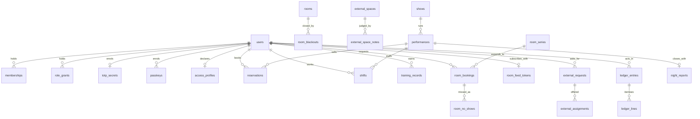
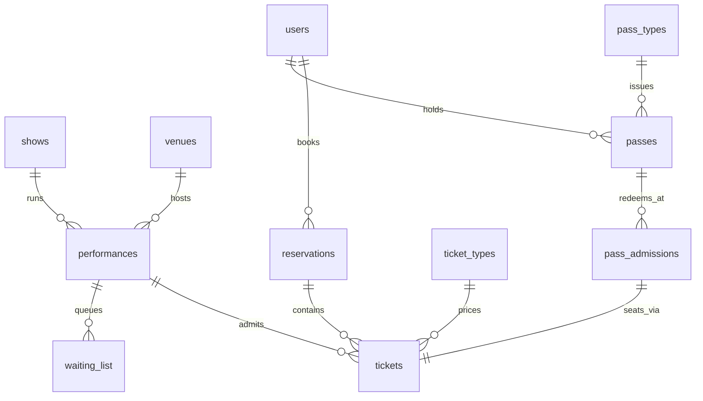
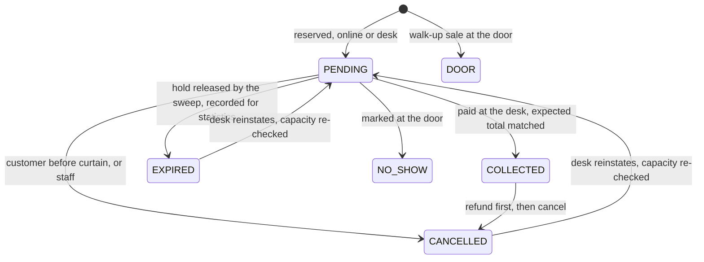
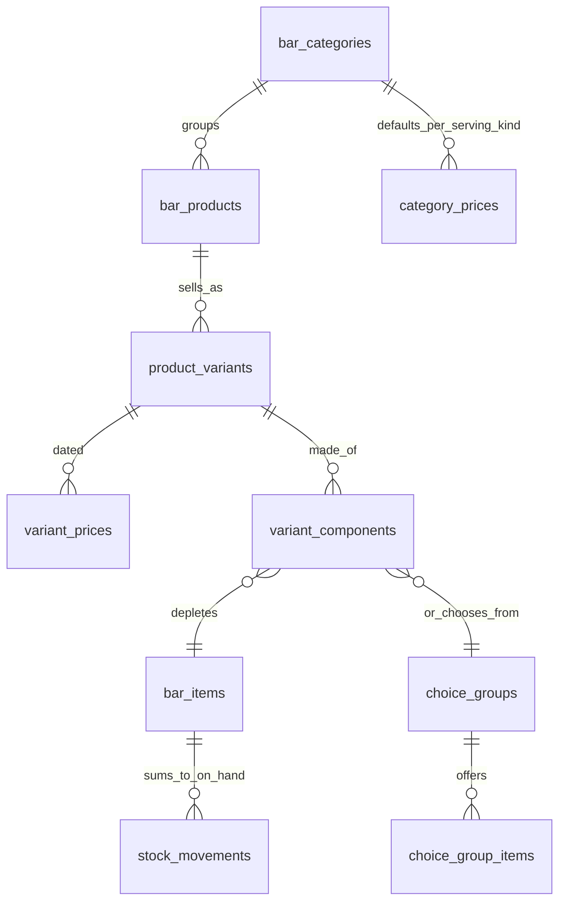
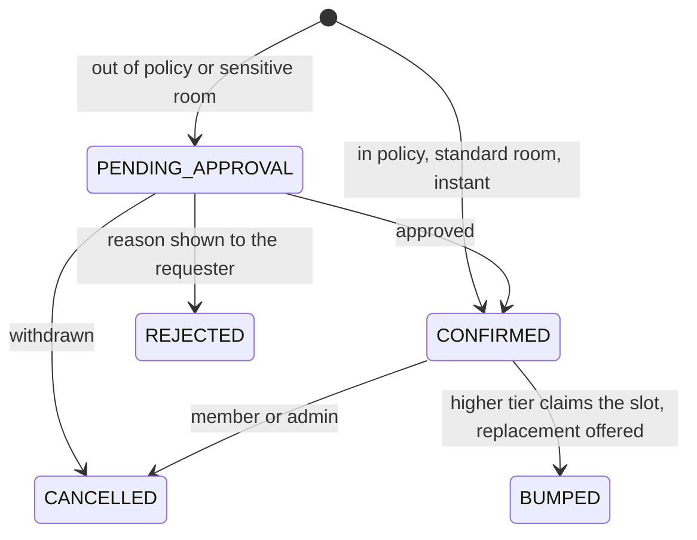
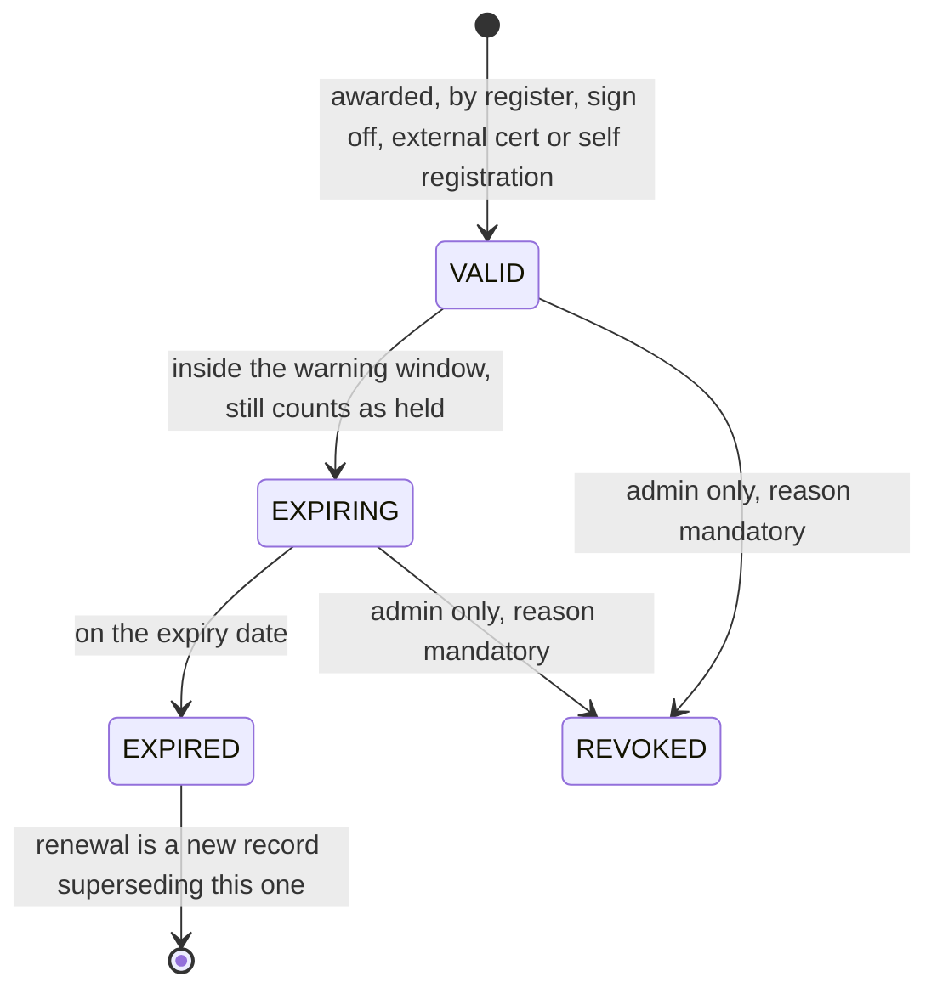

# Data model

Every table in the unified database, by module. `architecture.md` is the shape of the system;
this is its memory. The migration tooling (`migration/`) loads into exactly this model.

## Conventions

- **Ids** are text nanoids, generated by the application. Every imported row takes a fresh id;
  the live schema carries no legacy identifiers (decision 0015).
- **Instants** are integer seconds UTC (`*_at`), which is what `unixepoch()` returns. **Civil dates** (a performance day, a
  price's effective date) are ISO `YYYY-MM-DD` text, meaning the Europe/London day (0014).
- **Money** is integer pence (0004). **Booleans** are integers 0/1.
- **Enums** are text with a CHECK constraint; the values below are exhaustive.
- **Append-only tables** (marked APPEND-ONLY) refuse UPDATE and DELETE by trigger, with the
  narrow named exceptions listed in each entry (0010).
- **Scrub columns** (marked scrub) hold personal free text and are cleared by erasure (0011).
  Classification lives in `shared/utils/personal-data.ts`, one entry per table naming what the
  export carries and what erasure scrubs, deletes or leaves; `tests/unit/personal-data.test.ts`
  refuses a table that names a person and is not classified. The classification is per table
  today, not per column.
- FKs: `restrict` where history must survive (money, records), `cascade` for owned children,
  `set null` where the reference is optional colour.

## The shape at a glance

Everything hangs off `users`; the ledger and the programme are the other two centres of
gravity.

## Identity and membership (module A)

### users
`id` PK · `email` UNIQUE lowercased · `name` · `pronouns` (optional, scrub) · `password`
(scrypt PHC, NULL for guest or Google-only; **never non-NULL on an @newtheatre.org.uk
address**, import-enforced, 0008) · `phone` NULL (scrub) · `password_set_at` NULL · `password_last_used_at` NULL ·
`google_sub` UNIQUE NULL · `google_linked_at` NULL · `google_last_used_at` NULL ·
`pending_google_email` UNIQUE NULL (admin-set claim marker) · `student_id` UNIQUE NULL (how the committee finds somebody on the
SU's list: names do not always match and the address is often personal, 0031) · `verified` bool ·
`disabled` bool · `session_epoch` int ·
`anonymised_at` NULL · `last_login_at` · `created_at` · `updated_at`.
Anonymisation rewrites `email` to `deleted-<id>@anonymised.invalid`, `name` to `Deleted
user`, clears `pronouns`, `phone`, `password`, `student_id`, `google_sub`, `pending_google_email` and the four
credential timestamps, and bumps
`session_epoch`. Every write path guards on `anonymised_at IS NULL`, and the
`users_tombstone_guard` trigger refuses an identifying UPDATE on an anonymised row whether the
path remembered to guard or not (0011, A-125 criterion 3): a guard in a handler is a guard one
handler can forget.
The four `*_at` credential columns are what the account's own screen lists as when each way in
was added and last used (A-113). They are NULL on a row that predates them, and on an imported
one where the old estate never recorded it: the screen says so rather than inventing a date.
Indexed on `disabled`, `verified`, `anonymised_at`, `last_login_at` and `name`, which are what
the admin directory filters and sorts on (A-121); without them every filter is a scan.

### emergency_contacts
`user_id` PK → users cascade · `name` (scrub) · `phone` (scrub) · `relation` (scrub) ·
`updated_at`. Readable only by tonight's duty manager and safety officers while the person
holds a shift or production role (A-3). Neither a shift nor a production role exists yet, so
until they do it is readable by its owner and nobody else: the audience opens when there is
something to evaluate it against, never wider than the story allows (A-114).
Written through `PUT /api/account/profile`, which removes the row when the contact's name is
cleared: a contact with no name is nobody, and an emptied row reads like an answer.

### memberships
`id` PK · `user_id` → users cascade · `starts_on` / `expires_on` (London dates: a term of one or
three years running from the purchase, not a committee year) · `source` CHECK `MANUAL|ROSTER` (no
purchase source: membership is bought at the SU only) · `evidence` (grant note or import run id) ·
`granted_by` · `confirmed_at` / `confirmed_by` (checked against the SU's list afterwards; a check
never gates money) · `renewal_notice_at` · `created_at`.
CHECK `expires_on > starts_on`. Current membership = today inside the term or inside
`MEMBERSHIP_GRACE_DAYS` after it, read at query time (0031). A renewal is another row: history is
never rewritten.

### fellowships
`id` PK · `user_id` → users restrict · `awarded_on` (date, London) · `awarded_by` (the
committee or meeting that resolved it, not an individual) · `citation` (the public wording of
what it was awarded for) · `revoked_at` NULL · `revoked_by` NULL · `revocation_reason` scrub ·
`created_at`. `pass_id` → passes (the lifetime entitlement, 0023) arrives with module D as a
nullable column: the roll is recorded first, because the committee assembles it before the box
office exists.
UNIQUE (`user_id`): a person is a Fellow once. `restrict` rather than `cascade` on purpose, so
deleting a user cannot silently remove an award from the theatre's own record; erasure
anonymises the person and the award stands.
A revoked fellowship stops future admissions and rewrites nothing (0023).

### role_grants
`id` PK · `user_id` → users cascade · `role` (namespace-free officer role, validated against
the permission map in code) · `expires_at` NULL = permanent (default: next 31 July, London) ·
`granted_by` · `granted_at` · `note` scrub · `expiry_warned_at`.
UNIQUE (`user_id`, `role`). Enforced at read time; the last-administrator guard is a write
check, not a constraint.

### totp_secrets
`user_id` PK → users cascade · `secret` · `confirmed_at` NULL until proven ·
`last_used_step` (replay block) · `created_at`.

### passkeys
`id` PK · `user_id` → users cascade · `credential_id` UNIQUE · `public_key` · `counter` ·
`transports` JSON · `backed_up` bool · `label` · `created_at` · `last_used_at`.
Relying-party id is the unified domain; nothing imports from the old estate (0008, SP-4).
Enrolment asks for a discoverable credential with user verification required, so sign-in is
usernameless and one passkey stands for both the credential and the second factor (A-105).
`counter` is written on every use and a value that fails to advance is refused as a copied
authenticator, which is the only reason keeping the count is worth anything.

### passkey_challenges
`id` PK (the attempt id the browser echoes back) · `challenge` · `user_id` → users cascade,
NULL while signing in because a usernameless attempt does not know whose it is · `expires_at` ·
`created_at`. Indexed on `expires_at`, and swept on each write rather than on a schedule.
A challenge is taken, not read: verifying anything against it removes it, so a response cannot
be replayed. Its own table rather than a kind on `auth_tokens`, because that column carries a
CHECK and widening one in SQLite is a full rebuild of a table holding live tokens (A-105).

### recovery_codes
`id` PK · `user_id` → users cascade · `code_hash` · `used_at` NULL. Eight per set; a new set
retires the old in the same batch.

### auth_tokens
`id` PK · `user_id` → users cascade · `kind` CHECK
`EMAIL_VERIFY|PASSWORD_RESET|MAGIC_LINK|SET_PASSWORD` · `token_hash` UNIQUE · `email` (bound
address for verify) · `expires_at` · `created_at`. One outstanding per (user, kind);
delete-as-claim on redemption. Transient: never migrated, swept when expired.

### access_profiles
`user_id` PK → users cascade · `status` CHECK `PENDING|VERIFIED|EXPIRED|DECLINED|WITHDRAWN` ·
the nine need flags below · `companions` int 0..2 · `access_card_number` (evidence sighted,
value not retained beyond the reference) · `requester_note` scrub, never shown to the door ·
`foh_note` (agreed operational wording, shown to the holder) · `consent_foh_at` NULL = the
door sees nothing · `verified_by` · `verified_at` · `expires_at`.
Special category data: encrypted at rest, deleted outright on erasure and 30 days after
withdrawal (D-6).

The nine flags follow the Access Card categories run by Nimbus Disability, so a patron who
already carries one recognises our questions and we recognise their card:

| Flag | What it means |
| --- | --- |
| `standing` | Standing for long periods is difficult or impossible. |
| `crowds` | Crowded settings cause overwhelm. |
| `level_access` | Wheelchair accessible facilities, or level access, are required. |
| `distance` | Moving more than short distances is restricted. |
| `urgent_toilet` | Prompt toilet access is needed, without queueing. |
| `essential_companion` | Access is significantly difficult without support from another person. |
| `visual_information` | Visual information is a barrier; alternative formats are needed. |
| `audible_information` | Audible information is difficult to access or process. |
| `other` | Anything the categories above do not cover, such as photosensitive epilepsy. |

**A card is evidence, not a requirement.** An Access Card number is the quickest way to confirm
a profile because Nimbus has already done the assessment, and it is one route among several. A
patron without one is verified on other evidence and gets the same profile; nothing in the
booking path may ask whether a card exists.

These are our column names, chosen to match Nimbus's meanings rather than to mirror its
vocabulary. The scheme's published symbol set has changed before (an assistance dog symbol has
come and gone, and crowds were added), so the mapping is ours to maintain and a change there is
a documentation change here, not a migration.

## Programme (shared by ticketing and show night)

### venues
`id` PK · `name` UNIQUE · `address` · `capacity` int NULL = uncapped · `is_external` bool ·
`image_key` (R2) · `description` · `created_at`. General admission only; no seat-map tables
exist and nothing may assume them (constraint 4).

### venue_features / venues_to_features
Feature vocabulary and junction (both cascade).

### venue_emergency_info
`venue_id` PK → venues cascade · assembly point, exits, isolation points, what3words, notes
(free text, safe: describes the building, never a person) · `updated_by` · `updated_at`.

### seasons
`id` PK · `name` UNIQUE · `starts_on` · `ends_on` · `sort` · `archived` bool. The financial
season is 1 August to 31 July.

### show_categories
`id` PK · `name` UNIQUE · `sort`.

### shows
`id` PK · `slug` UNIQUE · `title` · `subtitle` · `description` · `long_description` ·
`poster_key` (R2) · `category_id` → show_categories restrict · `season_id` → seasons set
null · `age_guidance` · `latecomer_policy` CHECK enum · `warnings_confirmed_none` bool
(distinct from "no rows") · `content_notes` · `status` CHECK `DRAFT|PUBLISHED` · timestamps.
`production_id` NULL, reserved: module B attaches here later without a rebuild (B preclusion).

### content_warnings / show_content_warnings
Vocabulary (`slug` UNIQUE, `title` UNIQUE, `kind` CHECK `TECHNICAL|GENERAL`, `category`,
`description`, `icon`, `sort`, `archived`) and junction (UNIQUE pair, `level` CHECK
`MENTIONED|DISCUSSED|DEPICTED` NULL exactly when TECHNICAL).

### performances
`id` PK · `show_id` → shows cascade · `venue_id` → venues restrict · `starts_at` ·
`doors_at` · `duration_minutes` · `interval_count` · `interval_minutes` ·
`capacity_override` NULL = venue capacity · `booking_closes_hours_before` (NULL and 0 both
mean curtain-up) · `hold_release_minutes_before` NULL = config default ·
`external_booking_url` NULL · `status` CHECK `DRAFT|ON_SALE|CANCELLED` · `notes` (internal,
safe) · timestamps.
Sold-out and completed are derived, never stored.

## Ticketing (module D)

The reservation lifecycle, including the hold release the old estate never had:

### ticket_types
`id` PK · `name` UNIQUE global · `description` · `price` pence (base) · `kind` CHECK
`SINGLE|PASS_ADMISSION` · `access_kind` CHECK `ACCESS|COMPANION` NULL · `archived` bool ·
`active_by_default` bool.
Archive, never delete, once sold (FK restrict from tickets).

### show_ticket_overrides / performance_ticket_overrides
UNIQUE (parent, ticket_type) · `price` NULL = inherit · `active` NULL = inherit. Resolution:
performance, then show, then base.

### reservations
`id` PK · `reference` UNIQUE (6 chars, no-look-alike alphabet; a retrieval key, never a
credential) · `performance_id` → performances restrict · `user_id` → users restrict ·
`status` CHECK `PENDING|COLLECTED|DOOR|EXPIRED|CANCELLED|NO_SHOW` · `source` CHECK
`WEB|DESK|DOOR` (the door writes DOOR, fixing the old blur) · `hold_expires_at` (set while
PENDING; the release sweep moves PENDING to EXPIRED and records it for no-show statistics) ·
`cancelled_by` CHECK `CUSTOMER|STAFF` NULL · `customer_notes` scrub · `staff_notes` scrub ·
`qr_token_hash` (the one stable QR credential, D-108) · timestamps.
Indexes: (`performance_id`, `status`), (`user_id`, `created_at`), `hold_expires_at`.

### tickets
`id` PK · `reservation_id` → reservations restrict · `performance_id` → performances
restrict · `ticket_type_id` → ticket_types restrict · `price_paid` pence snapshot ·
`price_source` CHECK `VARIANT|OVERRIDE|BASE|IMPORT` · `refunded_at` NULL.
**The capacity rule** (0006): a ticket counts toward capacity while its reservation status is
`PENDING|COLLECTED|DOOR` and `refunded_at IS NULL`; inserts carry the capacity predicate on
the statement. Index (`performance_id`, `refunded_at`).

### waiting_list
`id` PK · `performance_id` → performances cascade · `user_id` NULL → users · `email`
(guests) · `joined_at` · `status` CHECK `WAITING|OFFERED|CLAIMED|LAPSED|LEFT` ·
`offered_at` · `offer_expires_at` · `claimed_reservation_id` NULL.
Partial UNIQUE (`performance_id`, `email`) WHERE status IN ('WAITING','OFFERED'). Offers
cascade in join order; the claim is a conditional write.

### pass_types / pass_type_prices / pass_type_shows
As the old model: product (`slug` UNIQUE, `status` CHECK `DRAFT|ON_SALE|CLOSED`, validity and
sales windows, `max_issued`), price points (UNIQUE (type, label)), covered shows (UNIQUE
pair). Desk-sold only (0005).

### passes
`id` PK · `reference` UNIQUE · `pass_type_id` restrict · `pass_type_price_id` restrict ·
`user_id` → users restrict · `price_paid` snapshot · `status` CHECK
`ACTIVE|CANCELLED|EXPIRED` · `issued_by` · `notes` scrub · timestamps.
Issuing posts a `PASS_SALE` ledger entry in the same batch (fixing the old estate's silent
pass money).

### pass_admissions  APPEND-ONLY
`id` PK · `pass_id` restrict · `performance_id` restrict · `ticket_id` UNIQUE restrict ·
`admitted_at` · `admitted_by` NULL (self-serve).
**UNIQUE (`pass_id`, `performance_id`) is the once-per-performance rule.**

### pass_requests
`id` PK · request → decision workflow (`status` CHECK `PENDING|FULFILLED|DECLINED|EXPIRED`,
`note` scrub, `decided_by`, `pass_id` NULL). A request is not a pass.

## The ledger (module I)

### ledger_entries  APPEND-ONLY
`id` PK · `happened_at` · `london_day` (civil date, computed server-side) · `source` CHECK
`DESK|TILL|SELF_SERVE|IMPORT|SYSTEM` · `tender` CHECK `CARD|COMP|TAB|NONE` · `actor_id` →
users restrict NULL (system) · `total_pence` (0 on a COMP; negative on a reversal) ·
`reverses_entry_id` NULL self-FK (a correction points at what it corrects) · `comp_reason`
NULL, **no CHECK** until module D decides its values (0033) · `comp_approved_by` NULL · `discount_id` NULL · `discount_percent` /
`discount_pence` snapshots · `tab_debtor_id` NULL → users restrict · `tab_settled_at` ·
`tab_settlement_entry_id` NULL self-FK · `void_of_entry_id` NULL (tab charges only; a
reversing entry, 0031's rule carried) · `created_at`.
Exception to append-only: none. Even voids and refunds are new reversing rows, and
`ledger_entries_no_self_reversal` refuses an entry that claims to reverse itself.
`server/utils/ledger.ts` is the only writer; `check:ledger` fails the build on any other file
that inserts into either table. `postEntry` returns statements rather than writing them, so
money and the thing it paid for commit in one batch (0001, I-102 criterion 6).

### ledger_lines  APPEND-ONLY
`id` PK · `entry_id` → ledger_entries cascade · `kind`, **no CHECK**, held as an enum in
`shared/utils/ledger.ts` and enforced at the one write path, because a CHECK on an append-only
table can never be widened (0033):
`TICKET_COLLECTION|WALK_UP|BAR_ITEM|PASS_SALE|TAB_SETTLEMENT|REFUND|IMPORT` ·
`amount_pence` gross · `reservation_id` NULL · `performance_id` NULL · `ticket_id` NULL ·
`product_variant_id` NULL · `qty` · `unit_price_pence` · `price_ref` (which price row and
level resolved, F-121) · `choices` JSON.

### z_readings
`london_day` PK · `reader_pence` (typed from the SumUp display) · `expected_pence` (computed
at entry, snapshot) · `variance_pence` · `entered_by` · `note` · `created_at`. The daily
reconciliation record (I-104); a variance is a fact to explain, not an error to suppress.

### periods
`id` PK · `kind` CHECK `TERM|SEASON` · `starts_on` · `ends_on` · `closed_at` NULL ·
`closed_by`. A closed period locks its ledger days; corrections post into the open period.

## Show night (module E)

### shift_templates
`id` PK · `venue_id` NULL = fallback · `role` CHECK `DUTY_MANAGER|DOOR|BAR` · `count`.
UNIQUE (`venue_id`, `role`).

### shifts
`id` PK · `performance_id` → performances cascade · `role` CHECK as above · `user_id` NULL →
users restrict · `status` CHECK `OPEN|CLAIMED|CONFIRMED|DECLINED` · `needs_review` bool
(training gate could not be evaluated) · `assigned_by` · `claimed_at` · `confirmed_at` ·
`notes` (describes the slot, safe).
CHECK: OPEN implies `user_id` NULL, non-OPEN implies NOT NULL. Partial UNIQUE
(`performance_id`) WHERE role='DUTY_MANAGER' AND status='CONFIRMED'. Claims are conditional
writes gated live on training records (E-1).

### incidents  APPEND-ONLY
`id` PK · `performance_id` restrict · `reported_by` restrict · `body` (operational free
text; people by role, never diagnosis) · `severity` CHECK `NOTE|NEAR_MISS|INCIDENT|SERIOUS` ·
`supersedes_id` NULL self-FK · `created_at`. Follow-ups live in V2's workflow tables.

### age_checks  APPEND-ONLY
`id` PK · `performance_id` restrict NULL (bar can check outside a show) · `checked_by`
restrict · `outcome` CHECK `ACCEPTED|REFUSED` · `reason` CHECK enum (mandatory on REFUSED) ·
`description` (appearance, never a name) · `product` · `notes` · `supersedes_id` NULL ·
`created_at`. The licensing register; exports span CSV and PDF.

### night_reports
`performance_id` PK → performances restrict · `payload` JSON (attendance, takings by tender,
incidents, milestones, staffing, bar summary, access counts only) · `closing_note` ·
`closed_by` NULL (auto-close) · `auto_closed` bool · `closed_at` · `emailed_at` NULL = retry
queue. UNIQUE by PK makes closing idempotent.

### backstage_nights / backstage_devices / backstage_messages / backstage_presets
As the estate's proven design: the join code is derived (HMAC of night + epoch + secret) and
never stored; devices hold a token hash and the epoch they joined at; messages carry
`direction`, optional `milestone` CHECK enum, snapshot `label`, acknowledgement; presets are
committee-editable. Free text purges at 30 days; milestones persist into the night report.

### foh_contacts
`id` PK · `kind` CHECK `COMMITTEE|VENUE|SECURITY|TAXI|OTHER` · `label` · `phone` · `note` ·
`sort`.

## Bar (module F)

One stocked thing sells at many sizes; price resolves variant first, category default second
(0017). Stock only ever moves through the append-only ledger.

### bar_items  (stocked things)
`id` PK · `name` · `unit` CHECK `ML|ITEM` · `container_ml` NULL for whole items, **immutable
once movements exist** · `par_qty` · `age_restricted` bool default true · `allergen_notes` ·
`status` CHECK `ACTIVE|RETIRED` · `created_at`.

### bar_categories
`id` PK · `name` · `sort` · `colour`.

### bar_products  (sellable things)
`id` PK · `category_id` → bar_categories restrict · `name` · `status` CHECK
`ACTIVE|HIDDEN|RETIRED` · `staffed_only` bool (not on self-serve tabs) · `sort`.

### product_variants
`id` PK · `product_id` → bar_products cascade · `serving_kind` (the price-resolution key:
`bottle`, `125ml`, `175ml`, `250ml`, `single`, `double`, `pint`, `half`, `item`…) · `label` ·
`sort`. UNIQUE (`product_id`, `serving_kind`).

### variant_components
`id` PK · `variant_id` → product_variants cascade · `item_id` NULL → bar_items restrict ·
`choice_group_id` NULL (exactly one of the two) · `qty` in the item's real units ·
`included_in_price` bool (the free mixer, 0017).

### choice_groups / choice_group_items
`id` PK · `name` (e.g. Mixers); members reference bar_items.

### variant_prices  APPEND-ONLY
`id` PK · `variant_id` cascade · `price_pence` · `effective_from` civil date · `created_at` ·
`created_by`. Latest row on or before today wins; same-day rows resolve by `created_at`
(fixing the old one-row-per-day trap).

### category_prices  APPEND-ONLY
`id` PK · `category_id` cascade · `serving_kind` · `price_pence` · `effective_from` ·
`created_at` · `created_by`. Resolution: variant price first, category default second,
refuse-to-sell if neither (0017, F-121).

### bar_discounts
`id` PK · `name` · `percent` 1..100 · `status`. Snapshotted onto entries; bar lines only.

### bar_sessions / bar_session_performances
One open session per venue per London night (partial UNIQUE (night, venue) WHERE
`closed_at IS NULL`); may span a matinee and evening (E-127); checklist JSON on close.

### stock_movements  APPEND-ONLY
`id` PK · `item_id` → bar_items restrict · `qty` signed, real units · `kind` CHECK
`DELIVERY|SALE|COMP|STOCKTAKE|WASTAGE|TRANSFER|ADJUST|REVERSAL` · `ref_table` / `ref_id` ·
`actor_id` · `created_at`. On-hand is always `SUM(qty)`. Partial UNIQUE (`ref_id`) WHERE
ref_table='stocktake_lines' (a duplicate finish rolls the batch back).

### stock_deliveries / stock_delivery_lines / stocktakes / stocktake_lines
As the estate's proven design: deliveries at cost; one open stocktake (partial unique);
counted NULL distinct from counted zero; finishing posts movements atomically.

### comp_requests
`id` PK · lines JSON snapshot · `gross_pence` · `status` CHECK
`PENDING|APPROVED|DECLINED|EXPIRED` (expiry derived at read, 10 minutes) · `requested_by` ·
`decided_by` · `ledger_entry_id` NULL · `note` scrub · `created_at`.

## Rooms (module C)

### rooms
`id` PK · `name` UNIQUE · `description` · `capacity` NULL = uncapped, CHECK `> 0` · `is_active`
bool · `sensitive` bool (books via the approval queue regardless of policy) · `created_at` ·
`updated_at` · `min_booking_minutes` / `max_booking_hours` / `notice_hours` / `horizon_weeks` /
`active_bookings_cap`, each NULL falling back to the estate setting of the same name; nought is an
override meaning none needed, so resolution tests absence rather than falsiness (C-106 criterion 1)
· `campus` · `building` · `contact` (free text: a name, an address, whatever gets the room
booked). Indexed on `is_active`, which is what a member-facing calendar filters on.
**Every room here is one we control.** A `venue` is where a performance happens, and an internally
managed room may be one: the auditorium is booked for rehearsals and hosts performances. So the noun
is always *room*. Rooms the Students' Union manages are **not in this table at all**: they are
`external_spaces`, a reference catalogue, because we can never guarantee availability we do not
control (decision 0036, C-119, C-120). `is_external` is gone with them, and `sensitive` is now the
only room-level reason a booking goes to the approval queue whatever the policy says.
Retired, never deleted: a booking made last term still names something (C-101 criterion 2), and
there is no delete endpoint at all rather than one that refuses. Capacity is compared against a
booking's attendee count as a **warning, never a refusal**: the old estate recorded both and
compared neither.

### room_hours
`id` PK · `room_id` cascade · `weekday` 0..6 CHECK · `opens` `HH:MM` · `closes` `HH:MM`, CHECK
`closes > opens`. **No rows at all = open whenever**: most rooms have no restriction worth
recording, and making an officer fill in seven days to say so is the wrong default. Once a room
has any hours, they are exhaustive, so a weekday with no row is then a day it is shut. Zero-padded so the two compare and sort as
strings, which is why no part of the opening-hours rules involves a date or a timezone.
Replaced wholesale on an edit rather than patched: seven days is small enough that a diff would
be more code than value.

### room_bookings
`id` PK · `room_id` → rooms restrict · `user_id` → users restrict · `title` · `attendees` int NULL
· `starts_at` · `ends_at` (half-open interval; CHECK `ends_at > starts_at`) · `tier`, **no CHECK**,
enum in `shared/utils/bookings.ts` · `status` CHECK
`CONFIRMED|PENDING_APPROVAL|REJECTED|CANCELLED|BUMPED` · `rejection_reason` scrub · `notes`
scrub · `reason` scrub (why an exception is asked for, the member's own words, C-108) ·
`escalated_at` NULL (when the approvers were told it was waiting, so a sweep tells them once) ·
`decided_by` → users NULL, `decided_at` NULL (who answered the request, and when) ·
`no_show_recorded_at` NULL · timestamps. Indexed on `status`, which the request sweep reads. Indexed on `(room_id, starts_at, ends_at)`, which
is exactly what the clash predicate reads, and on `user_id` for the active-bookings cap.
`tier` carries no CHECK because `ROOM_PRIORITY_TIERS` is committee-editable, and a constraint
behind an editable list breaks writes the moment the list is used (0033's reasoning, C-115).

**`purpose` is not `tier`.** A tier answers who keeps a contested slot; a purpose answers what the
room is needed for, which is what makes a room suitable or not. One `USelect` was doing both jobs
under the label "What kind of booking". `purpose` is nullable with no default and no CHECK: the
list (`ROOM_PURPOSES`) is committee-editable and validated at the write path, and the history
C-118 imports was never asked, so "not recorded" is a real answer rather than an invented one. It
is required on every new booking and deliberately not preselected on the form, because a defaulted
purpose means a member who never looked at the field gets no suitability warning (C-119). A link
may carry it (`/rooms/book?purpose=REHEARSAL`), which is a stated intent rather than a silent
default.
`series_id` → room_series NULL and `occurrence` NULL carry an occurrence's place in its term
(C-110). `bumped_to_booking_id` and `bumped_reason` carry a bump (C-115). Indexed on `series_id`,
which every series-scoped action reads. Adding a column is not a rebuild, and this table is not
append-only.

**Bumping** (C-115) is never automatic: a booking over a confirmed one is still a 409, and only an
officer with `rooms.write` may take a slot, with a mandatory reason. The order comes from
`ROOM_PRIORITY_TIERS`, so a committee that reorders the tiers reorders the rule; a tier the setting
no longer lists ranks below everything, and an equal or lower tier can never bump. The displaced
booking becomes `BUMPED`, which is distinct from `CANCELLED` and is never deleted, and links to
what was offered in its place.

The displaced member is offered **the nearest equivalent slot, held for them rather than
suggested**: the same room first, then a room whose recorded capacity is at least equal, closest in
time either side, skipping anything booked or closed. A room whose capacity nobody recorded is not
offered against a room that has one, because it cannot be shown to be big enough. If nothing
equivalent is free the bump still goes ahead and the message says so. The whole thing is one batch:
the displaced row flips guarded on `CONFIRMED`, and both the claimant's booking and the offer are
written only if that flip landed, so a lost race leaves nothing behind.
Erasure scrubs `notes`, `reason` and `rejection_reason` to null and `title` to `Erased booking`,
and keeps the row: the room was used, which is a fact about the room rather than about the person
(0011). `title` is NOT NULL, and nulling it would fail the whole erasure batch, so the register
names what a non-nullable scrubbed column becomes instead (`scrubTo`).
A member cancels through `POST /api/rooms/bookings/[id]/cancel`, which is **a status change and
never a deletion**: no member-facing delete path exists at all, rather than one that refuses
(C-112 criterion 2, audit RM-3). The write is guarded on the status it read, so two cancels racing
leave one success. `CANCELLED`, `REJECTED` and `BUMPED` are terminal, and the row stays in the
member's own list with its status (criterion 5).
Occupancy: `CONFIRMED` and `PENDING_APPROVAL` hold their slot; the clash rule is half-open
and rides the write as a predicate. `server/utils/bookings.ts` is the only writer, and it is one
guarded `INSERT ... SELECT ... WHERE NOT EXISTS ... RETURNING id`: a row returned is the win, and
no rows is disambiguated by a single read into gone (410) or beaten (409), the pattern 0003 names.
A request lands `PENDING_APPROVAL`, which already holds its slot in both the clash predicate and the
availability sweep, so a decision in progress cannot be booked out from under (C-108 criterion 2).
The approvers are told when a request arrives (`room.request.raised`), not only once it has gone
stale. If an approver has the rooms topic muted the send is skipped and logged as suppressed, and
the request still stands on the queue: a muted inbox cannot orphan one (C-113 criterion 4).
`rooms:sweep` tells the approvers once when a request has waited past `ROOM_REQUEST_ESCALATE_HOURS`
and lapses it past `ROOM_REQUEST_EXPIRE_HOURS`, both guarded on the status they read so an approver
deciding at the same moment wins. Approvers are whoever holds `rooms.write`; there is no approver
role, and C-109's queue reads it the same way.

The queue is `GET /api/admin/rooms/requests`, gated on `rooms.write`, and it **re-judges every
waiting request as it reads it** rather than recalling the verdict from when it was written: a
request made on Monday may have run out of notice by Thursday, and the officer deciding needs what
is true now (C-109 criterion 1). The requester's standing is what it judges against, never the
reader's.

`POST /api/admin/rooms/requests/decide` answers one or up to a hundred at once. Each decision is
**its own guarded statement**, never one `UPDATE` over an id list: the clash rule rides the
approving write, so an approval beaten to the slot returns a conflict listing what took it rather
than confirming a double booking (criterion 3, audit RM-4). No statement's parameter count grows
with the batch; the read that fetches the rows first chunks at 90 (0003). A zero-row write is
disambiguated by one read into missing, already settled, room gone, or beaten, so a partly refused
batch says which ones and why rather than reading as a success.
`REJECTED`, `CANCELLED` and `BUMPED` are terminal for everyone, officers included: reopening is
refused because the slot may already be somebody else's (criterion 5). An approval may move the
booking into a different room, one at a time, and the clash rule is asserted against the room it is
going into.
Decisions notify **once per member per action**: five approvals for one person in one batch are
five lines of one email, not five emails (criterion 4). A rejection reason is shown to the
requester word for word, in the message and in their own booking list (criterion 2), and stays out
of the audit trail, which records the room and the decision only (0011).
There is no override, deliberate or otherwise: blackouts (C-114) and priority tiers (C-115) are how
a legitimate double-booking happens, and each leaves a record of what happened and why.
Read back through `GET /api/rooms/availability`, which takes a span of London days, counts the
sweep before fetching it and refuses past `ROOM_AVAILABILITY_ROW_BOUND` rather than truncating: half
a sweep would show a taken slot as free (C-103 criterion 1). Every conflict it returns is masked by
the same helper the booking refusal uses, so a member reads "Booked" and nothing else unless the
booking is their own (criteria 4 and 5). Conflict responses mask titles and identities from
non-admins ("Booked"). In-policy bookings for standard rooms confirm instantly (C-1).

### room_feed_tokens
`id` PK · `user_id` → users cascade, UNIQUE · `token_hash` UNIQUE · `last_fetched_at` NULL ·
`created_at`. One live feed per person, and minting replaces the row, which is what revokes the
old URL: the hash it would be looked up by is gone, so nothing compares or expires anything
(C-104 criterion 3). The URL carries the plaintext and the database holds only its hash, so a
leaked backup grants no calendar. The plaintext is returned once, in the response that mints it,
and is readable nowhere afterwards; `GET /api/account/room-feed` answers only whether one exists.

`GET /rooms/feed/<token>/calendar.ics` is a Nitro route rather than an API one, because a calendar
client fetches it with no session and no cookie: the token is the whole authorisation, and it
reaches that one member's bookings and nothing else. A token that names no account gets the same
404 as one that was never issued. It carries `ROOM_FEED_WEEKS` ahead, because a subscription is
polled forever and the horizon is what stops the file growing without end. A cancelled, rejected
or bumped booking is still sent, marked `CANCELLED` with `SEQUENCE:1`, so a client that already
holds the event strikes it out rather than leaving a rehearsal on somebody's phone (criterion 5).

Every time is a London wall clock carrying a `VTIMEZONE`, never a UTC instant, so a 19:00 booking
reads 19:00 in both halves of the year (criterion 4). `shared/utils/ics.ts` builds the file and is
pure, so both transitions are unit cases rather than a hope.

`GET /api/rooms/bookings/[id]/ics` is the same builder for one booking, and the confirmation email
carries that file as an attachment (criterion 1).

### Utilisation reporting
No table: the figures are counted from `room_bookings`, `room_hours` and `room_no_shows` on demand
(C-117). Every total is summed in SQL rather than by fetching rows and adding them up, so a year is
one statement and not a download. `GET /api/admin/rooms/reports/utilisation` breaks down by room or
by tier, pages, and returns an envelope; `.../reports/export` is the same figures as CSV, every cell
quoted so a room name with a comma cannot split a row (criterion 3).

Confirmed, cancelled and no-show hours are told apart, and a no-show is **its own figure rather
than a deduction**: the room was held and not used, which is the number the review wants
(criterion 1). Whether a booking counts as a no-show uses `CURRENTLY_MARKED`, the same
latest-entry-wins rule the ladder uses, so a withdrawn no-show returns to being used hours and the
report and the ladder can never disagree.

The denominator is what the policy engine says a room is open for, walked day by day from
`room_hours`, so the figure a booking is judged against and the figure it is divided by are the
same. A room with no hours recorded is always open and therefore has **no** denominator: that reads
as "no opening hours recorded", never as nought per cent.

The span is London days, so a report of one month neither gains nor loses an hour when the clocks
move inside it (0014). Figures survive an erasure, because the bookings do (0011, criterion 4).

Breakdown by production, and the pre-migration flag on imported bookings, arrive with the stories
that create those things (C-118, module B).

### room_no_shows
`id` PK · `booking_id` → room_bookings restrict · `user_id` → users restrict · `kind` CHECK
`RECORDED|WITHDRAWN` · `reason` NULL · `supersedes_id` NULL · `recorded_by` → users NULL ·
`recorded_at`. Indexed on `user_id` and on `booking_id`. **Append-only, trigger-enforced**, joining
the 0010 set: a correction is a superseding `WITHDRAWN` entry naming what it replaces, never an
edit, so the count a member is judged on can always be reconstructed (C-116 criterion 2). The old
app promised no-show tracking and never built it, so an empty booked room cost nothing (RM-1).

Anyone holding `rooms.write` may mark a booking, and only a **past confirmed** one: a booking still
to come cannot have been missed, and one nobody held cannot either (criterion 1).

**One booking is one no-show** however many entries exist about it: the count is the latest entry
per booking, not a row count. Ties break on `rowid` rather than on `id`, because `recorded_at` is
whole seconds and a mark and its withdrawal can share one; the table never deletes, so a later
insert always has the higher rowid. `latestFor` orders identically, so what a withdrawal supersedes
and what the ladder counts can never disagree.

The ladder is `ROOM_NO_SHOW_RECORD_AT` (2) and `ROOM_NO_SHOW_PREAPPROVAL_AT` (3), counted over a
window that is **rolling and bounded by the committee year, whichever is shorter**
(`ROOM_NO_SHOW_WINDOW_DAYS`, 365): a June no-show survives the July handover, and one from two
committees ago does not follow somebody about (0009, criterion 3).

At the pre-approval step, `judge()` sets `needsApproval` for **every** booking whatever the policy
says about it, so it diverts to the approval queue, and the booking form says so before the member
fills it in (criterion 4). `GET /api/rooms/standing` gives a member their own count, standing and
records, withdrawals included, so a correction is visible rather than a gap (criterion 5).

Erasure keeps the rows: append-only means a scrub could not run here even if it were wanted, and
the reference resolves to the tombstone the user row became, so the statistics survive and the
ladder dies with the account (criterion 6, 0010, 0011).

### external_requests and external_assignments
`external_requests`: `id` PK · `user_id` → users restrict · `title` · `purpose` · `attendees` ·
`starts_at`, `ends_at` CHECK `ends_at > starts_at` · `preferred_space_id`, `assigned_space_id` →
external_spaces NULL · `notes` · `su_reference` · `status` CHECK
`REQUESTED|AWAITING_EXTERNAL|CONFIRMED|REJECTED|CANCELLED` · `submitted_at`/`by` ·
`decided_at`/`by` · `rejection_reason` · `escalated_at` · timestamps. Indexed on `status` and
`user_id`. `external_assignments`: `id` PK · `request_id` → external_requests cascade · `space_id`
→ external_spaces restrict · `outcome` CHECK `ACCEPTED|REFUSED` · `reason` · `recorded_by` → users
· `recorded_at`.

**A request is not a booking** (decision 0036). It holds no slot anywhere, so two members may ask
for the same evening and a union ask never blocks a booking of our own. It has no room until the
union answers, which is why it cannot live in `room_bookings`: `room_id` is NOT NULL and every
member-facing read of it is an `innerJoin`, so a nullable room would make an in-flight request
silently vanish from the member's page, their feed and the queue.

**A series may hold occurrences of both kinds** (C-124). `external_requests` carries `series_id`
and `occurrence` like a booking does, so a week moved elsewhere keeps its place in the term rather
than breaking it up. `room_series.head_booking_id` and `head_request_id` name the earliest
occurrence still standing of either kind, and exactly one is ever set: a head naming both would
name neither. `room_series.room_id` stays NOT NULL and keeps meaning *the room the series was
booked in*, which is the form's default and stays true when one week moves; it is not a claim about
every occurrence. Cancelling a term cancels both kinds, because a week left waiting on somebody
after the term is gone is a form nobody withdraws, and it still sends one message naming the weeks.

**A request moves between the two tables rather than being cancelled and re-asked** (C-123).
Neither `status` set can gain a value: both carry a `CHECK` and both tables have cascading
dependents, so `check:migrations` refuses the rebuild. So a move is a **supersede**, the habit the
rest of the estate already has: the old row goes to `CANCELLED` carrying `converted_to_request_id`
or `converted_to_booking_id`, and the new row points back the other way. **A cancellation carrying
one of those pointers must never display as "Cancelled"**: `saysBookingState` and
`saysExternalState` exist for that, and a member seeing a live request marked withdrawn is the
defect they prevent.

The two directions are not symmetric. Unlisting **frees** the slot the request was holding and
always succeeds, but is refused when there is no longer time to ask, naming the date the form would
have had to go in by. Relisting **claims** a slot, so it is `claimSlot` with the predicate on the
INSERT, it refuses naming the room when somebody else has it, and it lands `CONFIRMED` or
`PENDING_APPROVAL` according to the policy: choosing the room is not a licence to skip the rules.
Title, purpose, attendees, times and notes cross; the member's `reason` does not, because it
answers a question the other side never asks.

**The screens never say "the union", and never "ask the union".** A member books *a room not
listed here*; the estate calls these *rooms we do not manage*. The Students' Union is named only
where a person needs to know whose form it is and who decides. The identifiers keep `external`,
which is the domain word and is not read by anybody outside this repository.

The lifecycle is `REQUESTED → AWAITING_EXTERNAL → CONFIRMED`, with `refuse-assignment` looping back
to the union and `reject`/`cancel` ending it. Every write is guarded on the status it read (0006).
**Confirm is folded into assign**: an accepted assignment is the confirmation. `assign` and
`refuse-assignment` are both allowed **from `CONFIRMED` as well**, because the union moving us room
to room after answering is ordinary: a refusal clears `assigned_space_id` and returns the request to
`AWAITING_EXTERNAL`, and submitting again clears `escalated_at` so the new wait is chased on its own
terms. `AWAITING_EXTERNAL`
keeps exactly its old meaning, the form is in and they have not answered, so C-118's import no
longer translates it away.

`external_assignments` is why asking again is not the spreadsheet all over again: **every room the
union offered is kept**, with whether it suited and why, so nobody later has to remember that we
asked for one room, were given another, and sent it back. Refusing an offer may write the
suitability note in the same action, so the blacklist builds itself out of the work.

Assigning a room noted `UNSUITABLE` for the request's purpose is **refused with 409** unless the
body says `despite`. That is deliberately not the "warn and allow" shape `overCapacity` uses: the
whole complaint is that nobody knew the room was wrong until they turned up to it, and a warning
there would be read past. The audit records that a note existed and was overridden, never its
wording (0011).

Cancelling one the union already has **tells the approvers**, because our arrangement with them
stands until a person withdraws it. That closes the C-112 criterion 3 gap `docs/known-issues.md`
recorded, which could not be closed before because there was no arrangement object to withdraw.

An external request **escalates but never expires**: expiry frees a held slot and this holds none,
so lapsing one would tell the member nothing while the union may still answer. `rooms:sweep` chases
the approvers once past `ROOM_REQUEST_ESCALATE_HOURS`, saying which half of the wait it is stuck in.

A confirmed union room reaches everywhere a booking does: the member's calendar feed (tentative
while it is still with the union, since they may yet say no) and the day-before reminder, which
sends one message covering our rooms and theirs together.

**Notice is counted in working days**, defaulting to three, from the member's ask rather than from
the day the form goes in: a request waiting in the queue eats its own slack. Saturdays, Sundays and
any date in `BANK_HOLIDAYS` do not count, and **the booking's own date is never judged**, only the
gap before it, so a Saturday get-in is ordinary. Where the holiday list does not reach the date
being judged the request is **refused** rather than counted, because a list read as "no holidays"
grants less notice than the rule requires; `/api/health` and the settings screen both report
coverage running short before anybody is refused (C-121, decision 0038).

Both list endpoints return `{ items, total, more }` capped at 200 rows, `more` saying plainly that
the cap was hit rather than reporting it as a total. The officer's queue orders **open first and
soonest first, then the settled ones most recent first**: it is a list of work, and an answered
request from last term is a lookup. Every request's offers arrive with it in one query, chunked at
90 bound parameters (0003).

Erasure scrubs the member's words from a request and keeps what was asked; an assignment scrubs
`recorded_by` and keeps what the union offered, and `submitted_by`/`decided_by` are scrubbed like
every other officer column in the module.

### external_spaces and external_space_notes
`external_spaces`: `id` PK · `name` UNIQUE · `campus` · `building` · `contact` · `capacity` CHECK
`> 0 OR NULL` · `is_active` · timestamps. `external_space_notes`: `id` PK · `space_id` →
external_spaces cascade · `purpose` · `verdict` CHECK `SUITABLE|CAUTION|UNSUITABLE` · `reason`
NOT NULL · `written_by` → users NULL · timestamps, UNIQUE `(space_id, purpose)`.

**A catalogue, never an estate.** These are rooms the Students' Union manages, listed so a member
can state a preference and so we remember what we learned about each. Nothing here holds a slot,
appears on a calendar, or can be booked: we cannot promise a room we do not control (C-119
criterion 1). A room is retired rather than deleted, so an old request still names something.

**A verdict is about one room and one purpose**, which is the whole point of the pairing: the fixed
table that ruins a rehearsal is exactly what a meeting wants. `UNIQUE (space_id, purpose)` means
noting the same pair again replaces the verdict rather than leaving two claims nobody can choose
between. Notes are **ordinary editable rows, not an 0010 append-only register**: they say what we
believe about a room today, and a room that gets its table removed should simply stop being marked
bad. `purpose` carries no CHECK because `ROOM_PURPOSES` is committee-editable (0033's family).

`GET /api/rooms/external-spaces` searches on the server and never ships the catalogue, and returns
per result the verdict and warning for the purpose asked about, so a member is warned before the SU
is ever troubled. Notes for a set of spaces are read in one statement, split at 90 because the ids
come from a result set (0003, 0006).

Erasure scrubs `written_by` and keeps the note: what we learned about a room outlives whoever wrote
it down, and the audit trail keeps who. The wording never enters an audit detail, because a note may
describe a person's experience (0011).

### room_blackouts
`id` PK · `room_id` → rooms cascade NULL · `reason` NOT NULL · `starts_at`, `ends_at` CHECK
`ends_at > starts_at` · `created_by` → users NULL · timestamps. Indexed on `(starts_at, ends_at)`
and on `room_id`. **A null `room_id` is every room**, which is what a building closure or a fire
alarm test means (C-114 criterion 1). The old app had no blackout mechanism at all, so members
booked into a get-in and found out on the night (RM-6).

A booking, a request or a series occurrence overlapping a closure is refused **with the reason
attached** (criterion 2). That is the one deliberate exception to C-103's conflict masking: a
closure renders on the calendar for everybody with its stated reason and is never shown as
"Booked" (criterion 4), because a member turned away deserves to know it is rewiring rather than
go looking for whoever booked it. A series lists a blacked-out occurrence among its refusals like
any other, so the member skips it explicitly rather than having it dropped for them.

Creating a closure **cancels what is already booked under it, in the same batch that writes it**,
and writes the reason into each `rejection_reason`. Only the occurrences a closure actually covers
are cancelled, never a whole series: a get-in on one Monday does not take a term with it
(criterion 3). Any series whose head went has the next occurrence promoted. Everybody affected is
told once, however many of their bookings went, naming each (C-113 criterion 2).

Removal **restores nothing** (criterion 5). A cancelled booking stays cancelled and has to be made
again, because its slot may be somebody else's by then. Creation and removal are both audited.

Erasure scrubs `created_by` to null and keeps the closure: the room was shut, which is a fact
about the room; who typed it in lives in the audit trail (0010, 0011).

### room_series
`id` PK · `user_id` → users restrict · `room_id` → rooms restrict · `title` · `frequency` CHECK
`DAILY|WEEKLY` · `weekdays` (sorted list, Sunday nought; null for a daily series) · `starts_on`
London day · `clock_from`, `clock_to` wall clocks · `occurrences` CHECK `> 0` ·
`head_booking_id` NULL · timestamps. Indexed on `user_id`.

**The recurrence is stored as the member described it, never as instants.** A wall clock and a
London day expand to instants on demand; storing instants would bake one DST offset into a whole
term, which is the bug C-110 criterion 4 names (0014). `shared/utils/series.ts` does the expansion
and walks calendar days, never milliseconds: one week is 167 hours in March and 169 in October, so
a 19:00 rehearsal that stays 19:00 is not evenly spaced in real time. Both transitions are
automated cases.

Creation expands, then **policy- and conflict-checks every occurrence before any row is written**
(criterion 2). Each occurrence counts against `ROOM_ACTIVE_BOOKINGS_PER_MEMBER` as the check walks
the term, which is what the setting means by "a series counts each occurrence". If any occurrence
fails, nothing is written and the refusal lists every failing occurrence with its day and reason,
so a member resubmits with `skip` and keeps every other week where it was (criterion 3). The whole
series confirms or the whole series queues; an occurrence is never a different kind of thing from
its siblings (criterion 6). Occurrences carry `series_id` and `occurrence`, and are ordinary
bookings for every other rule in the module (criterion 5).

The write is one `db.batch`: the series row, then a guarded claim per occurrence, then a statement
that fails the batch unless every claim landed (**0035**). A guarded `INSERT` matching nothing
writes no row and raises nothing, so without that assertion a series beaten to one slot would
commit eleven of its twelve weeks silently.

`head_booking_id` is the earliest occurrence still standing. Cancelling it promotes the next **in
the same batch as the cancel**, whatever the scope, so a series never splits and nothing can read
a head that is already gone (C-111 criterion 3).

Cancelling from a series **always asks which**: `POST /api/rooms/bookings/[id]/cancel` refuses a
booking carrying a `series_id` unless the body names `scope` as `occurrence` or `series`. There is
no default, because a single button meaning either one week or a whole term is the ambiguity the
story exists to remove (criterion 1). A series-scoped cancel covers every non-terminal occurrence
in one predicate rather than an id list, so a term of any length is one statement (0003, 0006);
already cancelled or rejected occurrences are untouched (criterion 2). One message names the weeks
that went, never one per occurrence (criterion 5).

Editing an occurrence or a series is not built: no booking-edit path exists anywhere in the module
yet, so a series edit would mean inventing a single-booking edit first.

Erasure scrubs the series title to `Erased series` and keeps the row, the same rule its occurrences
follow. It exports under its own section, because the bundle keys by section and sharing the
bookings one would lose a table.

Equipment (C V2) tables are deliberately not designed yet; nothing above precludes an asset
register referencing `users` and training records.

## Training (module G)

Carries the old rehearsal design nearly verbatim (0018), with delivery modes added.

### departments / department_leads
`departments`: `code` PK vocabulary · `name` · `description` · `is_active` · `sort` ·
timestamps. Committee-editable, so it is a table rather than a CHECK (0033).

`department_leads`: `id` PK · `department` restrict · `user_id` cascade · `expires_at` NULL =
permanent, with no column default: the write path stamps the next 31 July, London ·
`granted_by` set null · `granted_at`. UNIQUE (`department`, `user_id`), and indexed on
`expires_at`, which is what makes the never-swept read cheap. The only assigned standing in the
module: trainer and supervisor standing derive from records instead, and expiry is read at every
leads-only surface rather than swept (0037, G-110).
Erasure keeps the row: who stewarded a department in a year is governance history, it holds no
free text, and it names nobody but its subject.

### modules
`id` PK (published human id, e.g. `TECH-111`) · `department` restrict · `kind` CHECK
`MODULE|CERTIFICATION|BRIEF` · `name` · `description` · `notes` (lead-only) ·
`delivery_mode` CHECK `IN_PERSON|SELF_DIRECTED|HYBRID` · `expiry_mode` CHECK
`NONE|MONTHS|ACADEMIC_YEAR` · `expiry_months` · `allows_external` bool ·
`external_evidence` · `safety_critical` bool · `signoff_required` bool · `grants_trainer` /
`grants_supervisor` bool (frozen while unrevoked records exist) · `self_registrable` bool
(BRIEF only, G-208) · `status` CHECK `DRAFT|ACTIVE|RETIRED` · `sort` · timestamps.

Six further CHECKs carry rules the form also states, because a rule stated only in a form holds
only until somebody writes a second writer: safety-critical is never `SELF_DIRECTED`; a `MONTHS`
policy carries months and nothing else does; a months policy is between 1 and 120; a `BRIEF`
carries no expiry policy; a `BRIEF` grants neither standing; only a `BRIEF` is self-registrable.
Each is a closed set about process, so each may carry a constraint (0033). The cap is also
`MAX_EXPIRY_MONTHS` in `shared/utils/training.ts`, and the two move together only by hand.

A module stores an expiry **policy**, never a date. What a record earned today would run to is
computed on the way out of a request from the policy, `ACADEMIC_YEAR_BOUNDARY` and
`TRAINING_CARRY_OVER_DAYS`; an award stamps the answer onto the record, and no later change to
the policy moves it (G-123, G-124).

### module_materials
`id` PK · `module_id` cascade · `label` · `url` · `sort` · `created_at`. Zero or more links
per module, owned by the module's department and editable by its leads (G-107 criteria 1 and
5). The single `materials_url` column this section previously named was an error against 0018,
which has always said links, plural.

### module_prerequisites
`id` PK · `module_id` cascade · `requires_id` restrict · `created_at`. UNIQUE
(`module_id`, `requires_id`), CHECK `module_id <> requires_id`, indexed on `requires_id`.

Direct edges only: there is no transitive or grouped expression anywhere, and every prerequisite
check in the system evaluates these edges against currently held records, with EXPIRING counting
as held (G-108). Cascade from the requiring end and restrict from the required end, so an edge
dies with the module that declared it and never takes the module it points at with it.

A cycle is refused at the write by a recursive walk that returns the shortest path back, so the
refusal names the loop rather than saying one exists: the officer cannot see a path running
through modules they are not looking at. The walk binds three parameters whatever the graph's
size, and its visited check compares whole ids, because matching on a bare substring would let a
module whose id ends in another's stop the walk early and miss a real loop (0003).

Two rules are the write path's rather than the schema's, because each is a fact about the other
table: a `BRIEF` can never be the target of an edge, and a module another requires cannot be
changed into one. No `created_by` column: the trail carries provenance, and a column ending `_by`
would demand a personal-data entry for a table that names nobody.

### training_sessions / session_modules / session_attendees
As proven: sessions carry `held_on` civil date, status CHECK
`PLANNED|OPEN|FULL|DELIVERED|CANCELLED`, capacity, register stamps; attendees UNIQUE
(session, user) with status CHECK `SIGNED_UP|CANCELLED|ATTENDED|ABSENT`, sign-up order is
the derived waitlist; the register opens on the day, marks must cover it exactly, and
delivery is a single-winner conditional write.

Validity is derived at read time, never stored; the diagram is the derivation, not a status
column:

### training_records  APPEND-ONLY (exception: revocation stamps `revoked_*` once)
`id` PK · `user_id` restrict · `module_id` restrict · `awarded_on` civil date ·
`expires_on` NULL = never · `expiry_overridden` bool · `source` CHECK
`SESSION|SIGNOFF|EXTERNAL|SELF|LEGACY` (`SELF` is G-208 brief self-registration and V2
quizzes; `LEGACY` is vocabulary only, nothing writes it) · `session_id` NULL ·
`granted_by` · `evidence_ref` scrub · `revoked_at` / `revoked_by` / `revoke_reason` scrub ·
`created_at`. Indexed on (`user_id`, `module_id`) and on `module_id`.
Validity is derived (`VALID|EXPIRING|EXPIRED`), never stored; expiring counts as held. Which
record is current is derived the same way: a renewal is a newer award for the same person and
module, and supersession is computed, not a column.
Partial UNIQUE (`session_id`, `user_id`, `module_id`) WHERE session NOT NULL AND revoked
NULL.

`session_id` carries **no foreign key, now or ever**. The sessions table is G-112's, and adding a
key to this one later would be a table rebuild, which the append-only triggers make a refusal
(0010). G-112 enforces the reference at its write path instead.

The append-only trigger is an allow-list rather than a blanket refusal, in the shape
`audit_log` has used since migration 0001. It admits exactly three edits and refuses every other:
erasure clearing `evidence_ref` and `revoke_reason`; a revocation stamping `revoked_at`,
`revoked_by` and `revoke_reason` once; and G-124's recalculation restating `expires_on` on a
record that is neither overridden nor revoked, which is criterion 4 of that story expressed in the
database. Two consequences worth stating, because both look like good practice from the outside:

- **No CHECK ties `revoke_reason` to `revoked_at`.** The reason is mandatory at revocation, but
  erasure must be able to clear it, and a CHECK on an append-only table can never be dropped.
  The rule lives in Zod and at the write path.
- **The table can never be rebuilt.** `ALTER TABLE ADD COLUMN` still works; a new CHECK, a new
  foreign key or a widened CHECK does not.

### module_requests
One open request per (user, module) by partial unique; decline carries a reason shown to the
requester (scrub).

### practice_targets / practice_windows
Targets keyed by immutable `key`; windows opened by register-open or by hand, closed by
sweep; consumers inside the same database now, no API seam.

## Platform (modules H, J, K)

### notification_preferences
`user_id` · `topic` CHECK `BOOKINGS|SHIFTS|TRAINING|ROOMS|ANNOUNCEMENTS` · `email` bool ·
`push` bool. UNIQUE pair. Transactional types have no preference rows at all.

### notification_log
`id` PK · `user_id` NULL · `type` · `channel` · `subject` · refs (record/session/booking) ·
`status` CHECK `SENT|FAILED|RETRYING|SKIPPED_UNDELIVERABLE` · `sent_at` · `error`.
Idempotency claims (a promotion, a reminder) are partial unique indexes here.

### inbox_items
`id` PK · `user_id` cascade · `type` · `title` · `body` · `link` · `read_at` ·
`created_at`. The in-app channel; never coalesced.

### config
`key` PK · `value` JSON · `updated_by` · `updated_at`. Defaults live in code; a missing row means
the default, so the table holds overrides only and a default changed in code still propagates.
Read through `configValue()` in `server/utils/configuration.ts`, which loads the override set once
per request: an isolate-scoped cache would hold a stale value until the isolate recycled, and a
settings change has to take effect on the next request (0012). A key the workshop register proposed
no value for has neither row nor default, and reading one is refused rather than guessed (0019).
The settings surface shows default, current and last editor; wide-blast keys take a typed
confirmation (J-104, J-105). Policy pages resolve `{{TOKENS}}` against this table (0012).

### audit_log  APPEND-ONLY (exception: erasure redacts identifying values in `detail`)
`id` PK · `actor_id` NULL = system · `action` · `target` · `detail` JSON (never personal
free text) · `created_at`. Indexes on actor, action, target, created_at.
Trigger-enforced: rows are never deleted, and no field may be rewritten except `detail`. The
aim is that `detail` never carries identifying values (0011), but aim is not guarantee, so
erasure can redact one that has. Everything that says what happened, and when, and to whom it
was done, survives the redaction. A correction supersedes with a new entry.

Two registries govern what may be written. `shared/utils/audit-actions.ts` is the closed catalogue
of actions: each carries a label and the module it belongs to, and `auditEntry` refuses a name that
is not in it, so a typo cannot create a category and the screen always has something to display.
`shared/utils/audit-coverage.ts` says which route answers for which entry, and `check:audit` fails
the build when a mutating route is missing from it, claims an action it does not write, or is
exempt without a reason (J-101 criterion 5). A state change records `changes: { field: { from, to } }`,
one shape whatever endpoint wrote it (J-101 criterion 4); a settings change whose value is
sensitive records a hash pair instead, which is a redaction rather than a diff (0024).

A `manual.*` action is recorded after the fact by an officer, for something that happened outside
the system. Its `actor_id` is the officer who signed it, and its detail carries `onBehalfOf` (a
`user:<id>` reference to whoever decided it) and `occurredAt` (the real-world date, which is not
`created_at`). Everybody a manual entry names is an account on this system: the trail never holds a
name it could not later anonymise (0028).

### mfa_attempts
`id` PK · `user_id` → users cascade · `expires_at` · `created_at`. A first credential that has
been proven but not yet answered with a second factor (A-111). Five minutes, single use: a
wrong code consumes the attempt and issues a fresh one, so a typo costs the code and not the
password step. Swept on a schedule; an expired attempt returns the user to the first step.

### rate_limits
`key` PK · `window_start` · `count`. Fixed-window, swept daily.

## The conditional-write claims (0006), in one place

| Claim | Mechanism |
| --- | --- |
| Seat capacity | ticket INSERT carries a NOT-EXISTS/count predicate against effective capacity; zero rows = beaten, quoted with live availability |
| Shift claim | UPDATE ... WHERE status='OPEN'; duty-manager uniqueness by partial unique index |
| Register delivery | UPDATE session SET status='DELIVERED' WHERE status IN ('OPEN','FULL'); the loser 409s, awards ride the same batch |
| Waiting-list offer/claim | UPDATE ... WHERE status='OFFERED' AND offer not lapsed |
| Promotion / reminder at-most-once | conditional INSERT under a partial unique in notification_log |
| Pass per performance | UNIQUE (pass_id, performance_id) |
| One open bar session / stocktake | partial unique WHERE open |
| Same-slot room bookings | half-open overlap predicate on the INSERT/UPDATE |

Each row in this table is a named racing test in CI (K-105, K-121).

## Migration notes (what the real data says)

Measured against production on 26 August 2026: auth holds 9,974 users (8,268 already
anonymised, 9,930 guests, 38 role grants); proscenium holds 30,110 reservations and 45,563
tickets (£114,309.50 in unrefunded snapshots) but only one transactions row, so historical
money imports as `IMPORT`-source ledger lines derived from tickets, not from transactions;
rooms holds 258 bookings across 4 rooms and 27 external venues (external venues import as
inactive external rooms or retire, an open question in `backlog/C-spaces.md`); training
holds 59 records against a placeholder catalogue and does not migrate (K-117 resolved). The
incident and age-check registers are empty (K-115 resolved, count-guarded at cutover).
