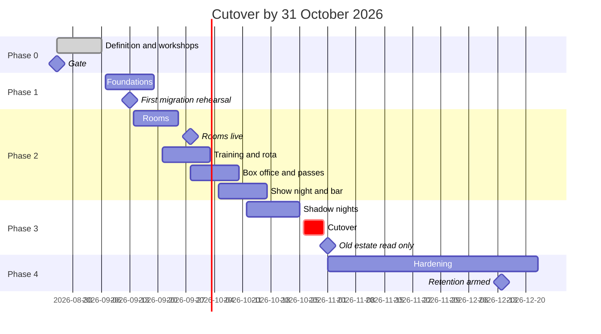

# Roadmap: cutover by 31 October 2026

Compressed from the original plan at the committee's direction. The compression is honest only
because Phase 0's authoring is already done (this package), and because the first shows of the
autumn season double as shadow nights. The build itself was always a matter of weeks; what this
timeline removes is slack between decisions, not testing or trust-building.

## Phases

### Phase 0: definition (26 August to 6 September)

- This package authored and circulated: backlog, ADRs, workshops register, spikes, standards.
- Committee workshops in the week of 31 August (agenda in `workshops.md`).
- Spikes: all five answered on 26 August (outcomes in `spikes.md`). SP-1 refused (typed
  cross-check permanent), SP-2 manual import only, SP-4 trivial, SP-5 settled D1. SP-3 is
  confirmed build work: the export and reconciliation tooling is written by this project,
  first dry-run by 13 September.
- Pre-migration data repairs run against the live estate in this window (the bar container
  sizes, zeroed stocktakes, double-voided tabs and placeholder-email customers already
  documented in proscenium's known issues). They are owed regardless of migration.

**Gate: passed 26 August 2026, eleven days early (decision 0019).** The committee signed the
backlog scope and accepted the decision records; the configuration defaults are deferred to the
workshops in the week of 31 August and ship meanwhile as the proposed values in
`workshops.md`. Product code begins from that date.

### Phase 1: foundations (7 to 19 September)

- New repository from `standards.md`: CI, test harness with the named regression cases seeded,
  deploy pipeline, health checks, migration gating.
- Identity: accounts, Workspace-only Google, passkeys, MFA, roles with committee-year expiry.
- Platform spine: configuration surface, audit trail, ledger schema, notification centre
  skeleton, design system, phone-first operational shell.
- First data import: all users and roles, re-runnable from fresh exports weekly thereafter.

**Gate: a committee member signs in with a Workspace account, holds an expiring role, and every
action they take lands in the audit trail.**

### Phase 2: modules (14 September to 17 October, slices overlapping)

| Slice | Build window | Live |
| --- | --- | --- |
| Room booking (calendar, policy engine, approvals) | 14 to 25 September | **28 September**, term start, as the pilot module |
| Training records and rota (catalogue, records, registers, shift claiming) | 21 September to 3 October | **5 October** |
| Box office and passes (public site, reservations with expiring holds, desk collection, pass issue and redemption, door scanning) | 28 September to 10 October | **12 October**, in time for season on-sale |
| Show night and bar (tonight screens, registers, backstage board, till with variants, stock, tabs, reconciliation, night reports) | 5 to 17 October | shadow first (Phase 3) |

- The committee authors the real training catalogue in parallel, owner named, deadline
  30 September.
- Migration rehearsals run weekly from fresh production exports, checksummed and reconciled by
  row counts and money totals.

**Gate: feature-complete MVP; every money, capacity, register and erasure invariant covered by
automated tests; two consecutive green migration rehearsals.**

### Phase 3: shadow and cutover (12 to 31 October)

- Shows are assigned to a system for their whole run during the transition: door and money
  follow the show's system, so no single night ever splits across two records.
- The first shows of the season run on the old system with the new door screen and till
  operated in shadow alongside, reconciling both records each night (at least three nights).
- Shows from the week of 26 October run authoritatively on the new system.
- **31 October: final import from frozen exports; the old estate goes read-only on 1 November.**
- Rollback: the read-only old estate can be re-armed within a day for the remainder of the
  season if a cutover-blocking defect appears.

### Phase 4: hardening (November to December)

- The season runs on the new system; defects fixed on live rhythm; operator documentation
  finished in-app; a training evening for committee and volunteers.
- Retention automation armed in December after its first reviewed dry-run digest.
- A restore drill from backups before the break.
- Late December: V2 planning against two months of real usage.

### Phase 5: V2 (from January 2027)

In rough order: self-directed and hybrid training modules with quizzes; equipment loans;
budgets and settlements; marketing segments; practice sandboxes; allocations and holds.
Handover mode ships before July 2027 so the incoming committee is handed the system by the
system. The production module is specified in summer 2027 for the 2027/28 season.

## What the compressed dates depend on

1. Gate review turnaround inside a week; a fortnight's delay here is a fortnight off the back.
2. The SP-3 migration tooling reaching its first green dry-run by 13 September (the other
   four spikes are already answered).
3. The training catalogue authored by 30 September (committee work, not code).
4. The pre-migration repairs done in September.
5. Shadow nights actually happening at the season's first shows; if the season opens later than
   mid-October, cutover slips with it, not the other way round.
6. One primary developer working agent-assisted with same-day committee answers on product
   questions; a second contributor compresses Phase 2 further but changes no gate.
