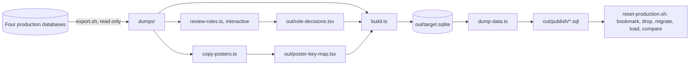

# Migration tooling (SP-3)

The pipeline that turns four production databases into one. Standalone: the application never
imports from here. One command builds the whole unified database locally from fresh dumps; one
script, and only one, replaces production's contents with it (0072).

## Safety rules

- Exports are reads of production. Nothing here writes to a remote database except
  `reset-production.sh`, which refuses without `--i-mean-it <database>` and a Time Travel
  bookmark, and `copy-posters.ts`, which writes only into the unified R2 bucket.
- Dumps and outputs live in `dumps/` and `out/`, both gitignored: they contain personal data
  and belong on this machine only, deleted after each run.
- The id maps (`out/*-id-map.tsv`, `out/id-map.tsv`) are working artefacts (decision 0015): they
  never enter the application database and are archived with the read-only old estate.
- Every role grant crosses because a person decided it should, at a prompt, and the decision is
  on file in `out/role-decisions.tsv` (0070). A build with an undecided grant fails.



## Running it

```bash
bun install
bun run migration:export          # wrangler d1 export --remote, four databases, into dumps/<date>/
bun run migration:review-roles    # one prompt per live old grant; answers land in out/role-decisions.tsv
bun run migration:copy-posters    # copies show posters between R2 buckets; can run alongside the build
bun run migration:build           # schema, identity, catalogue, every history, reconciled; out/target.sqlite
bun run migration:dump -- --skip-ledger   # out/publish/NNN-data.sql plus counts.json
./migration/reset-production.sh --i-mean-it unified   # production, by hand, with the NUXT_HUB_* triplet set
```

`build.ts` prints one line per step (`ok` or `FAILED` with each problem) and a row count per
table, and writes `out/build-summary.json`. Every step's exceptions are in `out/*-exceptions.txt`:
each line names a row the transform refused to guess about. A step that fails stops the build,
and the fix goes into the transform, never into the numbers.

Each `transform-*.ts` script runs its own step alone against a target you name (usually
`out/target.sqlite`), for iterating on one transform; `build.ts` runs the same functions
(`steps.ts`) in order in one process. `bun migration/dry-run-synthetic.ts` proves the transforms
against synthetic data built in the script, never against `dumps/`.

## What the build does, in order

1. **Schema** (`schema.ts`): applies `server/db/migrations/sqlite` in journal order to a fresh
   `out/target.sqlite` and writes the `_hub_migrations` ledger, so the target is exactly what
   production runs and answers `/api/health` the same way.
2. **Inventory**: per-table row counts and domain checksums for all four dumps (`out/manifest.json`).
3. **Identity** (K-112, `identity.ts`): merges the four user stores on the canonical stage-door
   id, mints fresh ids, wipes any password on an `@newtheatre.org.uk` address (0008), preserves
   tombstones as tombstones, drops old-domain passkeys (SP-4), and writes each grant the decisions
   file accepted with the expiry it decided (0070). The old estate's audit history is not imported
   (0030). Checked against the manifest before anything is loaded: counts, wipes, tombstones, no
   old estate id in `granted_by`, every address lowercase, every live grant decided, and the
   K-115 guard that the incident and age-check registers are still empty upstream.
4. **Load** (`load.ts`): upserts the identity core into the target by identity, never writing to a
   person already anonymised there (0011, 0059).
5. **Catalogue** (`catalogue.ts`, 0075): rooms and union venues from `rooms`, departments,
   modules and prerequisites from `training`, the `SINGLE` ticket types from `proscenium`, all by
   id, and the one system-owned `Pass admission` ticket type (0074).
6. **Bookings** (C-118, `bookings.ts`): the old rooms app's bookings, recurring series and union
   requests, keyed to the accounts identity minted and the rooms the catalogue minted. The old
   app lost every booker (`user_id` is NULL on all 258 rows in the 13 September export), so a
   booking naming nobody lands on one shadow account, `rooms-import@legacy.invalid`, named for
   what it is; a booking naming no room at all stays an exception.
7. **Training** (K-113, `training.ts`): department leads, sessions, attendance, requests and
   records from `rehearsal`'s live history (0065), against the catalogue the same build imported.
   `training_records` is append-only (0010): inserts only, ids kept in a map.
8. **Programme** (K-113, `programme.ts`): venues, seasons, categories, shows, the content-warning
   vocabulary, performances, and the show- and performance-level ticket price overrides. A show's
   poster key comes from `out/poster-key-map.tsv` where `copy-posters.ts` has written one; a rerun
   never overwrites a poster uploaded through the app since.
9. **Reservations and passes** (`reservations.ts`, `passes.ts`, 0073): every reservation and seat,
   with the old `LEGACY_IMPORT` channel landing as `DESK`. A ticket of an old `PASS_SALE` type is
   not a seat: it becomes a pass, with a pass type per product and committee year, a price point
   per price seen, and `issued_by` null. A ticket of an old `PASS_ADMISSION` type lands on the
   system's pass-admission ticket type and becomes a `pass_admissions` row on the holder's pass
   for that year; a second seat on one performance is a second pass, never a merge; admissions
   with no recorded sale mint an admissions-only pass priced at nought and say so in `notes`. A
   reservation left holding no seat is skipped and counted. The two negative prices in the estate
   are clamped to nought and counted; non-`EXACT` price confidences are counted per value rather
   than listed per ticket.
10. **Money** (K-114, I-109, `money.ts`): six years of ticket revenue as opening ledger history,
    from `tickets` never `transactions`; a refund posts a reversing entry; every line names the
    seat, reservation and performance the same build imported, so revenue by show (I-106) reads it.

Not imported, on purpose: memberships (no old database holds membership state; every member reads
lapsed until recorded, `docs/operations.md`), the old audit history (0030), the bar (nothing to
carry, K-116), web push subscriptions, and anything under `tickets_sale` in the Heroku-era
Postgres dump, which holds nothing the Cloudflare estate had not already resolved.

## Why the same row keeps the same id

Every `out/*-id-map.tsv` is an input as well as an output: read before anything is minted, so a
rebuild updates rather than duplicates. Losing one costs a rebuild of the scratch target, not ten
thousand duplicate people: delete `out/target.sqlite` and the maps together and start again.

## Loading the dumps

`lib.ts#execDump` runs a dump one statement at a time inside one transaction, recognising a
statement boundary only outside a quoted value. `Database.exec()` on the whole 44 MB proscenium
file is quadratic and did not finish in ten minutes; this takes under a second.

## Publishing

`dump-data.ts` writes INSERT files parents-first, twenty thousand statements each, leaving out the
rows the migrations themselves seed (recognised by any unique key: their ids differ per database).
`reset-production.sh` records each loaded file in `out/publish/DONE`, so a run that stops halfway
picks up where it stopped, and ends by comparing every table's count with `out/publish/counts.json`.
The bookmark it prints first is the way back: `docs/operations.md` has the restore command.
