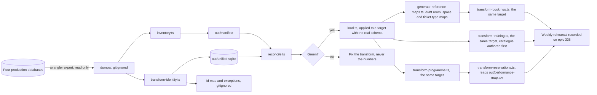

# Migration tooling (SP-3)

The pipeline that turns four production databases into one, rehearsed weekly until cutover
(epic #338). Standalone: the application never imports from here.

## Safety rules

- Exports are reads of production; nothing here ever writes to a remote database.
- Dumps and outputs live in `dumps/` and `out/`, both gitignored: they contain personal data
  and belong on this machine only, deleted after each rehearsal.
- The id map (`out/id-map.tsv`) is a working artefact (decision 0015): it never enters the
  application database and is archived with the read-only old estate at cutover.



## Running a rehearsal

A target with the real application schema first, the same one every later step writes into:
`bun run dev` once creates `.data/db/sqlite.db`, or copy it, or apply the Drizzle migrations to
a scratch file by hand.

```bash
bun install
./migration/export.sh          # pulls fresh dumps from production via wrangler
bun migration/inventory.ts     # loads dumps locally, writes out/manifest.json + .md
bun migration/transform-identity.ts   # builds the unified identity core in out/unified.sqlite
bun migration/reconcile.ts     # verifies counts and invariants; non-zero exit on failure
bun migration/load.ts /tmp/rehearsal.db          # writes out/load.sql and applies it
bun migration/generate-reference-maps.ts /tmp/rehearsal.db  # drafts room, space and ticket-type
                                                              # maps; authored ones confirm
bun migration/transform-bookings.ts /tmp/rehearsal.db   # the old rooms history, same target
bun migration/transform-training.ts /tmp/rehearsal.db   # training history, catalogue authored first
bun migration/transform-money.ts /tmp/rehearsal.db      # ticket revenue, same target
bun migration/transform-programme.ts /tmp/rehearsal.db  # venues, shows, performances, same target
bun migration/transform-reservations.ts /tmp/rehearsal.db  # reservations and tickets, reads the programme output above
```

## Proving the pipeline without a real export

`bun migration/dry-run-synthetic.ts` runs identity, load, bookings, money, programme and
reservations end to end against synthetic data built in the script itself, never against `dumps/`
or `out/`. It exists because no existing test populated `identity.ts`'s `mirrors` with real
content or seeded an unmapped account in `bookings.ts`, so K-113's own exception paths, cited in
`identity.ts`'s own comments, had never actually fired anywhere. It does not exercise `export.sh`,
`inventory.ts` or `reconcile.ts` themselves, which read real files; it proves the transforms, not
the file-handling around them.

**`transform-bookings.ts`, `transform-training.ts` and `transform-money.ts` take the target as an
argument and refuse to run without one, on purpose.** Unlike identity, `room_bookings.room_id` and
`external_requests`' own room reference are real foreign keys onto rooms administered through the
live app; no hand-maintained schema subset can ever hold real room ids, because rooms are never
migrated, only referenced. `load.ts` has to run against the same target first, so the users these
key to already exist there (`docs/known-issues.md`). `transform-training.ts` additionally refuses
a target with no training catalogue: `departments` and `modules` are authored, never migrated.

`transform-money.ts` differs from the other two in one respect worth knowing: `ledger_entries` and `ledger_lines` are the application's own tables, so the money step writes into the real schema rather than staging through `out/unified.sqlite` the way identity and bookings do.

`export.sh` requires a wrangler login with access to the New Theatre account. Every later
step is offline against the dumps.

## What exists so far

- **Inventory**: per-table row counts and domain checksums (money totals, status splits) for
  all four databases; the baseline every rehearsal reconciles against.
- **Identity transform** (the cutover's first import, K-112): merges the four user stores on
  the canonical auth id, mints fresh ids, wipes any password on an @newtheatre.org.uk
  address (decision 0008), preserves anonymised tombstones as tombstones, drops old-domain
  passkeys (SP-4), and maps role grants through `role-map.json` (provisional until the
  workshop signs the vocabulary; unmapped grants land in the exceptions report). The old
  estate's audit history is not imported, in any shape (decision 0030); `reconcile.ts` checks
  that nothing has quietly started importing it again.
- **Reconciliation**: source-versus-target counts, the register count guard (K-115), and the
  invariant checks (no Workspace passwords, tombstones preserved, email uniqueness, every old role
  mapped, no old estate id left in `granted_by`, every address lowercase).
- **Booking history** (C-118): the old rooms app's bookings and recurring series, keyed to the
  accounts the identity transform minted. Statuses map to the unified vocabulary, with
  `AWAITING_EXTERNAL` becoming `PENDING_APPROVAL` on an external room, which is how the unified
  system models a booking the Theatre Manager arranges with the SU. Times are milliseconds there
  and seconds here, so the reconciliation checksums total booked seconds as well as counting rows:
  a unit error puts the whole history in 1970 and no row count would catch it. Nothing is invented:
  a booking whose account or room did not come across is skipped and named in
  `out/booking-exceptions.txt` rather than given one, and tombstones stay tombstones: a re-import
  never restores what erasure already scrubbed from an existing booking, using the same
  `NOT_ANONYMISED()` guard `load.ts` uses, on the conflict branch of every table this transform
  writes (0011, 0059, K-113). Web push
  subscriptions are deliberately not read; push consent is re-collected when push works.
  `out/room-map.tsv` maps each old `room:<id>` to a unified room and `out/space-map.tsv` maps each
  `venue:<id>` to a union room, drafted by `generate-reference-maps.ts` and confirmed, not
  written by hand from nothing (see "Two kinds of map" below). A booking at a union venue imports into `external_requests` rather than
  `room_bookings`, keeping `AWAITING_EXTERNAL` with the meaning it always had (C-120, 0036), and
  the venue it names lands in `preferred_space_id` where the union had not yet answered and in
  `assigned_space_id` where it had. The reconciliation checksums both tables.

- **Load** (K-112 criterion 4): turns the core into `out/load.sql`, upserts keyed on identity, and
  applies it to a local target when given one. It never deletes, so a person or a grant that
  vanished upstream stays until somebody decides; and it never touches production, which is applied
  by hand from the runbook in `docs/operations.md`. **It never writes to a person already
  anonymised in the target** (K-112 criterion 3, 0011): every generated statement, for every
  table the loader owns, carries `WHERE NOT EXISTS (SELECT 1 FROM users WHERE id = ... AND
  anonymised_at IS NOT NULL)`, so a rehearsal or a weekly run that reads a stale, pre-erasure
  export from the old estate cannot reinstate a deleted `totp_secrets` or `recovery_codes` row,
  or rewrite the `users` row itself, for someone erased here since the export was taken.
- **Money** (K-114, I-109): six years of ticket revenue as opening ledger history, from `tickets`,
  never `transactions`, which the old estate holds one row in across its whole life; the price
  lived on the ticket (`price_paid`), not in a separate ledger table. `reservations` is not read:
  no reservation-level record is imported here, so `customer_notes`, `staff_notes` and
  `anonymised_at` never enter the picture, and nothing needs un-tombstoning. A refund
  (`refunded_at` set) posts a second, reversing entry rather than replacing the sale, so both the
  gross figure and the net stay reconstructable from ledger rows (0004, 0010). A ticket whose
  `price_confidence` reads anything but `EXACT` still imports, and is named in the exceptions
  report rather than silently trusted. `performance_id`, `reservation_id` and `ticket_id` are left
  unset on every imported line: `transform-money.ts` does not read `out/performance-map.tsv`,
  which `transform-programme.ts` now writes, so attributing an old sale to its new performance id
  is possible but not yet wired up. The total is unaffected; that attribution is recoverable for as
  long as `out/id-map.tsv` and the archived old estate exist (0015), which is why the mapping lives
  in the ticket id kept in `out/money-id-map.tsv`, not a column on the entry, until it is wired up.
- **Training** (K-113, `migration/training.ts`): who led a department, who ran and attended a
  session, who asked to be taught, and every training record, from `rehearsal`'s live database.
  Not a revival of G-127's withdrawn Heroku-era import: G-127 and K-117 named the archive
  `rehearsal` had already absorbed once before this migration's scope begins, not `rehearsal`'s
  own current data (0065). The catalogue (`departments`, `modules`) is authored fresh in the
  unified system, the same way ticket types are, and is not read here; the transform refuses to
  run against a target with no catalogue rather than invent one. `training_sessions` is
  trainer-keyed for its erasure guard, not user-keyed like everything else this transform writes,
  because that is the column `personal-data.ts` scrubs it on. `training_records` is append-only
  (0010): every insert is `ON CONFLICT (id) DO NOTHING`, never `DO UPDATE`, which the
  `training_records_named_edits_only` trigger would refuse outright; the id is kept in
  `out/training-record-id-map.tsv` so the same historical award lands once. An old attendee
  source of `SELF`/`LEAD` becomes `SIGNUP`/`WALK_IN`, and an old `ADMIN`-sourced record becomes
  `LEGACY`, the vocabulary G-127 reserved and left unused. A department lead carries no expiry in
  the old app; an imported one gets the committee year end following the grant, the same policy a
  live grant already gets, rather than the standing authority a bare `NULL` would otherwise confer
  on an assignment years out of date.
- **Programme** (K-113): venues, seasons, show categories, shows, the content-warning vocabulary
  and performances, from the old proscenium database. Venues, seasons and shows insert or update
  by id exactly as bookings do; nothing here is keyed to a person, so 0059's `NOT_ANONYMISED`
  guard has nothing to guard, checked against `shared/utils/personal-data.ts` rather than assumed.
  A season's `starts_at`/`ends_at` are read in London, not UTC, the same discipline every date in
  this estate uses (0014): the old estate's last instant of 31 July BST is still 31 July in
  London, one second before midnight, not already the first second of August. The old latecomer
  vocabulary has four values and the new one three; `SUITABLE_BREAK` and `ANY_TIME` both narrow to
  `ADMITTED`, counted rather than silently collapsed. A show's `external_url` and `programme_url`
  have no unified column: dropped, and counted. A show naming a category, season or venue that did
  not import lands with that reference null rather than broken, named in the exceptions; the same
  is true of a performance naming a show or venue, and a warning link naming a show or warning,
  neither of which is written at all when its reference is missing. `out/venue-id-map.tsv`,
  `season-id-map.tsv`, `category-id-map.tsv`, `show-id-map.tsv`, `warning-id-map.tsv` and
  `performance-map.tsv` each map an old id to the unified one, read back before minting so a
  rehearsal updates last week's rows. The reconciliation checksums total scheduled seconds across
  every performance, the same discipline `bookings.ts` applies to its own times. **Run this before
  the reservations transform** (#840), which reads `out/performance-map.tsv`, keyed on the raw
  old id with no prefix, and cannot run without it. Venues, seasons and show categories gained
  their own admin screens once D-131 landed (`/box-office/venues`, `/box-office/seasons`,
  `/box-office/show-categories`), for anything the committee adds or retires after cutover; unlike
  `ticket_types` below, this transform still mints all three from the old estate, matched by id
  rather than by name, so none of the three needs a reference map. `ticket_types` is not read here: it is
  authored fresh through D-119's admin screen, the same way `departments` and `modules` are for
  training, never migrated (`docs/data-model.md` names it "built by Wave 0 contract... everything
  else in this module is unbuilt"). Confirmed directly with the reservations stream that it does
  need one: `out/ticket-type-map.tsv` is a reference map, drafted by `generate-reference-maps.ts`
  the same way `out/room-map.tsv` and `out/space-map.tsv` are (below), not written from nothing.

## Two kinds of map, and only one is written by hand

Every `out/*.tsv` file maps an old id to something in the unified system, but not all of them are
built the same way, and calling both kinds "written by hand" is what made this look like it
demanded a spreadsheet nobody could actually populate (Matt, 10 September).

**Minted maps** (`id-map.tsv`, `venue-id-map.tsv`, `season-id-map.tsv`, `show-id-map.tsv`,
`performance-map.tsv`, `booking-id-map.tsv`, `training-record-id-map.tsv`, and the rest) are an
input as well as an output. The transform that owns one mints the unified row itself, records
old id to new, and reads the file back before minting anything, so a rehearsal updates last
week's rows rather than importing a second copy of the estate. Nothing to confirm: the transform
created both sides of the mapping in the same run.

**Reference maps** (`room-map.tsv`, `space-map.tsv`, `ticket-type-map.tsv`) point at rows a
transform does **not** create, because rooms, union venues and ticket types are authored fresh
through their own admin screens rather than migrated (the same reasoning training's catalogue
and programme's non-import of `ticket_types` already follow). A transform cannot mint one of
these the way it mints an id, but it does not follow that a human must invent the mapping from
nothing either: `generate-reference-maps.ts` drafts it, matching each old row to a target row by
name on a column the target already keeps unique (`rooms.name`, `external_spaces.name`, both
case-sensitive; `ticket_types.name`, matched case-insensitively, the stronger of its two unique
indexes), which is as reliable as matching by id. A confident match is pre-filled; an old row
with no name match is left blank and named in the console output, never guessed and never given
the nearest name. `transform-bookings.ts` refuses to run while `room-map.tsv` or `space-map.tsv`
still has a blank line; the reservations transform (#840) does the same for
`ticket-type-map.tsv`. Filling a blank in by hand, or authoring the missing room, venue or
ticket type and rerunning the draft, are the only two ways it resolves; the generator never
creates one itself, which would bypass the admin screen's own validation. A row the file has
already seen, confirmed or still blank, is never touched by a later draft: only a new old row
gets a fresh line.

**Ordering this implies for a rehearsal**: rooms, union venues and ticket types must already be
authored in the unified system before `generate-reference-maps.ts` runs, or the draft is mostly
blank and the consuming transform correctly refuses. On the very first rehearsal, before anyone
has used the room or ticket type admin screens, that is expected, not broken.

- **Reservations as records** (module I): the booking each ticket belonged to, distinct from the
  ledger totals `transform-money.ts` already carries. `reservations.performance_id` is not
  nullable, so an old row naming no performance, or naming one the programme transform has not
  mapped, cannot become a row here at all; it is skipped and named in
  `out/reservation-exceptions.txt` rather than left reading as missing money, since the ledger
  total for the same ticket may already have imported independently. The same is true of a
  ticket naming a ticket type `out/ticket-type-map.tsv` has not mapped: the ticket is skipped,
  its reservation still lands. `out/performance-map.tsv` is the programme transform's own output,
  read here the same way `bookings.ts` reads `room-map.tsv`, keyed on the old estate's own id with
  no prefix. `out/ticket-type-map.tsv` is a reference map, the same kind `room-map.tsv` and
  `space-map.tsv` are (above): `generate-reference-maps.ts` will draft it against
  `ticket_types.name` once the mechanism covers ticket types, confirmed rather than invented,
  since `ticket_types` is authored fresh, not migrated. Both maps are empty until they exist,
  which every row here accounts for as an exception rather than a guess. A guest account imports
  exactly like a full one (K-112): nothing here tests for a password, only whether the id
  resolved; an old reservation naming nobody, or naming somebody whose account never came across,
  imports with `user_id` left null rather than invented, since the column allows it. Erasure
  scrubs `customer_notes` and `staff_notes` rather than deleting the row, so only the conflict
  branch is guarded against one already anonymised (0059); tickets carry no personal-data.ts
  entry of their own and need no guard. The reconciliation checksums the total price paid across
  surviving tickets, not just row counts.

## Why the same person keeps the same id

`out/id-map.tsv` is an input as well as an output. The transform reads it before minting anything,
so a rehearsal updates the estate rather than importing a second copy of it. The file is gitignored
because this repository is public and the map is what links the archived old estate to live
identities. Losing it costs a reload of a scratch target, not ten thousand duplicate people: wipe
the rehearsal database and start again.

The old estate's audit history is deliberately not imported (decision 0030).

Every module now has a transform; the weekly rehearsals proceed in dependency order, programme
before reservations, since `transform-reservations.ts` reads `out/performance-map.tsv`. Bar has
nothing to transform: production holds no stock-movement history to import (K-116,
`docs/backlog/K-platform.md`).
