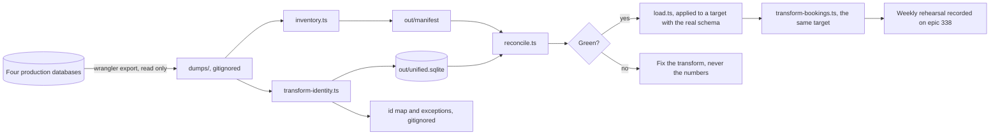

# Migration tooling (SP-3)

The pipeline that turns four production databases into one, rehearsed weekly until cutover
(epic #338). Standalone: the application never imports from here.

## Safety rules

- Exports are reads of production; nothing here ever writes to a remote database.
- Dumps and outputs live in `dumps/` and `out/`, both gitignored: they contain personal data
  and belong on this machine only, deleted after each rehearsal.
- The id map (`out/id-map.tsv`) is a working artefact (decision 0015): it never enters the
  application database and is archived with the read-only old estate at cutover.



## Running a rehearsal

A target with the real application schema first, the same one every later step writes into:
`bun run dev` once creates `.data/db/sqlite.db`, or copy it, or apply the Drizzle migrations to
a scratch file by hand.

```bash
bun install
./migration/export.sh          # pulls fresh dumps from production via wrangler
bun migration/inventory.ts     # loads dumps locally, writes out/manifest.json + .md
bun migration/transform-identity.ts   # builds the unified identity core in out/unified.sqlite
bun migration/reconcile.ts     # verifies counts and invariants; non-zero exit on failure
bun migration/load.ts /tmp/rehearsal.db          # writes out/load.sql and applies it
bun migration/transform-bookings.ts /tmp/rehearsal.db   # the old rooms history, same target
bun migration/transform-money.ts /tmp/rehearsal.db      # ticket revenue, same target
```

**`transform-bookings.ts` and `transform-money.ts` take the target as an argument and refuse to
run without one, on purpose.** Unlike identity, `room_bookings.room_id` and
`external_requests`' own room reference are real foreign keys onto rooms administered through the
live app; no hand-maintained schema subset can ever hold real room ids, because rooms are never
migrated, only referenced. `load.ts` has to run against the same target first, so the users these
key to already exist there (`docs/known-issues.md`).

`export.sh` requires a wrangler login with access to the New Theatre account. Every later
step is offline against the dumps.

## What exists so far

- **Inventory**: per-table row counts and domain checksums (money totals, status splits) for
  all four databases; the baseline every rehearsal reconciles against.
- **Identity transform** (the cutover's first import, K-112): merges the four user stores on
  the canonical auth id, mints fresh ids, wipes any password on an @newtheatre.org.uk
  address (decision 0008), preserves anonymised tombstones as tombstones, drops old-domain
  passkeys (SP-4), maps role grants through `role-map.json` (provisional until the workshop
  signs the vocabulary; unmapped grants land in the exceptions report), and imports the old
  audit histories into `audit_archive`.
- **Reconciliation**: source-versus-target counts, the register count guard (K-115), and the
  invariant checks (no Workspace passwords, tombstones preserved, email uniqueness, every old role
  mapped, no old estate id left in `granted_by`, every address lowercase).
- **Booking history** (C-118): the old rooms app's bookings and recurring series, keyed to the
  accounts the identity transform minted. Statuses map to the unified vocabulary, with
  `AWAITING_EXTERNAL` becoming `PENDING_APPROVAL` on an external room, which is how the unified
  system models a booking the Theatre Manager arranges with the SU. Times are milliseconds there
  and seconds here, so the reconciliation checksums total booked seconds as well as counting rows:
  a unit error puts the whole history in 1970 and no row count would catch it. Nothing is invented:
  a booking whose account or room did not come across is skipped and named in
  `out/booking-exceptions.txt` rather than given one, and tombstones stay tombstones. Web push
  subscriptions are deliberately not read; push consent is re-collected when push works.
  `out/room-map.tsv` maps each old `room:<id>` to a unified room and `out/space-map.tsv` maps each
  `venue:<id>` to a union room; both are written by hand, because a wrong room silently rewrites
  years of utilisation. A booking at a union venue imports into `external_requests` rather than
  `room_bookings`, keeping `AWAITING_EXTERNAL` with the meaning it always had (C-120, 0036), and
  the venue it names lands in `preferred_space_id` where the union had not yet answered and in
  `assigned_space_id` where it had. The reconciliation checksums both tables.

- **Load** (K-112 criterion 4): turns the core into `out/load.sql`, upserts keyed on identity, and
  applies it to a local target when given one. It never deletes, so a person or a grant that
  vanished upstream stays until somebody decides; and it never touches production, which is applied
  by hand from the runbook in `docs/operations.md`.

## Why the same person keeps the same id

`out/id-map.tsv` is an input as well as an output. The transform reads it before minting anything,
so a rehearsal updates the estate rather than importing a second copy of it. The file is gitignored
because this repository is public and the map is what links the archived old estate to live
identities. Losing it costs a reload of a scratch target, not ten thousand duplicate people: wipe
the rehearsal database and start again.

The old estate's audit history is deliberately not imported (decision 0030).

Remaining transforms (programme, reservations and tickets, rooms, bar) follow the same
shape, one file per module, as the weekly rehearsals proceed.
